# USULAN PENDEKATAN (PROPOSED METHOD)

## Gambaran Umum Pendekatan

Penelitian ini dirancang sebagai sistem *real-time people counting* berbasis video dengan paradigma *detection-tracking-counting*. Rancangan ini menargetkan skenario ruang publik seperti area kampus, pintu masuk gedung, halte/stasiun, koridor layanan, atau titik pengawasan yang memiliki arus manusia dinamis. Fokusnya bukan pada estimasi massa kerumunan per citra, melainkan pada penghitungan orang yang bergerak melewati RoI, garis virtual, atau transisi zona dengan mempertahankan identitas lintasan antar-frame. Dengan demikian, pendekatan ini berbeda dari *density-map crowd counting* yang umumnya menjumlahkan peta kepadatan tanpa menyediakan ID, arah perpindahan, dan status objek yang diperlukan untuk hitungan masuk-keluar [S027], [S028], [S029], [S033].

Pipeline yang diusulkan adalah: video masukan → preprocessing frame dan anotasi ruang → deteksi manusia → pelacakan multi-objek → validasi lintasan → *counting logic* → keluaran hitungan dan log evaluasi. Komponen deteksi direncanakan memakai detector real-time/NMS-free sebagai kandidat utama agar bottleneck inferensi dapat ditekan. YOLO26 ditempatkan sebagai kandidat implementasi/prototipe karena dokumentasi dan preprint 2026 memosisikannya sebagai detector end-to-end/NMS-free untuk deployment real-time/edge [S001], [S002]. Namun, dasar akademik untuk argumen detector NMS-free/end-to-end tetap akan ditopang oleh YOLOv10 dan RT-DETR karena keduanya merupakan rujukan ilmiah peer-reviewed untuk deteksi real-time tanpa NMS [S003], [S004]. Posisi ini penting agar novelty penelitian tidak digantungkan pada YOLO26 semata.

Komponen pelacakan direncanakan menempatkan DiffMOT sebagai tracker utama karena rancangan sistem perlu mengantisipasi gerak non-linear, oklusi, dan fragmentasi lintasan yang dapat memicu *identity switch* [S021]. OC-SORT atau keluarga SORT modern disiapkan sebagai baseline dan fallback efisien ketika constraint perangkat, latency, atau kemudahan integrasi menjadi faktor dominan [S024]. Di atas deteksi dan tracking, penelitian ini menempatkan *counting logic* sebagai komponen eksplisit: RoI polygon, *line crossing*, transisi zona, validasi arah, memori status ID, *debouncing*, dan penanganan konservatif terhadap track yang hilang lalu aktif kembali. Rancangan ini diarahkan untuk mengurangi hitung ganda, *missed count*, dan salah arah pada skenario oklusi atau pergerakan bolak-balik di sekitar garis hitung [S010], [S011], [S025], [S026], [S035].

Tahap saat ini belum mencakup eksperimen aktual. Seluruh bagian berikut ditulis sebagai rencana metodologi, rencana arsitektur sistem, rencana skenario eksperimen, dan rencana evaluasi. Karena itu, naskah ini tidak menyajikan tabel hasil, klaim performa baru, atau kesimpulan empiris bahwa satu model telah unggul pada data target.

## Arsitektur Sistem yang Diusulkan

Arsitektur sistem yang diusulkan terdiri atas lima lapisan: (1) input video dan preprocessing, (2) deteksi manusia, (3) multi-object tracking, (4) *counting logic*, dan (5) keluaran serta logging evaluasi. Alur awal rancangan ditunjukkan dalam diagram berikut.

```mermaid
flowchart LR
    A[Input Video CCTV / Rekaman Ruang Publik] --> B[Preprocessing: resize, frame sampling, timestamp, RoI/zone annotation]
    B --> C[Human Detector: YOLO26 candidate / YOLOv10-RT-DETR baseline]
    C --> D[Detection Output: bbox, confidence, class, frame time]
    D --> E{Tracker Mode}
    E -->|Robust path| F[DiffMOT: non-linear motion tracking]
    E -->|Efficient fallback| G[OC-SORT / SORT-family]
    F --> H[Track Management: ID, trajectory, confidence, lost/reactivated status]
    G --> H
    H --> I[Counting Logic: RoI polygon, line/zone crossing, trajectory validation]
    I --> J[ID State Memory: unseen, inside, counted-in/out, cooldown, expired]
    J --> K[Output: in/out count, zone count, event log, overlay]
    K --> L[Evaluation: detection, tracking, counting error, FPS/latency]
```

Lapisan input menerima video dari kamera tetap, CCTV, rekaman ruang publik, atau dataset video yang memiliki karakteristik pejalan kaki. Pada tahap preprocessing, video akan dipecah menjadi frame dengan timestamp, ukuran frame akan dinormalisasi sesuai kebutuhan detector, dan metadata seperti frame index, ukuran asli, FPS sumber, serta identitas kamera akan dicatat. RoI, garis virtual, dan zona akan didefinisikan secara eksplisit pada koordinat frame. Jika data lokal mengandung wajah, plat nomor, atau informasi personal lain, prosedur anonimisasi seperti blurring wajah/area sensitif direncanakan sebelum data digunakan untuk pelabelan dan evaluasi. Preprocessing tidak dimaksudkan untuk mengubah isi kejadian, tetapi untuk memastikan format data konsisten dan area hitung terdefinisi.

Lapisan deteksi menghasilkan bounding box manusia, confidence score, class label, dan waktu inferensi per frame. YOLO26 akan diposisikan sebagai kandidat implementasi karena orientasi NMS-free dan edge deployment yang dijelaskan oleh sumber vendor/preprint [S001], [S002]. YOLOv10 dan RT-DETR akan dipakai sebagai anchor akademik atau baseline konseptual untuk membandingkan desain detector end-to-end/NMS-free [S003], [S004]. Apabila ruang eksperimen berikutnya memungkinkan, detector lain seperti D-FINE, DEIM-based RT-DETR, atau RF-DETR dapat dipertimbangkan sebagai pembanding akurasi-latensi, tetapi bukan syarat utama rancangan awal [S005], [S006], [S007]. Output detector akan difilter pada kelas manusia/person dan diserahkan ke tracker tanpa melakukan keputusan hitung langsung, sebab deteksi per-frame tidak cukup untuk memastikan identitas dan arah perpindahan.

Lapisan tracking menghubungkan deteksi antar-frame menjadi track ID. DiffMOT direncanakan sebagai jalur utama untuk menguji manfaat prediksi gerak non-linear pada kondisi perubahan arah, crossing, dan oklusi [S021]. OC-SORT/SORT-family akan digunakan sebagai jalur fallback dan baseline ringan karena efisien, relatif mudah diintegrasikan, serta berguna untuk mengukur trade-off antara robustness dan latency [S024]. Track management akan menyimpan ID, posisi bounding box, centroid atau bottom-center point, riwayat lintasan, confidence/status track, status hilang, dan kemungkinan reaktivasi. Informasi ini menjadi masukan langsung untuk logika hitung.

Lapisan counting tidak hanya membaca jumlah deteksi pada suatu frame, tetapi mengevaluasi lintasan terhadap struktur ruang. Rancangan awal menggunakan kombinasi RoI polygon, garis hitung, dan zona. Sebuah track hanya akan dipertimbangkan valid jika memenuhi syarat spasial-temporal, misalnya masuk ke RoI, memiliki lintasan minimal beberapa frame, melintasi garis dari arah tertentu, atau berpindah dari zona asal ke zona tujuan. Untuk mengurangi *double-counting*, setiap ID akan memiliki state seperti `unseen`, `inside-zone`, `counted-in`, `counted-out`, `cooldown`, dan `expired`. Mekanisme *debouncing* akan mencegah ID yang bergerak bolak-balik di sekitar garis dihitung berulang dalam jendela waktu pendek. Track yang hilang sementara akibat oklusi akan diperlakukan konservatif: sistem akan mencoba mempertahankan memori status selama batas waktu tertentu, tetapi tidak langsung membuat event hitung baru jika reaktivasi lintasan masih ambigu.

Lapisan keluaran akan menghasilkan hitungan masuk, keluar, total per zona, event log per ID, overlay visual, dan catatan error. Event log direncanakan memuat timestamp, ID, status sebelum/sesudah, koordinat crossing, arah, confidence rata-rata, tracker mode, dan alasan event diterima atau ditolak. Logging ini penting karena evaluasi people counting tidak cukup hanya menampilkan angka total akhir; analisis error perlu dapat menelusuri apakah kesalahan berasal dari detector, tracker, atau counting logic. Dokumentasi NVIDIA DeepStream `nvdsanalytics` hanya dipakai sebagai referensi teknis untuk konsep implementasi RoI filtering, direction detection, dan line-crossing yang bergantung pada tracker ID, bukan sebagai bukti akademik SOTA [S035].

## Rencana Data dan Preprocessing

Rencana data dibagi menjadi data publik untuk pengujian komponen dan data target untuk validasi konteks ruang publik. Data publik akan dipakai agar evaluasi awal tidak hanya bergantung pada rekaman internal. CrowdHuman direncanakan untuk kebutuhan deteksi manusia pada crowd/occlusion karena dataset ini menyediakan anotasi full-body, visible-region, dan head box pada citra manusia padat; train+validation berisi sekitar 470 ribu instance manusia dengan rata-rata 22,6 orang per citra [S038]. MOT20 direncanakan untuk menguji tracker pada skenario pedestrian padat; benchmark ini menyediakan delapan sekuens dari tiga scene dengan anotasi pedestrian sangat padat, termasuk kepadatan yang dapat mencapai 246 pedestrian per frame [S036]. DanceTrack direncanakan sebagai pelengkap untuk menguji gerak non-linear dan appearance seragam; dataset ini memiliki 100 video dan 105.855 frame dengan karakter gerak beragam yang menekan kualitas asosiasi identitas [S037].

Data target/lokal direncanakan berupa rekaman ruang publik kampus atau lingkungan sejenis jika izin dan prosedur etika tersedia. Alternatifnya, penelitian akan menggunakan video publik yang memiliki lisensi/akses jelas dan karakteristik kamera tetap, misalnya pintu masuk, koridor, lobi, atau area tunggu. Pemilihan data target akan mempertimbangkan sudut kamera, kepadatan, variasi pencahayaan, arah arus, frekuensi oklusi, dan kebutuhan privasi. Data target tidak akan diperlakukan sebagai bukti generalisasi luas sebelum jumlah video, variasi scene, dan protokol anotasinya memadai.

Preprocessing direncanakan dalam beberapa langkah. Pertama, video akan distandardisasi ke format yang dapat diproses pipeline, misalnya resolusi kerja tertentu, FPS sampling, frame index, timestamp, dan penyimpanan metadata kamera. Kedua, RoI polygon, garis hitung, dan zona akan diberi anotasi manual pada frame referensi. Ketiga, ground truth counting akan dibuat secara manual melalui pencatatan event masuk/keluar atau perpindahan zona, bukan hanya jumlah orang per frame. Keempat, bila evaluasi tracker dilakukan pada data target, anotasi track ID pada subset video akan disiapkan untuk menghitung HOTA, IDF1, MOTA, ID switch, dan fragmentasi. Kelima, data yang mengandung identitas personal akan melalui anonimisasi sesuai kebutuhan, misalnya blurring wajah atau pembatasan distribusi data mentah.

Penggunaan data akan dibedakan menurut tujuan. CrowdHuman akan dipakai untuk menguji atau menyesuaikan detector manusia pada citra crowded, bukan untuk menilai counting berbasis lintasan karena tidak memiliki ID temporal. MOT20 dan DanceTrack akan dipakai untuk mengevaluasi kualitas tracking, bukan langsung sebagai dataset counting kecuali skenario line/zone sintetis didefinisikan secara hati-hati. Data target akan digunakan untuk validasi event counting karena area, garis, dan zona dapat ditentukan sesuai kebutuhan aplikasi. Perbedaan fungsi dataset ini perlu dijaga agar metrik deteksi, tracking, dan counting tidak tertukar.

## Tahapan Metodologi

Tahap pertama adalah definisi skenario dan ruang hitung. Pada tahap ini, penelitian akan menentukan jenis scene yang menjadi target, posisi kamera, bentuk RoI, garis virtual, zona asal-tujuan, arah masuk/keluar, serta kondisi yang dianggap event valid. Output tahap ini adalah spesifikasi skenario yang mencakup peta koordinat RoI/line/zone, definisi event, daftar kasus sulit seperti oklusi dan pergerakan bolak-balik, serta format log yang akan dipakai untuk evaluasi.

Tahap kedua adalah persiapan data dan anotasi. Data publik akan diorganisasi sesuai peran komponennya, sedangkan data target akan dipilih atau direkam jika izin tersedia. Preprocessing akan menghasilkan frame/video standar, metadata, anotasi RoI, anotasi garis/zona, dan ground truth event counting. Pada subset yang diperlukan, anotasi track ID akan disiapkan agar kesalahan tracking dapat dipisahkan dari kesalahan counting. Tahap ini juga akan mencatat pembatasan data sejak awal, misalnya jumlah scene, variasi pencahayaan, tingkat oklusi, dan batasan privasi.

Tahap ketiga adalah implementasi atau integrasi detector. YOLO26 akan diimplementasikan sebagai kandidat prototipe jika dependensi dan runtime tersedia. YOLOv10/RT-DETR atau detector NMS-free lain akan dipakai sebagai baseline akademik atau pembanding sesuai kelayakan sumber daya. Evaluasi detector direncanakan memeriksa AP/mAP, precision, recall, false positive, false negative, dan latency. Pada tahap ini belum ada keputusan hitung; detector hanya menyediakan input bagi tracker.

Tahap keempat adalah integrasi tracker. DiffMOT akan diintegrasikan sebagai jalur robust untuk prediksi gerak non-linear, sedangkan OC-SORT/SORT-family disiapkan sebagai jalur efisien. Keluaran tracker akan distandardisasi agar counting logic tidak bergantung pada implementasi tracker tertentu. Struktur keluaran minimal berisi frame index, track ID, bounding box, centroid atau bottom-center point, confidence, status aktif/hilang, dan riwayat lintasan. Evaluasi tracker akan diarahkan pada HOTA, IDF1, MOTA, ID switch, dan fragmentasi, karena metrik ini membantu membedakan kegagalan deteksi dari kegagalan asosiasi identitas [S025], [S026].

Tahap kelima adalah perancangan *counting logic*. Rancangan awal akan menguji beberapa tingkat kompleksitas: line crossing sederhana, line crossing dengan RoI, transisi zona, serta transisi zona dengan ID state memory dan *debouncing*. Aturan hitung akan dibuat eksplisit agar dapat diuji ulang: kapan ID mulai aktif, kapan event diterima, kapan event ditolak, berapa lama ID berada dalam cooldown, bagaimana track hilang ditangani, dan bagaimana arah ditentukan dari lintasan. Logika ini akan dibuat konservatif agar sistem tidak langsung menghitung ulang ID yang muncul kembali setelah oklusi tanpa bukti lintasan yang cukup.

Tahap keenam adalah logging dan evaluasi. Setiap eksperimen yang direncanakan akan menyimpan konfigurasi detector, tracker, threshold, resolusi, FPS sampling, definisi RoI/zone, hasil event counting, metrik komponen, dan catatan error. Evaluasi akan dipisahkan menjadi evaluasi detector, evaluasi tracker, evaluasi counting, dan evaluasi real-time. Pemisahan ini penting karena performa detector tinggi tidak otomatis menghasilkan counting yang benar, dan tracker dengan HOTA/IDF1 baik masih dapat gagal jika aturan line/zone tidak tepat.

Tahap ketujuh adalah analisis error dan iterasi rancangan. Analisis akan mengklasifikasikan kesalahan ke dalam beberapa kategori: false positive detector yang dihitung sebagai orang, missed detection yang memutus track, ID switch yang memicu hitung ganda, fragmentasi track yang menghilangkan event, definisi RoI/line yang terlalu dekat dengan area padat, dan latency yang membuat frame penting terlewat. Perbaikan yang direncanakan dapat berupa penyesuaian threshold, smoothing lintasan, perluasan RoI, perubahan zona, penambahan cooldown, atau pemilihan tracker fallback yang lebih sesuai. Tahap ini baru akan menghasilkan kesimpulan empiris setelah eksperimen benar-benar dilakukan.

## Rencana Skenario Eksperimen

Skenario eksperimen dirancang untuk tahap berikutnya dan belum dilaksanakan pada fase penulisan ini. Setiap skenario akan memiliki konfigurasi, dataset, metrik, dan log error yang terpisah agar sumber kegagalan dapat ditelusuri.

| Skenario | Tujuan | Rancangan evaluasi | Keluaran yang direncanakan |
|---|---|---|---|
| A — Evaluasi detector | Menilai kualitas deteksi manusia dan latency detector | Membandingkan YOLO26 sebagai kandidat implementasi dengan YOLOv10/RT-DETR atau baseline lain pada data manusia/crowd | AP/mAP, precision, recall, FP/FN, latency detector, catatan deteksi kecil/teroklusi |
| B — Evaluasi tracker | Menilai stabilitas ID pada crowd, oklusi, dan gerak non-linear | Membandingkan DiffMOT dengan OC-SORT/SORT-family pada MOT20, DanceTrack, atau subset target beranotasi | HOTA, IDF1, MOTA, ID switch, fragmentasi, runtime tracker |
| C — Evaluasi counting logic | Menilai pengaruh aturan RoI/zone/ID memory terhadap error counting | Ablation dari line crossing sederhana sampai RoI + zone transition + ID state memory + debouncing | MAE/MAPE per video/zona, over-count, under-count, direction accuracy, daftar event salah |
| D — Evaluasi real-time readiness | Menilai kelayakan end-to-end pipeline | Mengukur FPS, latency end-to-end, penggunaan CPU/GPU/memori pada konfigurasi perangkat yang tersedia | FPS, latency rata-rata/p95, resource utilization, konfigurasi bottleneck |
| E — Validasi domain target | Menilai kesesuaian awal pada rekaman ruang publik/kampus atau video publik sejenis | Menguji pipeline pada scene target dengan RoI/line/zone yang sesuai konteks | Counting error per scene, error type, catatan domain shift, rekomendasi iterasi |

Pada Skenario A, evaluasi detector akan diarahkan pada kemampuan mendeteksi manusia kecil, saling tumpang tindih, atau sebagian tertutup. CrowdHuman relevan untuk evaluasi deteksi manusia pada crowd, tetapi karena dataset ini berupa citra statis, hasilnya tidak akan langsung disamakan dengan akurasi counting [S038]. YOLO26 akan diuji sebagai kandidat implementasi jika dependensi tersedia; YOLOv10 dan RT-DETR akan menjadi rujukan akademik untuk desain NMS-free/end-to-end [S003], [S004].

Pada Skenario B, evaluasi tracker akan menilai apakah track ID tetap stabil ketika objek bergerak berdekatan, tertutup, atau berubah arah. MOT20 akan memberi tekanan pada kepadatan dan oklusi, sedangkan DanceTrack akan memberi tekanan pada gerak non-linear dan appearance seragam [S036], [S037]. DiffMOT akan diposisikan sebagai jalur robust, sedangkan OC-SORT/SORT-family menjadi baseline/fallback efisien [S021], [S024]. Skenario ini tidak akan langsung menyimpulkan akurasi hitung, tetapi akan menunjukkan kualitas asosiasi yang menjadi prasyarat counting berbasis lintasan.

Pada Skenario C, evaluasi counting logic akan dilakukan sebagai ablation bertahap. Baseline pertama adalah line crossing sederhana. Variasi kedua menambahkan RoI agar objek di luar area aktif tidak dihitung. Variasi ketiga memakai transisi zona untuk memastikan arah dan urutan perpindahan. Variasi keempat menambahkan ID state memory, debouncing, cooldown, dan reactivation handling. Perbandingan ini direncanakan untuk melihat komponen aturan mana yang paling berpengaruh terhadap over-count, under-count, dan salah arah. Hasil yang diharapkan dari skenario ini bukan sekadar total hitungan, tetapi daftar event yang benar, event yang hilang, event yang dihitung ganda, dan alasan kegagalannya.

Pada Skenario D, evaluasi real-time readiness akan mengukur apakah pipeline dapat berjalan dalam batas latency yang realistis. Karena sistem mencakup detector, tracker, dan counter, pengukuran akan dilakukan secara end-to-end, bukan hanya waktu inferensi detector. Metrik akan mencakup FPS, latency rata-rata, latency p95, penggunaan CPU/GPU, memori, dan stabilitas runtime. Jika perangkat edge seperti Jetson tersedia, skenario ini akan mempertimbangkan optimisasi runtime, TensorRT/ONNX, kuantisasi, atau penyesuaian resolusi sesuai arahan literatur edge AI [S009], [S028], [S031], [S032].

Pada Skenario E, validasi domain target akan dilakukan pada video ruang publik yang paling mendekati kebutuhan aplikasi. Validasi ini akan memeriksa apakah RoI, garis, zona, dan aturan state bekerja pada kondisi nyata: pencahayaan berubah, orang berhenti di area hitung, beberapa orang melintas bersamaan, atau track hilang di tengah oklusi. Jika data target masih terbatas, kesimpulan akan dibatasi sebagai validasi awal dan tidak akan digeneralisasi ke semua ruang publik.

## Rencana Metrik Evaluasi

Evaluasi detector akan memakai AP/mAP, precision, recall, false positive, false negative, dan latency detector. AP/mAP digunakan untuk menilai kualitas lokalisasi dan klasifikasi pada data deteksi, sedangkan precision/recall diperlukan untuk membaca trade-off antara false alarm dan missed detection. Latency detector akan dicatat karena sistem real-time tidak hanya membutuhkan akurasi, tetapi juga waktu respons yang rendah. Namun, metrik detector tidak akan dipakai sendirian untuk menyimpulkan keberhasilan people counting.

Evaluasi tracker akan memakai HOTA, IDF1, MOTA, ID switch, dan fragmentasi track. HOTA direncanakan karena menyeimbangkan detection accuracy, association accuracy, dan localization sehingga lebih diagnostik untuk MOT [S025]. IDF1 akan digunakan untuk menilai pelestarian identitas, yang langsung terkait dengan risiko double-counting dan missed-counting [S026]. MOTA tetap dicatat sebagai metrik umum MOT, tetapi interpretasinya akan hati-hati karena metrik ini dapat lebih dipengaruhi oleh deteksi daripada asosiasi. ID switch dan fragmentasi akan digunakan sebagai indikator operasional kegagalan yang mudah ditelusuri ke event counting.

Evaluasi counting akan memakai absolute counting error, MAE, MAPE, over-count, under-count, dan direction accuracy. Unit evaluasinya dapat berupa per video, per zona, per interval waktu, atau per arah lintasan. MAE akan menunjukkan rata-rata selisih absolut terhadap ground truth, sedangkan MAPE akan dipakai jika jumlah event cukup besar dan tidak menimbulkan distorsi pada video dengan ground truth kecil. Over-count dan under-count akan dipisahkan karena penyebabnya berbeda: over-count sering terkait ID switch, reaktivasi, atau garis terlalu sensitif; under-count sering terkait missed detection, track hilang, atau event yang tidak memenuhi syarat validasi. Direction accuracy akan menilai apakah sistem membedakan masuk dan keluar secara benar.

Evaluasi real-time akan memakai FPS end-to-end, latency end-to-end, latency p95, utilisasi CPU/GPU, penggunaan memori, dan ukuran model/runtime jika tersedia. Pengukuran end-to-end akan meliputi preprocessing, detector, tracker, counting logic, dan logging. Jika deployment edge diuji pada tahap berikutnya, metrik tambahan seperti konsumsi daya, suhu perangkat, dan kestabilan selama durasi video panjang dapat dicatat. Semua pengukuran akan disertai konfigurasi resolusi, FPS input, batch size, runtime backend, dan perangkat keras agar hasil dapat direplikasi.

Selain metrik numerik, evaluasi direncanakan menyertakan analisis kualitatif berbasis log error. Setiap kesalahan counting akan dikaitkan dengan akar masalah: detector gagal, tracker mengganti ID, track terfragmentasi, RoI/line kurang tepat, arah ambigu, atau latency membuat frame crossing terlewat. Analisis ini diperlukan karena tujuan penelitian bukan hanya memperoleh angka akhir, tetapi memahami bagaimana integrasi detector-tracker-counter perlu diperbaiki.

## Ancaman Validitas dan Mitigasi Awal

Ancaman validitas internal muncul karena hasil yang kelak diperoleh dapat dipengaruhi oleh konfigurasi detector, threshold confidence, resolusi input, FPS sampling, parameter tracker, ukuran buffer track, dan aturan counting. Untuk mitigasi awal, setiap eksperimen direncanakan memakai pencatatan konfigurasi lengkap, seed atau versi model jika relevan, serta ablation yang memisahkan pengaruh detector, tracker, dan counting logic. Perubahan konfigurasi tidak akan dicampur tanpa dokumentasi karena dapat membuat interpretasi hasil menjadi kabur.

Ancaman validitas konstruk muncul karena metrik yang berbeda mengukur aspek yang berbeda. AP/mAP tidak sama dengan akurasi counting; HOTA/IDF1 tidak langsung mengukur jumlah orang masuk-keluar; FPS tinggi tidak menjamin hitungan benar. Untuk mitigasi awal, evaluasi akan dibagi menjadi metrik detector, tracker, counting, dan real-time. Kesimpulan metodologis hanya akan ditarik sesuai konstruk yang diukur. Jika suatu konfigurasi detector memiliki mAP tinggi tetapi counting error tetap besar, analisis akan menelusuri kemungkinan kegagalan asosiasi ID atau aturan zona, bukan menyimpulkan detector sebagai penyebab tunggal.

Ancaman validitas kesimpulan muncul jika jumlah video, variasi scene, atau jumlah event terlalu kecil. Dataset publik seperti CrowdHuman, MOT20, dan DanceTrack membantu menguji komponen tertentu, tetapi tidak menyediakan seluruh struktur evaluasi counting target. Data lokal atau video publik target juga dapat terbatas karena izin, privasi, dan ketersediaan anotasi. Mitigasi awalnya adalah membuat skenario evaluasi bertahap, melaporkan ukuran data dan jumlah event secara transparan, menghindari klaim generalisasi luas, serta memisahkan hasil validasi awal dari klaim performa umum.

Ancaman validitas eksternal muncul karena performa pada benchmark publik belum tentu berpindah ke CCTV ruang publik lokal. MOT20 menekan kepadatan, DanceTrack menekan gerak non-linear, dan CrowdHuman menekan deteksi manusia pada crowd, tetapi ketiganya tidak identik dengan kamera kampus, pintu masuk gedung, atau area layanan yang menjadi target aplikasi [S036], [S037], [S038]. Untuk mitigasi awal, rancangan evaluasi akan menyertakan validasi domain target bila data tersedia, mencatat karakteristik kamera dan scene, serta membatasi interpretasi hasil pada domain yang benar-benar diuji.

Ancaman implementasi dan reproduktibilitas muncul karena YOLO26 masih diposisikan melalui dokumentasi vendor dan preprint, sedangkan sebagian komponen dapat berubah mengikuti versi library [S001], [S002]. Untuk mitigasi awal, YOLO26 akan ditulis sebagai kandidat implementasi/prototipe, bukan sumber novelty tunggal. Versi kode, model, dependency, runtime backend, dan perangkat keras akan dicatat. Sumber vendor seperti DeepStream akan dipakai untuk referensi teknis implementasi RoI/line analytics, bukan sebagai bukti ilmiah bahwa sistem yang diusulkan sudah unggul [S035].

Ancaman etika dan privasi muncul karena data video ruang publik dapat memuat identitas personal. Mitigasi awal mencakup pemilihan data dengan izin yang jelas, pembatasan akses data mentah, anonimisasi bila diperlukan, penyimpanan log yang tidak menyertakan identitas personal, dan penggunaan data publik sesuai lisensi. Evaluasi akan diarahkan pada perilaku sistem terhadap lintasan dan event counting, bukan identifikasi individu. Dengan mitigasi tersebut, rancangan ini diharapkan siap masuk ke tahap eksperimen tanpa mengaburkan batas antara metodologi yang direncanakan dan hasil yang belum diperoleh.
