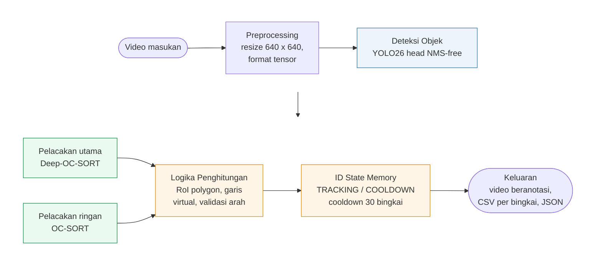
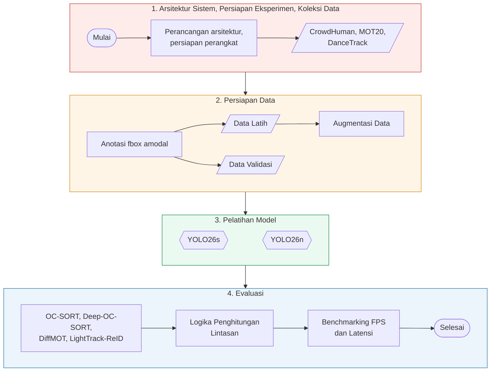
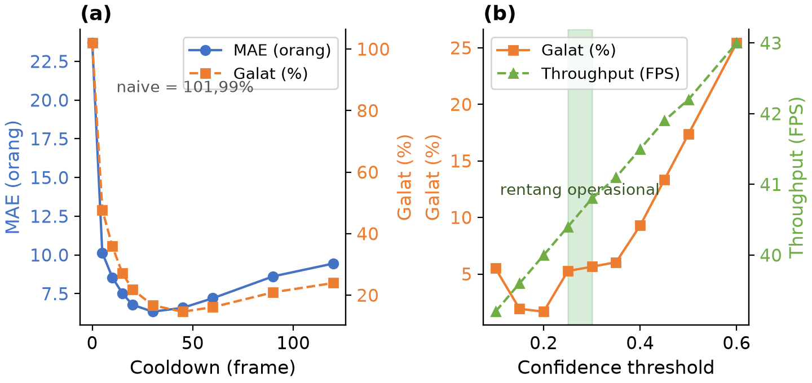

# RANCAGE: Real-Time Adaptive Neural Counting with Associative Group Estimation

Dokumen deskripsi ciptaan program komputer.

## Data untuk formulir e-Hakcipta

| Kolom | Isi |
| --- | --- |
| Jenis Ciptaan | Program Komputer |
| Judul Ciptaan | RANCAGE: Real-Time Adaptive Neural Counting with Associative Group Estimation |
| Pencipta | [isi: nama lengkap sesuai KTP, NIK, kewarganegaraan] |
| Pemegang Hak Cipta | [isi: sama dengan pencipta, atau Universitas Siliwangi bila hak dialihkan] |
| Tanggal pertama kali diumumkan | [isi: tanggal] |
| Tempat pertama kali diumumkan | [isi: kota] |
| Bahasa program | Python 3 |
| Contoh ciptaan yang dilampirkan | Source code (potongan awal dan akhir) + dokumen ini |

Catatan pengisian: nama pencipta harus persis sama dengan KTP, termasuk gelar dan ejaan. Judul ciptaan
jangan dibuat generik. Tanggal pengumuman tidak boleh melewati tanggal permohonan.

---

## DAFTAR ISI

- PENDAHULUAN
- METODE
- KODE PROGRAM
- DAFTAR PUSTAKA

---

## PENDAHULUAN

Pengelolaan ruang publik menuntut informasi jumlah orang yang cepat, tepat, dan dapat diperbarui sambil
berjalan. Stasiun kereta, kampus, pusat perbelanjaan, dan terminal menyesuaikan kapasitas serta prosedur
keselamatan berdasarkan angka tersebut [1]. Pemantauan manual melalui kamera pengawas bergantung penuh pada
operator, sehingga konsistensinya sulit dipertahankan begitu jumlah objek dalam bingkai bertambah. Penelitian
people counting dan smart surveillance menempatkan kebutuhan sistem bukan sebatas mendeteksi keberadaan manusia
pada satu bingkai, melainkan juga mempertahankan identitas dan membaca perpindahan objek antar-bingkai agar arus
masuk dan keluar dapat dihitung [2].

Kondisi visual ruang publik membuat pekerjaan itu tidak sederhana. Kamera dipasang jauh sehingga tubuh manusia
tampil kecil atau hanya terlihat sebagian, pencahayaan berubah, dan orang berdiri berdekatan. Sistem yang hanya
mendeteksi manusia per bingkai berpotensi menghasilkan hitungan yang tidak konsisten. Orang yang sama terdeteksi
kembali sesudah terhalang objek lain. Identitas tertukar ketika dua jalur berdekatan. Objek yang bergerak
bolak-balik di sekitar garis perhitungan memicu hitungan berulang. Literatur crowd counting dan multi-object
tracking (MOT) mencatat bahwa oklusi, variasi perspektif, gerak non-linear, missed detection, dan identity
switch langsung memengaruhi keandalan sistem berbasis video [3], [4].

Studi terdahulu memperlihatkan people counting berkembang melalui dua paradigma dengan karakter berbeda.
Density-map crowd counting berguna untuk memperkirakan total kerumunan, tetapi tidak selalu menyediakan
identitas objek, arah lintasan, atau memori status yang dibutuhkan untuk menghitung orang masuk dan keluar per
zona [5], [6]. Pendekatan detection-tracking-counting mendeteksi individu, menjaga identitas antar-bingkai, lalu
menghitung berdasarkan Region of Interest (RoI), garis, atau zona [2]. Pendekatan kedua yang dipakai dalam
penelitian ini. Pada sisi detektor, arsitektur NMS-free menjadi arah perkembangan yang menekan beban
post-processing, dengan YOLOv10 memperkenalkan consistent dual assignments yang menyelaraskan proses one-to-many
dan one-to-one sehingga inferensi cukup memakai satu head tanpa Non-Maximum Suppression [13]. Pada sisi
pelacakan, DiffMOT menargetkan gerakan non-linear melalui prediktor berbasis diffusion dan dilaporkan mencapai
HOTA 62,3 serta IDF1 63,0 di DanceTrack pada 22,7 FPS dengan RTX 3090 [7]. Kecepatan itu belum menjamin kinerja
perangkat edge, sehingga algoritma yang lebih ringan tetap relevan sebagai cadangan. Deep-OC-SORT memadukan
estimasi gerak observation-centric dengan appearance embedding yang diperbarui memakai exponential moving
average, sehingga asosiasi mempertimbangkan informasi gerak dan kemiripan visual sekaligus [8].

Masalah yang belum tertutup terletak pada sambungan antara deteksi, pelacakan, dan penghitungan. Kenaikan metrik
benchmark seperti mAP, HOTA, dan IDF1 tidak otomatis menghasilkan hitungan yang akurat bila logika penghitungan
dirancang terpisah dari dua komponen sebelumnya [2]. Sebagian besar penelitian mengevaluasi deteksi atau
pelacakan secara sendiri-sendiri, sedangkan kontribusi masing-masing komponen terhadap galat hitung akhir jarang
diukur dalam satu kerangka yang terkendali. Hal yang sama berlaku untuk biaya komputasi: tambahan latensi yang
dibawa logika penghitungan berbasis lintasan belum banyak didekomposisi per tahap, padahal anggaran real-time
33,3 ms per bingkai untuk 30 FPS tidak memberi ruang banyak.

RANCAGE dirancang untuk menutup celah tersebut. Ciptaan ini berupa pipeline people counting yang menyatukan
detektor NMS-free, empat varian multi-object tracker, dan logika penghitungan berbasis lintasan di dalam satu
arsitektur end-to-end. Detektor memakai keluarga YOLO dari Ultralytics dengan YOLO26 sebagai kandidat
implementasi, dan hasil fine-tuning pada CrowdHuman memakai anotasi fbox amodal. Tracker yang diuji ada empat,
yaitu OC-SORT [4], Deep-OC-SORT [8], DiffMOT [7], dan LightTrack-ReID [9], semuanya dijalankan pada keluaran
deteksi yang sama agar perbandingan tidak terpengaruh perbedaan mutu kotak. Lapisan penghitungan bekerja pada
lintasan tiap identitas, bukan pada objek per bingkai, memakai RoI polygon, garis virtual, uji perpotongan
segmen, dan ID state machine dengan cooldown 30 bingkai.

Evaluasi pada 29 sekuens gabungan MOT20 [10] dan DanceTrack [11] menunjukkan tiga hasil. Pertama, YOLO26s
mencapai mAP@0.5:0.95 sebesar 0,4974, terbaik di antara empat arsitektur yang diuji, sedangkan keunggulan
arsitektur NMS-free terukur pada latensi post-processing 0,164 sampai 0,170 ms dibandingkan 0,491 ms pada
YOLOv11n. Kedua, logika penghitungan menekan galat dari rentang 88,7 sampai 155,1 persen pada naive line
crossing menjadi 13,08 persen pada jalur DiffMOT dan 16,71 persen pada jalur Deep-OC-SORT. Ketiga, tambahan
latensi logika penghitungan hanya 0,11 ms dari total 24,61 ms end-to-end, atau setara 40,6 FPS pada RTX 4090,
dengan 95 persen bingkai berada di bawah anggaran 33,3 ms. Ciptaan ini tidak mengklaim kebaruan pada konsep
dasar line atau RoI counting; yang diukur adalah seberapa jauh konsep itu bertahan pada konfigurasi eksperimen
yang terkendali.

Program dijalankan melalui antarmuka baris perintah dan modul Python yang dapat diimpor. Berkas konfigurasi
berformat YAML memuat definisi garis virtual, polygon RoI, ambang confidence, ambang IoU, panjang cooldown, serta
pemilihan tracker. Keluaran program berupa video beranotasi, berkas CSV berisi jumlah orang per bingkai beserta
latensi, dan berkas JSON ringkasan berisi FPS rata-rata, latensi persentil 50 dan 95, jumlah bingkai yang
diproses, serta jumlah deteksi orang.

---

## METODE

RANCAGE terdiri atas lima tahap pemrosesan seperti ditunjukkan pada Gambar 1. Video dibaca dan disesuaikan
ukurannya menjadi 640 x 640. Deteksi objek dijalankan memakai YOLO26 dengan head NMS-free untuk menghasilkan
bounding box beserta confidence score [13]. Hasil deteksi diteruskan ke dua jalur pelacakan, yaitu Deep-OC-SORT
sebagai jalur utama yang memadukan estimasi Kalman observation-centric dengan re-identification berbasis fitur
dalam, dan OC-SORT sebagai jalur ringan bagi perangkat bersumber daya terbatas [4], [8]. Tracklet tiap identitas
kemudian diuji oleh lapisan penghitungan terhadap polygon RoI dan garis virtual. Hanya centroid di dalam polygon
RoI yang diproses. Perlintasan ditentukan dari segmen lintasan antara dua titik terakhir terhadap segmen garis
virtual, dengan uji counterclockwise untuk keberadaan irisan [31] dan hasil cross product kedua vektor untuk
menentukan arah masuk atau keluar. Arah bergantung pada urutan dua titik pembentuk garis virtual yang ditetapkan
satu kali di berkas konfigurasi.

ID state memory memegang status setiap identitas melalui dua keadaan operasional, yaitu TRACKING dan COOLDOWN.
Ketika lintasan sebuah identitas memotong garis virtual, sistem menghasilkan satu hitungan lalu memasukkan
identitas tersebut ke COOLDOWN selama 30 bingkai. Selama masa itu identitas yang sama tidak dapat memicu
hitungan baru, sehingga mekanisme ini menjamin satu hitungan per identitas dalam setiap jendela cooldown, bukan
satu hitungan untuk seluruh sesi. Riwayat lintasan setiap identitas dibatasi 10 titik agar pemakaian memori
tidak tumbuh tanpa batas pada video berdurasi panjang. Komponen inilah yang membedakan RANCAGE dari pendekatan
yang menghitung objek per bingkai [21].



Gambar 1. Arsitektur sistem RANCAGE.

Penelitian dijalankan dalam empat fase, yaitu studi literatur, metodologi, eksperimen, dan kesimpulan, seperti
ditunjukkan pada Gambar 2. Fase eksperimen memuat enam langkah berurutan: perancangan arsitektur dan persiapan
lingkungan, koleksi dataset, anotasi dan pembagian data, augmentasi data latih, pelatihan model, serta evaluasi.
Tiga dataset publik dipakai sesuai karakteristiknya. CrowdHuman dipakai untuk mengevaluasi kinerja deteksi
manusia pada 4.370 citra validation set dengan 103.115 kotak anotasi full body, tanpa informasi identitas
temporal [27]. MOT20 dipakai untuk mengukur kinerja pelacakan dan penghitungan pada kerumunan padat [10],
sedangkan DanceTrack dipakai untuk menguji ketahanan tracker terhadap gerakan non-linear dan objek berpenampilan
seragam [11]. Gabungan MOT20-train dengan 4 sekuens dan DanceTrack-val dengan 25 sekuens menghasilkan 29 sekuens
uji.

Evaluasi dibagi menjadi empat skenario. S1 mengukur kinerja detektor dari sisi akurasi dan latensi, termasuk
perbandingan konfigurasi zero-shot dan fine-tuned. S2 membandingkan tracker memakai kerangka TrackEval dengan
metrik HOTA, IDF1, MOTA, dan jumlah ID switch pada luaran deteksi yang dibuat identik. S3 mengukur pengaruh
logika penghitungan melalui perbandingan model naive line crossing dengan model state machine, serta analisis
sensitifitas terhadap panjang cooldown dan confidence threshold. S4 mengukur kinerja end-to-end berupa FPS dan
tail latency pada persentil 90, 95, dan 99, dijalankan pada server GPU RTX 4090 dan perangkat edge AMD RX 6600
dengan DirectML. Galat hitung dilaporkan memakai dua metrik karena keduanya dapat memberi gambaran berbeda.
Galat per sekuens dihitung sebagai rata-rata selisih relatif tiap sekuens, sehingga lebih sensitif pada sekuens
dengan jumlah objek kecil. Galat gabungan dihitung dari selisih total prediksi dan total ground truth, sehingga
lebih menggambarkan kecenderungan bias sistem secara keseluruhan dan nilai negatif menandai under-count. Ground
truth hitung diperoleh dengan menerapkan logika penghitungan yang sama pada lintasan ground truth, sehingga
metrik ini mengukur sensitifitas logika terhadap ketidaksempurnaan lintasan, bukan jumlah orang sebenarnya di
lokasi.



Gambar 2. Tahapan penelitian.

---

## KODE PROGRAM

**Dataset**

```python
def convert_odgt_to_yolo(odgt_path, images_dir, output_labels_dir):
    os.makedirs(output_labels_dir, exist_ok=True)
    
    with open(odgt_path, 'r') as f:
        lines = f.readlines()
        
    for line in lines:
        data = json.loads(line)
        img_id = data['ID']
        
        # Open image to get dimensions
        img_path = Path(images_dir) / f"{img_id}.jpg"
        if not img_path.exists():
            continue
            
        with Image.open(img_path) as img:
            img_width, img_height = img.size
            
        label_path = Path(output_labels_dir) / f"{img_id}.txt"
        
        with open(label_path, 'w') as f_label:
            for gt in data.get('gtboxes', []):
                if gt['tag'] == 'person':
                    # We use fbox (full body box) as the standard for people counting
                    # Format is [x, y, w, h] (top-left x, y)
                    x, y, w, h = gt['fbox']
                    
                    # Convert to YOLO format (center x, center y, w, h) normalized
                    x_center = (x + w / 2.0) / img_width
                    y_center = (y + h / 2.0) / img_height
                    norm_w = w / img_width
                    norm_h = h / img_height
                    
                    # Ensure values are between 0 and 1
                    x_center = max(0, min(1, x_center))
                    y_center = max(0, min(1, y_center))
                    norm_w = max(0, min(1, norm_w))
                    norm_h = max(0, min(1, norm_h))
                    
                    # Class 0 is person
                    f_label.write(f"0 {x_center:.6f} {y_center:.6f} {norm_w:.6f} {norm_h:.6f}\n")
                    
    print(f"Processed {len(lines)} images from {odgt_path}")
```

**Model**

```python
DETECTOR_CATALOGUE: dict[str, dict] = {
    # ---- NANO tier (apples-to-apples comparison) ----
    "yolov10n": {
        "model": "yolov10n.pt",
        "source_id": "S003",
        "description": "YOLOv10 nano (NeurIPS 2024). Tier-N anchor for NMS-free YOLO.",
        "size": "nano",
        "tier": "N",
        "nms_free": True,
    },
    "yolov11n": {
        "model": "yolo11n.pt",
        "source_id": None,
        "description": "YOLOv11 nano (Ultralytics 2024). Tier-N baseline.",
        "size": "nano",
        "tier": "N",
        "nms_free": False,
    },
    "yolo26n": {
        "model": "yolo26n.pt",
        "source_id": "S001/S002",
        "description": "YOLO26 nano. S001 preprint, S002 vendor doc.",
        "size": "nano",
        "tier": "N",
        "nms_free": True,
    },
    # ---- SMALL tier (apples-to-apples comparison) ----
    "yolo26s": {
        "model": "yolo26s.pt",
        "source_id": "S001/S002",
        "description": "YOLO26 small.",
        "size": "small",
        "tier": "S",
        "nms_free": True,
    },
    # ---- TRANSFORMER alternative ----
    "rtdetr-l": {
        "model": "rtdetr-l.pt",
        "source_id": "S004",
        "description": "RT-DETR large (CVPR 2024). NOT tier-comparable to YOLO nano/small.",
        "size": "large",
        "tier": "L-transformer",
        "nms_free": True,
    },
}

def detectors_by_tier(tier: str) -> list[str]:
    """Return aliases for a given tier: 'N', 'S', 'M', or 'L-transformer'."""
    return sorted(k for k, v in DETECTOR_CATALOGUE.items() if v.get("tier") == tier)
```

```python
class PeopleCounter:
    """Manages tracking history and counts people crossing a virtual line using a
    robust State Machine."""

    def __init__(self, virtual_line: Line, cooldown_threshold: int = 30,
                 roi: Polygon = None) -> None:
        self.virtual_line = virtual_line
        self.cooldown_threshold = cooldown_threshold
        self.roi = roi
        self.count_in = 0
        self.count_out = 0
        self._tracks: dict[int, TrackedObject] = {}

    def update(self, track_id: int, current_centroid: Point) -> None:
        """Update the position of a tracked object, advancing its state machine."""
        # Jika ROI didefinisikan, abaikan centroid di luar ROI
        if self.roi is not None:
            if not PolygonDetector.is_inside(self.roi, current_centroid):
                return

        if track_id not in self._tracks:
            self._tracks[track_id] = TrackedObject(id=track_id)

        track = self._tracks[track_id]

        # Simpan lintasan, batasi 10 titik agar RAM tidak bocor
        track.history.append(current_centroid)
        if len(track.history) > 10:
            track.history.pop(0)

        if len(track.history) < 2:
            return

        # 1. State: COOLDOWN (Debouncing)
        if track.state == TrackState.COOLDOWN:
            track.cooldown_frames -= 1
            if track.cooldown_frames <= 0:
                track.state = TrackState.TRACKING
            return

        # 2. State: TRACKING (evaluasi lintasan)
        previous_centroid = track.history[-2]
        trajectory = Line(start=previous_centroid, end=current_centroid)

        intersects, direction = LineCrossDetector.check_crossing(
            self.virtual_line, trajectory
        )

        if intersects:
            if direction == "IN":
                self.count_in += 1
            elif direction == "OUT":
                self.count_out += 1

            # Setelah memotong garis, identitas masuk masa pendinginan
            track.state = TrackState.COOLDOWN
            track.cooldown_frames = self.cooldown_threshold
```

```python
def run_smoke_test(
    video_path: str | Path,
    output_dir: str | Path,
    detector_name: str = "yolov10s",
    confidence_threshold: float = 0.25,
    iou_threshold: float = 0.45,
    max_frames: int | None = None,
    device: str | None = None,
) -> SmokeTestSummary:
    """Run detector over a video and write annotated video + CSV + summary JSON."""
    video_path = Path(video_path)
    output_dir = Path(output_dir)
    output_dir.mkdir(parents=True, exist_ok=True)

    meta = probe_video(video_path)
    detector = PeopleDetector(
        detector_name=detector_name,
        confidence_threshold=confidence_threshold,
        iou_threshold=iou_threshold,
        device=device,
        person_only=True,
    )

    annotated_path = output_dir / f"annotated_{detector_name}.mp4"
    csv_path = output_dir / f"per_frame_{detector_name}.csv"

    latencies: list[float] = []
    counts: list[int] = []
    max_count = 0
    max_count_frame = 0
    total_person_detections = 0

    def annotated_stream():
        nonlocal max_count, max_count_frame, total_person_detections
        with csv_path.open("w", newline="") as f:
            writer = csv.writer(f)
            writer.writerow(["frame_index", "person_count", "latency_ms", "fps_instant"])
            for idx, frame in iter_frames(video_path):
                t0 = time.perf_counter()
                fd = detector.detect_frame(frame, frame_index=idx)
                wall = (time.perf_counter() - t0) * 1000.0
                boxes = [d.bbox_xyxy for d in fd.detections]
                labels = [f"person {d.confidence:.2f}" for d in fd.detections]
                annotated = draw_boxes(frame, boxes, labels=labels)
                annotated = put_text(
                    annotated,
                    f"{detector_name} | frame {idx} | persons: {fd.person_count}",
                )
                writer.writerow([idx, fd.person_count, f"{fd.latency_ms:.3f}",
                                 f"{1000.0 / wall:.2f}" if wall > 0 else "0"])
                latencies.append(fd.latency_ms)
                counts.append(fd.person_count)
                total_person_detections += fd.person_count
                if fd.person_count > max_count:
                    max_count = fd.person_count
                    max_count_frame = idx
                if max_frames is not None and idx + 1 >= max_frames:
                    break
                yield annotated

    fps_write = meta.fps if meta.fps > 0 else 25.0
    write_video(annotated_path, annotated_stream(), fps=fps_write,
                width=meta.width, height=meta.height)
    processed_frames = len(counts)

    summary = SmokeTestSummary(
        detector=detector_name,
        source_id=DETECTOR_CATALOGUE[detector_name]["source_id"],
        video_path=str(video_path),
        fps_video=meta.fps,
        fps_processed=fps_write,
        fps_avg=processed_frames / (sum(latencies) / 1000.0) if sum(latencies) > 0 else 0.0,
        latency_mean_ms=float(np.mean(latencies)),
        latency_p50_ms=float(np.percentile(latencies, 50)),
        latency_p95_ms=float(np.percentile(latencies, 95)),
        total_frames=processed_frames,
        total_person_detections=total_person_detections,
        mean_persons_per_frame=float(np.mean(counts)),
        max_persons_in_frame=max_count,
        max_persons_frame_index=max_count_frame,
    )

    summary_path = output_dir / f"summary_{detector_name}.json"
    summary_path.write_text(json.dumps(asdict(summary), indent=2))
    return summary
```

**Hasil Training Model**


**Hasil Confusion Matrix**


**Hasil Perbandingan**


**Hasil Validate**


**Hasil Sensitivitas Cooldown dan Confidence**



**Hasil Latensi**


**Hasil Detect**


---

## DAFTAR PUSTAKA

[1] W. Mansouri, M. A. Alohali, H. Alqahtani, and N. Alruwais, "Deep convolutional neural network-based enhanced crowd density monitoring for intelligent urban planning on smart cities," 2025.

[2] D. Nurseitov, K. Bostanbekov, N. Toiganbayeva, A. Zhalgas, and D. Yedilkhan, "Vision-Based People Counting and Tracking for Urban Environments," pp. 1-23, 2026.

[3] Y. Chen, F. Meng, and Z. Chen, "OcclusionTrack: Multi-Object Tracking in Dense Scenes," no. 2, pp. 1-22, 2025.

[4] J. Cao, J. Pang, X. Weng, R. Khirodkar, and K. Kitani, "Observation-Centric SORT: Rethinking SORT for Robust Multi-Object Tracking".

[5] L. Deng, Q. Zhou, S. Wang, J. M. Gorriz, and Y. Zhang, "Deep learning in crowd counting: A survey," no. February 2023, pp. 1043-1077, 2024, doi: 10.1049/cit2.12241.

[6] H. F. Elsepae, H. M. El-hoseny, and E. K. I. Hamad, "Deep learning for crowd counting in complex environments: challenges and novel trends," 2026.

[7] W. Lv, Y. Huang, N. Zhang, R. L. Mei, and H. Dan, "DiffMOT: A Real-time Diffusion-based Multiple Object Tracker with Non-linear Prediction," pp. 19321-19330.

[8] G. Maggiolino, A. Ahmad, J. Cao, and K. Kitani, "Deep OC-SORT: Multi-Pedestrian Tracking by Adaptive Re-Identification," Carnegie Mellon University.

[9] S. Baz, J. Khan, P. Zhang, and M. M. Kamal, "LightTrack-ReID: A lightweight and occlusion-robust framework for multi-object tracking," 2026, doi: 10.1371/journal.pone.0342246.

[10] P. Dendorfer et al., "MOT20: A benchmark for multi object tracking in crowded scenes," pp. 1-7.

[11] P. Sun et al., "DanceTrack: Multi-Object Tracking in Uniform Appearance and Diverse Motion," pp. 20993-21002.

[12] A. D. Sappa, "A Decade of You Only Look Once (YOLO) for Object Detection: A Review," IEEE Access, vol. 13, pp. 192747-192794, 2025, doi: 10.1109/ACCESS.2025.3630988.

[13] A. Wang et al., "YOLOv10: Real-Time End-to-End Object Detection," no. NeurIPS, pp. 1-28, 2024.

[14] Y. Zhao et al., "DETRs Beat YOLOs on Real-time Object Detection," pp. 16965-16974.

[15] F. W. Yansong Peng, Hebei Li, Peixi Wu, Yueyi Zhang, Xiaoyan Sun, "D-FINE: Redefine Regression Task in DETRs as Fine-grained Distribution Refinement," pp. 1-18, 2024.

[16] S. Huang, Z. Lu, and C. Ap, "DEIM: DETR with Improved Matching for Fast Convergence".

[17] N. P. Isaac Robinson, Peter Robicheaux, Matvei Popov, Deva Ramanan, "RF-DETR: Neural Architecture Search for Real-Time Detection Transformers," pp. 1-24, 2026.

[18] N. Surantha and N. Sutisna, "Key Considerations for Real-Time Object Recognition on Edge Computing Devices," pp. 1-26, 2025.

[19] M. A. Khan, H. Menouar, R. Hamila, and A. Abu-dayya, "Crowd counting at the edge using weighted knowledge distillation," pp. 1-16, 2025.

[20] M. R. Holla and D. S. M. Darshan, "Optimizing accuracy and efficiency in real-time people counting with cascaded object detection," Int. J. Inf. Technol., 2024, doi: 10.1007/s41870-024-02153-w.

[21] S. Diaz-santos and P. Caballero-gil, "Real-Time Passenger Flow Analysis in Tram Stations Using YOLO-Based Computer Vision and Edge AI on Jetson Nano," 2025.

[22] Y. Ranasinghe, N. G. Nair, W. Gedara, C. Bandara, and V. M. Patel, "CrowdDiff: Multi-hypothesis Crowd Density Estimation using Diffusion Models".

[23] H. Yang, S. Park, C. Sim, and S. Jung, "Sentinel for confidence-aware multi-object tracking," pp. 1-18, 2026.

[24] K. Shim, K. Ko, Y. Yang, and C. Kim, "Focusing on Tracks for Online Multi-Object Tracking," pp. 11687-11696.

[25] R. Gao and L. Wang, "Multiple Object Tracking as ID Prediction," pp. 27883-27893.

[26] B. Galoaa, S. Amraee, and S. Ostadabbas, "DragonTrack: Transformer-Enhanced Graphical Multi-Person Tracking in Complex Scenarios," pp. 6373-6382.

[27] S. Shao, Z. Zhao, B. Li, T. Xiao, and G. Yu, "CrowdHuman: A Benchmark for Detecting Human in a Crowd," pp. 1-9.

[28] E. Ristani, F. Solera, R. Zou, R. Cucchiara, and C. Tomasi, "Performance Measures and a Data Set for Multi-Target, Multi-Camera Tracking," vol. 1.

[29] C. Mccarthy, H. Ghaderi, F. Marti, P. Jayaraman, and H. Dia, "Video-based automatic people counting for public transport: On-bus versus," Computers in Industry, vol. 164, p. 104195, 2025, doi: 10.1016/j.compind.2024.104195.

[30] L. Song, L. Han, J. Wang, H. Feng, and R. Ji, "Optimization of Indoor Pedestrian Counting Based on Target Detection and Tracking," pp. 1-20, 2026.

[31] J. O'Rourke, Computational Geometry in C, 2nd ed. Cambridge University Press, 1998.
