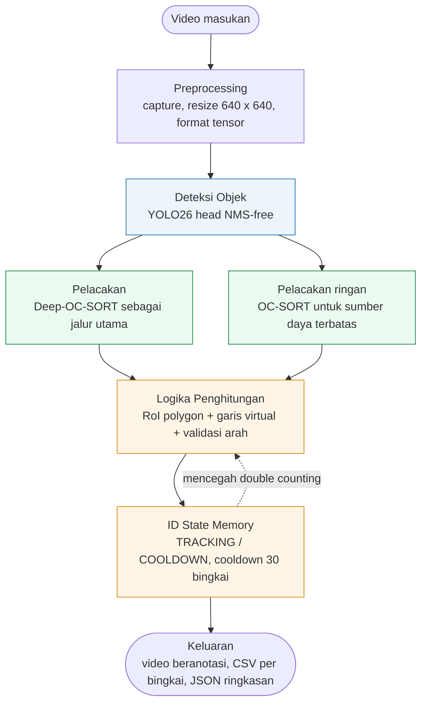
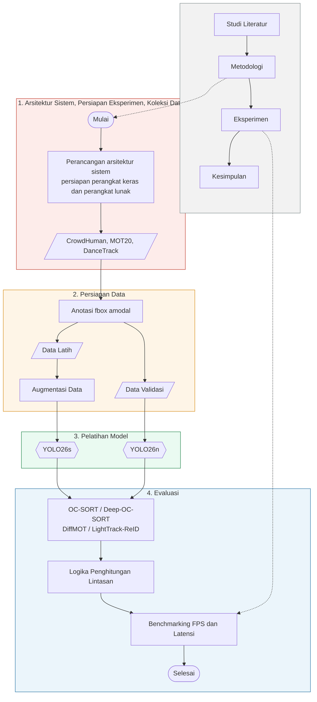

# RANCAGE: Real-Time Adaptive Neural Counting with Associative Group Estimation

**Dokumen deskripsi ciptaan program komputer untuk pencatatan Hak Cipta**

---

## Data untuk formulir e-Hakcipta

| Kolom | Isi |
| --- | --- |
| Jenis Ciptaan | Program Komputer |
| Judul Ciptaan | RANCAGE: Real-Time Adaptive Neural Counting with Associative Group Estimation |
| Pencipta | [isi: nama lengkap sesuai KTP, NIK, kewarganegaraan] |
| Pemegang Hak Cipta | [isi: sama dengan pencipta, atau Universitas Siliwangi bila hak dialihkan] |
| Tanggal pertama kali diumumkan | [isi: tanggal] |
| Tempat pertama kali diumumkan | [isi: kota] |
| Bahasa program | Python 3 |
| Contoh ciptaan yang dilampirkan | Source code (potongan awal dan akhir) + dokumen ini |

Catatan pengisian: nama pencipta harus persis sama dengan KTP, termasuk gelar dan ejaan. Judul ciptaan
jangan dibuat generik. Tanggal pengumuman tidak boleh melewati tanggal permohonan.

---

## DAFTAR ISI

1. PENDAHULUAN
2. METODE
3. KODE PROGRAM
4. DAFTAR PUSTAKA

---

## 1. PENDAHULUAN

Pengelolaan ruang publik menuntut informasi jumlah orang yang cepat, tepat, dan dapat diperbarui sambil
berjalan. Stasiun kereta, kampus, pusat perbelanjaan, dan terminal menyesuaikan kapasitas serta prosedur
keselamatan berdasarkan angka tersebut [1]. Pemantauan manual melalui kamera pengawas bergantung penuh pada
operator, sehingga konsistensinya sulit dipertahankan begitu jumlah objek dalam bingkai bertambah. Penelitian
people counting dan smart surveillance menempatkan kebutuhan sistem bukan sebatas mendeteksi keberadaan
manusia pada satu bingkai, melainkan juga mempertahankan identitas dan membaca perpindahan objek antar-bingkai
agar arus masuk dan keluar dapat dihitung [2].

Kondisi visual ruang publik membuat pekerjaan itu tidak sederhana. Kamera dipasang jauh sehingga tubuh manusia
tampil kecil atau hanya terlihat sebagian, pencahayaan berubah, dan orang berdiri berdekatan. Sistem yang hanya
mendeteksi manusia per bingkai berpotensi menghasilkan hitungan yang tidak konsisten. Orang yang sama terdeteksi
kembali sesudah terhalang objek lain. Identitas tertukar ketika dua jalur berdekatan. Objek yang bergerak
bolak-balik di sekitar garis perhitungan memicu hitungan berulang. Literatur crowd counting dan multi-object
tracking (MOT) mencatat bahwa oklusi, variasi perspektif, gerak non-linear, missed detection, dan identity
switch langsung memengaruhi keandalan sistem berbasis video [3], [4].

Studi terdahulu memperlihatkan people counting berkembang melalui dua paradigma besar dengan karakter berbeda.
Density-map crowd counting berguna untuk memperkirakan total kerumunan, tetapi tidak selalu menyediakan
identitas objek, arah lintasan, atau memori status yang dibutuhkan untuk menghitung orang masuk dan keluar
per zona [5], [6]. Pendekatan detection-tracking-counting mendeteksi individu, menjaga identitas antar-bingkai,
lalu menghitung berdasarkan Region of Interest (RoI), garis, atau zona [2]. Pendekatan kedua yang dipakai dalam
penelitian ini.

Pada sisi detektor, arsitektur NMS-free menjadi arah perkembangan yang menekan beban post-processing. YOLOv10
memperkenalkan consistent dual assignments yang menyelaraskan proses one-to-many dan one-to-one sehingga inferensi
cukup memakai satu head tanpa Non-Maximum Suppression [13]. Sejumlah arsitektur berbasis transformer seperti
RT-DETR [14] dan RF-DETR [15] menawarkan jalur alternatif, meski struktur encoder-decoder dan mekanisme atensinya
membawa kompleksitas komputasi yang lebih tinggi dibanding backbone konvolusi satu tahap. Pada sisi pelacakan,
DiffMOT menargetkan gerakan non-linear melalui prediktor berbasis diffusion dan dilaporkan mencapai HOTA 62,3
serta IDF1 63,0 di DanceTrack pada 22,7 FPS dengan RTX 3090 [7]. Kecepatan itu belum menjamin kinerja perangkat
edge, sehingga algoritma yang lebih ringan tetap relevan sebagai cadangan. Deep-OC-SORT memadukan estimasi gerak
observation-centric dengan appearance embedding yang diperbarui memakai exponential moving average, sehingga
asosiasi mempertimbangkan informasi gerak dan kemiripan visual sekaligus [8].

Masalah yang belum tertutup terletak pada sambungan antara deteksi, pelacakan, dan penghitungan. Kenaikan metrik
benchmark seperti mAP, HOTA, dan IDF1 tidak otomatis menghasilkan hitungan yang akurat bila logika penghitungan
dirancang terpisah dari dua komponen sebelumnya [2]. Sebagian besar penelitian mengevaluasi deteksi atau
pelacakan secara sendiri-sendiri, sedangkan kontribusi masing-masing komponen terhadap galat hitung akhir jarang
diukur dalam satu kerangka yang terkendali. Idem untuk biaya komputasi: tambahan latensi yang dibawa logika
penghitungan berbasis lintasan belum banyak didekomposisi per tahap, padahal anggaran real-time 33,3 ms per bingkai
(30 FPS) tidak memberi ruang banyak.

RANCAGE dirancang untuk menutup celah tersebut. Ciptaan ini berupa pipeline people counting yang menyatukan
detektor NMS-free, empat varian multi-object tracker, dan logika penghitungan berbasis lintasan di dalam satu
arsitektur end-to-end. Detektor memakai keluarga YOLO dari Ultralytics, dengan YOLO26 sebagai kandidat implementasi
dan hasil fine-tuning pada CrowdHuman memakai anotasi fbox amodal. Tracker yang diuji ada empat, yaitu OC-SORT [4],
Deep-OC-SORT [8], DiffMOT [7], dan LightTrack-ReID [9], semuanya dijalankan pada keluaran deteksi yang sama agar
perbandingan tidak terpengaruh perbedaan mutu kotak. Lapisan penghitungan bekerja pada lintasan tiap identitas,
bukan pada objek per bingkai, memakai RoI polygon, garis virtual, uji perpotongan segmen, dan ID state machine
dengan cooldown 30 bingkai.

Kontribusi teknis ciptaan ini ada tiga. Pertama, perancangan logika penghitungan berbasis lintasan yang menekan
over-count akibat ketidakstabilan identitas, dari galat 88,7 sampai 155,1 persen pada naive line crossing menjadi
13,08 sampai 16,71 persen pada dua jalur tracker terbaik. Kedua, perbandingan empat tracker pada keluaran deteksi
yang identik, lengkap dengan analisis sensitivitas parameter cooldown dan confidence threshold terhadap galat
hitung pada 29 sekuens MOT20 dan DanceTrack. Ketiga, dekomposisi latensi end-to-end per tahap pada dua kelas
perangkat, yaitu server GPU RTX 4090 dan perangkat edge AMD RX 6600 dengan DirectML. Ciptaan ini tidak mengklaim
kebaruan pada konsep dasar line atau RoI counting; yang diukur adalah seberapa jauh konsep itu bertahan pada
konfigurasi eksperimen yang terkendali.

Program dijalankan melalui antarmuka baris perintah dan modul Python yang dapat diimpor. Berkas konfigurasi
berformat YAML memuat definisi garis virtual, polygon RoI, ambang confidence, ambang IoU, panjang cooldown, serta
pemilihan tracker. Keluaran program berupa video beranotasi, berkas CSV berisi jumlah orang per bingkai beserta
latensi, dan berkas JSON ringkasan berisi FPS rata-rata, latensi persentil 50 dan 95, jumlah bingkai yang
diproses, serta jumlah deteksi orang.

---

## 2. METODE

### 2.1 Arsitektur Sistem

RANCAGE terdiri atas lima tahap pemrosesan. Tahap pertama membaca bingkai video dan menyesuaikan ukurannya
menjadi 640 x 640. Tahap kedua menjalankan deteksi objek memakai YOLO26 dengan head NMS-free untuk menghasilkan
bounding box beserta confidence score [13]. Tahap ketiga meneruskan hasil deteksi ke jalur pelacakan; Deep-OC-SORT
menjadi jalur utama karena memadukan estimasi Kalman observation-centric dengan re-identification berbasis fitur
dalam, sementara OC-SORT disediakan sebagai jalur ringan bagi perangkat bersumber daya terbatas [4], [8]. Tahap
keempat menjalankan logika penghitungan. Tracklet tiap identitas diuji terhadap polygon RoI dan garis virtual,
lalu arah perlintasan divalidasi. Tahap kelima menampilkan serta menyimpan hasil.

ID state memory memegang status setiap identitas dan menjadi penahan utama double counting. Status itu yang
membedakan jalur penghitungan RANCAGE dari pendekatan yang menghitung objek per bingkai [21].

Diagram arsitektur pada Gambar 1 disusun dari lima blok berurutan. Setiap blok dapat dijalankan terpisah
maupun bersambung, sehingga pengaruh satu komponen terhadap akurasi hitung dan latensi akhir dapat diukur
sendiri-sendiri.



Gambar 1. Arsitektur sistem RANCAGE.

Sumber kode diagram arsitektur ada di `docs/hki/diagram-arsitektur-sistem.mmd`. Blok pelacakan diberi dua jalur
agar terlihat bahwa jalur ringan dipakai ketika perangkat tidak memiliki GPU memadai, bukan sebagai pembanding
kualitas.

### 2.2 Tahapan Penelitian

Alur pengembangan ciptaan ini dibagi menjadi empat fase, yaitu studi literatur, metodologi, eksperimen, dan
kesimpulan. Fase eksperimen memuat enam langkah berurutan: perancangan arsitektur dan persiapan lingkungan,
koleksi dataset, anotasi dan pembagian data, augmentasi data latih, pelatihan model, serta evaluasi. Diagram
lengkapnya ada pada Gambar 2.



Gambar 2. Tahapan penelitian.

Sumber kode diagram di atas ada di `docs/hki/diagram-tahapan-penelitian.mmd`. Untuk hasil cetak, diagram
diekspor lewat draw.io (menu Arrange, Insert, Advanced, Mermaid) agar simpulnya memakai bentuk standar ANSI/ISO,
jalurnya ortogonal, dan ukuran kotaknya seragam.

### 2.3 Konfigurasi Deteksi dan Pelacakan

Detektor yang dibandingkan mencakup dua arsitektur NMS-free (YOLOv10 dan YOLO26) dan satu arsitektur berbasis NMS
(YOLOv11). Seluruh model di-fine-tune pada CrowdHuman [27] memakai anotasi fbox amodal, dengan konfigurasi
pelatihan yang seragam. Perbandingan dibagi per tier ukuran model agar tidak tercampur antara perbedaan arsitektur
dan perbedaan kapasitas model. Pada tier nano diuji YOLO26n, YOLOv10n, dan YOLOv11n; pada tier small diuji
YOLO26s.

Empat tracker dijalankan pada luaran deteksi YOLO26 yang sama. Parameter threshold, IoU, min-hits, dan max-age
disamakan. Seluruh tracker mengeluarkan hasil dalam format tlwh dengan track_id yang distandarkan, sehingga
logika penghitungan tidak bergantung pada implementasi tracker tertentu. Karena publikasi aslinya memakai
detektor dan protokol berbeda, angka absolut pada bagian hasil tidak merepresentasikan capaian yang dilaporkan
penelitian asli dari masing-masing tracker.

### 2.4 Logika Penghitungan Berbasis Lintasan

Dua model penghitungan dibandingkan. Model A (naive line crossing) mencatat objek begitu lintasannya memotong
garis virtual, tanpa memori status. Model ini rentan terhadap getaran posisi deteksi di sekitar garis dan
terhadap pergantian identitas, dua hal yang memicu hitungan berulang [30]. Model B menambahkan validasi RoI,
deteksi perpotongan lintasan, dan ID state machine.

Hanya centroid yang berada di dalam polygon RoI yang diproses. Perlintasan ditentukan dari segmen lintasan antara
dua titik terakhir, p1 dan p2, terhadap segmen garis virtual q1 dan q2. Keberadaan irisan diuji memakai tes
counterclockwise (CCW) pada segmen garis [31], dan arah perlintasan ditentukan dari hasil cross product kedua
vektor. Nilai positif menandai arah masuk (IN), nilai negatif menandai arah keluar (OUT). Arah bergantung pada
urutan dua titik pembentuk garis virtual, yang ditetapkan satu kali di berkas konfigurasi dan dipakai konsisten
pada seluruh sekuens.

Lapisan penghitungan memelihara status tiap identitas melalui dua keadaan operasional, yaitu TRACKING dan
COOLDOWN. Ketika lintasan sebuah identitas memotong garis virtual, sistem menghasilkan satu hitungan lalu
memasukkan identitas tersebut ke COOLDOWN selama 30 bingkai. Selama masa itu identitas yang sama tidak dapat
memicu hitungan baru. Setelah cooldown berakhir, identitas dapat dihitung kembali pada perlintasan berikutnya.
Mekanisme ini menjamin satu hitungan per identitas dalam setiap jendela cooldown, bukan satu hitungan untuk
seluruh sesi. Riwayat lintasan setiap identitas dibatasi 10 titik agar pemakaian memori tidak tumbuh tanpa batas
pada video berdurasi panjang.

Penyaringan RoI tersedia pada implementasi, namun tidak diaktifkan pada konfigurasi eksperimen. Konfigurasi
operasional yang dipakai adalah YOLO26s, Deep-OC-SORT, cooldown 30 bingkai, dan confidence threshold 0,30.

### 2.5 Dataset dan Skenario Evaluasi

Tiga dataset publik dipakai sesuai karakteristiknya. CrowdHuman dipakai untuk mengevaluasi kinerja deteksi
manusia pada citra statis yang tidak membawa informasi identitas temporal [27], dengan 4.370 citra validation set
dan 103.115 kotak anotasi full body. MOT20 dipakai untuk mengukur kinerja pelacakan dan penghitungan pada
kerumunan padat [10]. DanceTrack dipakai untuk menguji ketahanan tracker terhadap gerakan non-linear dan objek
dengan penampilan seragam [11]. Gabungan MOT20-train (4 sekuens) dan DanceTrack-val (25 sekuens) menghasilkan 29
sekuens uji.

Evaluasi dibagi menjadi empat skenario. S1 mengukur kinerja detektor dari sisi akurasi dan latensi, termasuk
perbandingan antara konfigurasi zero-shot dan fine-tuned. S2 membandingkan tracker memakai kerangka TrackEval
dengan metrik HOTA, IDF1, MOTA, dan jumlah ID switch pada luaran deteksi yang dibuat identik. S3 mengukur
pengaruh logika penghitungan melalui perbandingan Model A dan Model B serta analisis sensitivitas terhadap
panjang cooldown dan confidence threshold. S4 mengukur kinerja end-to-end berupa FPS dan tail latency pada
persentil 90, 95, dan 99, dijalankan pada server GPU RTX 4090 dan perangkat edge AMD RX 6600 dengan DirectML.
Sistem dinyatakan memenuhi kebutuhan real-time bila mampu mempertahankan minimal 30 FPS.

Galat hitung dilaporkan memakai dua metrik karena keduanya dapat memberi gambaran berbeda. Galat per sekuens
dihitung sebagai rata-rata selisih relatif tiap sekuens, sehingga lebih sensitif pada sekuens dengan jumlah objek
kecil. Galat gabungan dihitung dari selisih total prediksi dan total ground truth, sehingga lebih menggambarkan
kecenderungan bias sistem secara keseluruhan; nilai negatif menandai under-count. Ground truth hitung diperoleh
dengan menerapkan logika penghitungan yang sama pada lintasan ground truth, sehingga metrik ini mengukur
sensitivitas logika terhadap ketidaksempurnaan lintasan, bukan jumlah orang sebenarnya di lokasi.

---

## 3. KODE PROGRAM

Potongan kode berikut diambil dari berkas sumber yang benar-benar dipakai pada eksperimen. Bagian awal program
memuat katalog detektor dan antarmuka inferensi; bagian tengah memuat logika pelacakan dan penghitungan; bagian
akhir memuat pipeline end-to-end beserta evaluasi.

### 3.1 Katalog Detektor dan Pemilihan Arsitektur

Berkas `src/detector.py`. Katalog memisahkan model per tier ukuran agar perbandingan antar-arsitektur tidak
tercampur dengan perbedaan kapasitas model. Kolom `nms_free` mencatat fakta arsitektural, bukan klaim kinerja.

```python
DETECTOR_CATALOGUE: dict[str, dict] = {
    # ---- NANO tier (apples-to-apples comparison) ----
    "yolov10n": {
        "model": "yolov10n.pt",
        "source_id": "S003",
        "description": "YOLOv10 nano (NeurIPS 2024). Tier-N anchor for NMS-free YOLO.",
        "size": "nano",
        "tier": "N",
        "nms_free": True,
    },
    "yolov11n": {
        "model": "yolo11n.pt",
        "source_id": None,
        "description": "YOLOv11 nano (Ultralytics 2024). Tier-N baseline.",
        "size": "nano",
        "tier": "N",
        "nms_free": False,
    },
    "yolo26n": {
        "model": "yolo26n.pt",
        "source_id": "S001/S002",
        "description": "YOLO26 nano. S001 preprint, S002 vendor doc.",
        "size": "nano",
        "tier": "N",
        "nms_free": True,
    },
    # ---- SMALL tier (apples-to-apples comparison) ----
    "yolo26s": {
        "model": "yolo26s.pt",
        "source_id": "S001/S002",
        "description": "YOLO26 small.",
        "size": "small",
        "tier": "S",
        "nms_free": True,
    },
    # ---- TRANSFORMER alternative ----
    "rtdetr-l": {
        "model": "rtdetr-l.pt",
        "source_id": "S004",
        "description": "RT-DETR large (CVPR 2024). NOT tier-comparable to YOLO nano/small.",
        "size": "large",
        "tier": "L-transformer",
        "nms_free": True,
    },
}

def detectors_by_tier(tier: str) -> list[str]:
    """Return aliases for a given tier: 'N', 'S', 'M', or 'L-transformer'."""
    return sorted(k for k, v in DETECTOR_CATALOGUE.items() if v.get("tier") == tier)
```

### 3.2 Inferensi Deteksi per Bingkai

Berkas `src/detector.py`. Pembungkus tipis di atas Ultralytics YOLO dengan penyaringan kelas person (COCO class 0)
dan pengukuran latensi lokal memakai `time.perf_counter`.

```python
class PeopleDetector:
    """Thin wrapper around ultralytics.YOLO for people-only inference."""

    def __init__(
        self,
        detector_name: str = "yolov10s",
        confidence_threshold: float = 0.25,
        iou_threshold: float = 0.45,
        device: str | None = None,
        person_only: bool = True,
    ) -> None:
        if detector_name not in DETECTOR_CATALOGUE:
            raise ValueError(
                f"Unknown detector '{detector_name}'. "
                f"Available: {sorted(DETECTOR_CATALOGUE)}"
            )

        from ultralytics import YOLO  # local import keeps CPU-only fallback working

        entry = DETECTOR_CATALOGUE[detector_name]
        self.detector_name = detector_name
        self.source_id = entry["source_id"]
        self.confidence_threshold = confidence_threshold
        self.iou_threshold = iou_threshold
        self.person_only = person_only
        self.model = YOLO(entry["model"])
        if device is not None:
            self.model.to(device)

    def detect_frame(self, frame, frame_index: int = 0) -> FrameDetections:
        """Run detection on a single BGR frame (numpy array)."""
        import time

        start = time.perf_counter()
        results = self.model.predict(
            frame,
            conf=self.confidence_threshold,
            iou=self.iou_threshold,
            verbose=False,
        )
        latency_ms = (time.perf_counter() - start) * 1000.0

        detections: list[Detection] = []
        r = results[0]
        names = r.names
        boxes = r.boxes
        if boxes is None:
            return FrameDetections(frame_index=frame_index, latency_ms=latency_ms)

        for box in boxes:
            cls_id = int(box.cls.item())
            if self.person_only and cls_id != 0:
                continue
            coords = box.xyxy[0].tolist()
            x1, y1, x2, y2 = (float(coords[0]), float(coords[1]),
                              float(coords[2]), float(coords[3]))
            detections.append(
                Detection(
                    bbox_xyxy=(x1, y1, x2, y2),
                    confidence=float(box.conf.item()),
                    class_id=cls_id,
                    class_name=names.get(cls_id, str(cls_id)),
                )
            )

        return FrameDetections(
            frame_index=frame_index,
            detections=detections,
            latency_ms=latency_ms,
        )
```

### 3.3 Model Data untuk Pelacakan dan Penghitungan

Berkas `core/counting/models.py`. Struktur data yang dipakai bersama oleh lapisan pelacakan dan penghitungan.
Objek `TrackedObject` menyimpan riwayat lintasan, keadaan mesin status, dan sisa masa cooldown.

```python
from dataclasses import dataclass, field
from enum import Enum, auto
from typing import List

@dataclass(frozen=True)
class Point:
    """Represents a 2D coordinate in pixels."""
    x: float
    y: float

@dataclass(frozen=True)
class Line:
    """Represents a virtual line defined by two points."""
    start: Point
    end: Point

@dataclass(frozen=True)
class Polygon:
    """Represents a polygonal Region of Interest (ROI)."""
    points: List[Point]

class TrackState(Enum):
    """Lifecycle states of a tracked object for robust counting."""
    UNSEEN = auto()
    TRACKING = auto()
    COUNTED_IN = auto()
    COUNTED_OUT = auto()
    COOLDOWN = auto()
    EXPIRED = auto()

@dataclass
class TrackedObject:
    """Stores the state and history of a tracked object to prevent double counting."""
    id: int
    history: List[Point] = field(default_factory=list)
    state: TrackState = TrackState.TRACKING
    cooldown_frames: int = 0
    last_updated: int = 0  # Can be frame index or timestamp
```

### 3.4 Uji Perpotongan dan Penentuan Arah Perlintasan

Berkas `core/counting/detector.py`. Uji perpotongan segmen memakai tes counterclockwise, sedangkan arah
perlintasan ditentukan dari hasil cross product vektor garis virtual dan vektor perpindahan objek.

```python
class LineCrossDetector:
    """Mathematical service to detect if a trajectory intersects a virtual line."""

    @staticmethod
    def _ccw(A: Point, B: Point, C: Point) -> bool:
        """Check if points A, B, C are in counter-clockwise order."""
        return (C.y - A.y) * (B.x - A.x) > (B.y - A.y) * (C.x - A.x)

    @staticmethod
    def check_crossing(virtual_line: Line, trajectory: Line):
        """Check if the trajectory intersects the virtual line and determine direction."""
        A = virtual_line.start
        B = virtual_line.end
        C = trajectory.start
        D = trajectory.end

        # Line intersection check
        intersects = (
            LineCrossDetector._ccw(A, C, D) != LineCrossDetector._ccw(B, C, D) and
            LineCrossDetector._ccw(A, B, C) != LineCrossDetector._ccw(A, B, D)
        )

        if not intersects:
            return False, None

        # Determine direction using 2D cross product of vectors
        vA_x = B.x - A.x
        vA_y = B.y - A.y
        vB_x = D.x - C.x
        vB_y = D.y - C.y
        cross_product = (vA_x * vB_y) - (vA_y * vB_x)

        if cross_product > 0:
            return True, "IN"
        else:
            return True, "OUT"

class PolygonDetector:
    """Mathematical service to detect if a point is inside a polygon."""

    @staticmethod
    def is_inside(polygon: Polygon, point: Point) -> bool:
        """Check if a point is inside a polygon using the ray casting algorithm."""
        pts = polygon.points
        n = len(pts)
        if n < 3:
            return False

        inside = False
        p1 = pts[0]
        for i in range(1, n + 1):
            p2 = pts[i % n]
            if point.y > min(p1.y, p2.y):
                if point.y <= max(p1.y, p2.y):
                    if point.x <= max(p1.x, p2.x):
                        if p1.y != p2.y:
                            xinters = (point.y - p1.y) * (p2.x - p1.x) / (p2.y - p1.y) + p1.x
                            if p1.x == p2.x or point.x <= xinters:
                                inside = not inside
            p1 = p2

        return inside
```

### 3.5 Mesin Status dan Cooldown Penghitungan

Berkas `core/counting/counter.py`. Kelas `PeopleCounter` mengelola riwayat lintasan tiap identitas dan menahan
hitungan berulang melalui keadaan COOLDOWN. Riwayat dibatasi 10 titik supaya pemakaian memori stabil pada video
panjang.

```python
class PeopleCounter:
    """Manages tracking history and counts people crossing a virtual line using a
    robust State Machine."""

    def __init__(self, virtual_line: Line, cooldown_threshold: int = 30,
                 roi: Polygon = None) -> None:
        self.virtual_line = virtual_line
        self.cooldown_threshold = cooldown_threshold
        self.roi = roi
        self.count_in = 0
        self.count_out = 0
        self._tracks: dict[int, TrackedObject] = {}

    def update(self, track_id: int, current_centroid: Point) -> None:
        """Update the position of a tracked object, advancing its state machine."""
        # Jika ROI didefinisikan, abaikan centroid di luar ROI
        if self.roi is not None:
            if not PolygonDetector.is_inside(self.roi, current_centroid):
                return

        if track_id not in self._tracks:
            self._tracks[track_id] = TrackedObject(id=track_id)

        track = self._tracks[track_id]

        # Simpan lintasan, batasi 10 titik agar RAM tidak bocor
        track.history.append(current_centroid)
        if len(track.history) > 10:
            track.history.pop(0)

        if len(track.history) < 2:
            return

        # 1. State: COOLDOWN (Debouncing)
        if track.state == TrackState.COOLDOWN:
            track.cooldown_frames -= 1
            if track.cooldown_frames <= 0:
                track.state = TrackState.TRACKING
            return

        # 2. State: TRACKING (evaluasi lintasan)
        previous_centroid = track.history[-2]
        trajectory = Line(start=previous_centroid, end=current_centroid)

        intersects, direction = LineCrossDetector.check_crossing(
            self.virtual_line, trajectory
        )

        if intersects:
            if direction == "IN":
                self.count_in += 1
            elif direction == "OUT":
                self.count_out += 1

            # Setelah memotong garis, identitas masuk masa pendinginan
            track.state = TrackState.COOLDOWN
            track.cooldown_frames = self.cooldown_threshold
```

### 3.6 Pipeline End-to-End dan Pencatatan Metrik

Berkas `src/pipeline.py`. Pipeline membaca video, menjalankan deteksi per bingkai, menulis video beranotasi,
mencatat metrik per bingkai ke CSV, dan merangkum FPS serta latensi persentil ke JSON.

```python
def run_smoke_test(
    video_path: str | Path,
    output_dir: str | Path,
    detector_name: str = "yolov10s",
    confidence_threshold: float = 0.25,
    iou_threshold: float = 0.45,
    max_frames: int | None = None,
    device: str | None = None,
) -> SmokeTestSummary:
    """Run detector over a video and write annotated video + CSV + summary JSON."""
    video_path = Path(video_path)
    output_dir = Path(output_dir)
    output_dir.mkdir(parents=True, exist_ok=True)

    meta = probe_video(video_path)
    detector = PeopleDetector(
        detector_name=detector_name,
        confidence_threshold=confidence_threshold,
        iou_threshold=iou_threshold,
        device=device,
        person_only=True,
    )

    annotated_path = output_dir / f"annotated_{detector_name}.mp4"
    csv_path = output_dir / f"per_frame_{detector_name}.csv"

    latencies: list[float] = []
    counts: list[int] = []
    max_count = 0
    max_count_frame = 0
    total_person_detections = 0

    def annotated_stream():
        nonlocal max_count, max_count_frame, total_person_detections
        with csv_path.open("w", newline="") as f:
            writer = csv.writer(f)
            writer.writerow(["frame_index", "person_count", "latency_ms", "fps_instant"])
            for idx, frame in iter_frames(video_path):
                t0 = time.perf_counter()
                fd = detector.detect_frame(frame, frame_index=idx)
                wall = (time.perf_counter() - t0) * 1000.0
                boxes = [d.bbox_xyxy for d in fd.detections]
                labels = [f"person {d.confidence:.2f}" for d in fd.detections]
                annotated = draw_boxes(frame, boxes, labels=labels)
                annotated = put_text(
                    annotated,
                    f"{detector_name} | frame {idx} | persons: {fd.person_count}",
                )
                writer.writerow([idx, fd.person_count, f"{fd.latency_ms:.3f}",
                                 f"{1000.0 / wall:.2f}" if wall > 0 else "0"])
                latencies.append(fd.latency_ms)
                counts.append(fd.person_count)
                total_person_detections += fd.person_count
                if fd.person_count > max_count:
                    max_count = fd.person_count
                    max_count_frame = idx
                if max_frames is not None and idx + 1 >= max_frames:
                    break
                yield annotated

    fps_write = meta.fps if meta.fps > 0 else 25.0
    write_video(annotated_path, annotated_stream(), fps=fps_write,
                width=meta.width, height=meta.height)
    processed_frames = len(counts)

    summary = SmokeTestSummary(
        detector=detector_name,
        source_id=DETECTOR_CATALOGUE[detector_name]["source_id"],
        video_path=str(video_path),
        fps_video=meta.fps,
        fps_processed=fps_write,
        fps_avg=processed_frames / (sum(latencies) / 1000.0) if sum(latencies) > 0 else 0.0,
        latency_mean_ms=float(np.mean(latencies)),
        latency_p50_ms=float(np.percentile(latencies, 50)),
        latency_p95_ms=float(np.percentile(latencies, 95)),
        total_frames=processed_frames,
        total_person_detections=total_person_detections,
        mean_persons_per_frame=float(np.mean(counts)),
        max_persons_in_frame=max_count,
        max_persons_frame_index=max_count_frame,
    )

    summary_path = output_dir / f"summary_{detector_name}.json"
    summary_path.write_text(json.dumps(asdict(summary), indent=2))
    return summary
```

### 3.7 Antarmuka Penggambaran Garis dan RoI

Berkas `core/gui/drawer.py`. Proses menggambar garis virtual dan polygon RoI dipisahkan dari OpenCV agar
keadaannya dapat diuji satuan dan tidak bergantung pada pustaka antarmuka.

```python
class LineDrawerState:
    """Manages the state of the interactive line drawing process."""

    def __init__(self) -> None:
        self.point1: Point | None = None
        self.point2: Point | None = None

    @property
    def is_complete(self) -> bool:
        """Check if both points of the line have been drawn."""
        return self.point1 is not None and self.point2 is not None

    def add_point(self, x: int, y: int) -> None:
        if self.is_complete:
            self.reset()
            self.point1 = Point(float(x), float(y))
        elif self.point1 is None:
            self.point1 = Point(float(x), float(y))
        else:
            self.point2 = Point(float(x), float(y))

    def get_line(self) -> Line:
        if not self.is_complete:
            raise ValueError("Cannot get line: Drawing is incomplete.")
        assert self.point1 is not None
        assert self.point2 is not None
        return Line(start=self.point1, end=self.point2)
```

### 3.8 Hasil Pelatihan dan Pengujian

Hasil fine-tuning empat arsitektur YOLO pada CrowdHuman. Konfigurasi YOLO26s mencapai mAP@0.5:0.95 sebesar
0,4974 dan menjadi dasar pemilihan detektor operasional pada perangkat GPU.


Gambar 3. Kurva hasil pelatihan YOLO26s pada CrowdHuman.


Gambar 4. Confusion matrix hasil pelatihan pada CrowdHuman.


Gambar 5. Kurva precision-recall hasil pelatihan.

Perbandingan empat tracker pada luaran deteksi yang identik. Pada MOT20 yang berisi rata-rata 179 deteksi per
bingkai dengan puncak 272 deteksi, DiffMOT menghasilkan HOTA 44,37, MOTA 60,91, dan IDF1 53,86 dengan IDSW
terendah sebesar 6.905. OC-SORT mencatat MOTA 55,98 tetapi menghasilkan 14.293 IDSW dan 27.646 fragmentasi.


Gambar 6. Perbandingan metrik pelacakan empat tracker pada 29 sekuens.

Galat hitung pada 29 sekuens. State machine dengan cooldown menurunkan galat dari rentang 88,7 sampai 155,1
persen pada naive line crossing menjadi 13,08 persen pada jalur DiffMOT dan 16,71 persen pada jalur
Deep-OC-SORT.


Gambar 7. MAE dan galat hitung rata-rata per jalur pelacakan pada 29 sekuens.

Sensitivitas dua parameter operasional. Pola berbentuk U terlihat pada galat terhadap panjang cooldown, dengan
MAE terendah 6,34 pada cooldown 30 bingkai. Pada sisi confidence threshold, galat terendah 1,67 persen terjadi
pada ambang 0,20, sedangkan rentang 0,25 sampai 0,30 memberi performa lebih stabil dengan throughput di atas
40 FPS.


Gambar 8. Sensitivitas cooldown dan confidence threshold terhadap galat hitung dan throughput.

Dekomposisi latensi end-to-end pada RTX 4090. Total latensi 24,61 ms atau setara 40,6 FPS, masih di bawah
anggaran 33,3 ms. Deteksi YOLO26 menyumbang 14,20 ms (57,7 persen), disusul tracker dan Re-ID 9,45 ms (38,4
persen). Preprocessing memerlukan 0,85 ms dan logika penghitungan hanya 0,11 ms.


Gambar 9. Dekomposisi latensi end-to-end per perangkat.

Cuplikan kualitatif pada sekuens MOT20-02, yang memuat 34 sampai 38 orang per bingkai. DiffMOT dan OC-SORT
sama-sama melacak 38 orang pada satu bingkai, sedangkan ground truth mencatat 59 orang. Selisih terbesar berada
di area kerumunan padat, sehingga perbedaan tracker lebih tepat dinilai dari kestabilan identitas lintas waktu
daripada satu bingkai.


Gambar 10. Cuplikan kualitatif hasil pelacakan dan penghitungan.

---

## 4. DAFTAR PUSTAKA

[1] W. Mansouri, M. A. Alohali, H. Alqahtani, and N. Alruwais, "Deep convolutional neural network-based enhanced crowd density monitoring for intelligent urban planning on smart cities," 2025.

[2] D. Nurseitov, K. Bostanbekov, N. Toiganbayeva, A. Zhalgas, and D. Yedilkhan, "Vision-Based People Counting and Tracking for Urban Environments," pp. 1-23, 2026.

[3] Y. Chen, F. Meng, and Z. Chen, "OcclusionTrack: Multi-Object Tracking in Dense Scenes," no. 2, pp. 1-22, 2025.

[4] J. Cao, J. Pang, X. Weng, R. Khirodkar, and K. Kitani, "Observation-Centric SORT: Rethinking SORT for Robust Multi-Object Tracking".

[5] L. Deng, Q. Zhou, S. Wang, J. M. Gorriz, and Y. Zhang, "Deep learning in crowd counting: A survey," no. February 2023, pp. 1043-1077, 2024, doi: 10.1049/cit2.12241.

[6] H. F. Elsepae, H. M. El-hoseny, and E. K. I. Hamad, "Deep learning for crowd counting in complex environments: challenges and novel trends," 2026.

[7] W. Lv, Y. Huang, N. Zhang, R. L. Mei, and H. Dan, "DiffMOT: A Real-time Diffusion-based Multiple Object Tracker with Non-linear Prediction," pp. 19321-19330.

[8] G. Maggiolino, A. Ahmad, J. Cao, and K. Kitani, "Deep OC-SORT: Multi-Pedestrian Tracking by Adaptive Re-Identification," Carnegie Mellon University.

[9] S. Baz, J. Khan, P. Zhang, and M. M. Kamal, "LightTrack-ReID: A lightweight and occlusion-robust framework for multi-object tracking," 2026, doi: 10.1371/journal.pone.0342246.

[10] P. Dendorfer et al., "MOT20: A benchmark for multi object tracking in crowded scenes," pp. 1-7.

[11] P. Sun et al., "DanceTrack: Multi-Object Tracking in Uniform Appearance and Diverse Motion," pp. 20993-21002.

[12] A. D. Sappa, "A Decade of You Only Look Once (YOLO) for Object Detection: A Review," IEEE Access, vol. 13, pp. 192747-192794, 2025, doi: 10.1109/ACCESS.2025.3630988.

[13] A. Wang et al., "YOLOv10: Real-Time End-to-End Object Detection," no. NeurIPS, pp. 1-28, 2024.

[14] Y. Zhao et al., "DETRs Beat YOLOs on Real-time Object Detection," pp. 16965-16974.

[15] F. W. Yansong Peng, Hebei Li, Peixi Wu, Yueyi Zhang, Xiaoyan Sun, "D-FINE: Redefine Regression Task in DETRs as Fine-grained Distribution Refinement," pp. 1-18, 2024.

[16] S. Huang, Z. Lu, and C. Ap, "DEIM: DETR with Improved Matching for Fast Convergence".

[17] N. P. Isaac Robinson, Peter Robicheaux, Matvei Popov, Deva Ramanan, "RF-DETR: Neural Architecture Search for Real-Time Detection Transformers," pp. 1-24, 2026.

[18] N. Surantha and N. Sutisna, "Key Considerations for Real-Time Object Recognition on Edge Computing Devices," pp. 1-26, 2025.

[19] M. A. Khan, H. Menouar, R. Hamila, and A. Abu-dayya, "Crowd counting at the edge using weighted knowledge distillation," pp. 1-16, 2025.

[20] M. R. Holla and D. S. M. Darshan, "Optimizing accuracy and efficiency in real-time people counting with cascaded object detection," Int. J. Inf. Technol., 2024, doi: 10.1007/s41870-024-02153-w.

[21] S. Diaz-santos and P. Caballero-gil, "Real-Time Passenger Flow Analysis in Tram Stations Using YOLO-Based Computer Vision and Edge AI on Jetson Nano," 2025.

[22] Y. Ranasinghe, N. G. Nair, W. Gedara, C. Bandara, and V. M. Patel, "CrowdDiff: Multi-hypothesis Crowd Density Estimation using Diffusion Models".

[23] H. Yang, S. Park, C. Sim, and S. Jung, "Sentinel for confidence-aware multi-object tracking," pp. 1-18, 2026.

[24] K. Shim, K. Ko, Y. Yang, and C. Kim, "Focusing on Tracks for Online Multi-Object Tracking," pp. 11687-11696.

[25] R. Gao and L. Wang, "Multiple Object Tracking as ID Prediction," pp. 27883-27893.

[26] B. Galoaa, S. Amraee, and S. Ostadabbas, "DragonTrack: Transformer-Enhanced Graphical Multi-Person Tracking in Complex Scenarios," pp. 6373-6382.

[27] S. Shao, Z. Zhao, B. Li, T. Xiao, and G. Yu, "CrowdHuman: A Benchmark for Detecting Human in a Crowd," pp. 1-9.

[28] E. Ristani, F. Solera, R. Zou, R. Cucchiara, and C. Tomasi, "Performance Measures and a Data Set for Multi-Target, Multi-Camera Tracking," vol. 1.

[29] C. Mccarthy, H. Ghaderi, F. Marti, P. Jayaraman, and H. Dia, "Video-based automatic people counting for public transport: On-bus versus," Computers in Industry, vol. 164, p. 104195, 2025, doi: 10.1016/j.compind.2024.104195.

[30] L. Song, L. Han, J. Wang, H. Feng, and R. Ji, "Optimization of Indoor Pedestrian Counting Based on Target Detection and Tracking," pp. 1-20, 2026.

[31] J. O'Rourke, Computational Geometry in C, 2nd ed. Cambridge University Press, 1998.
