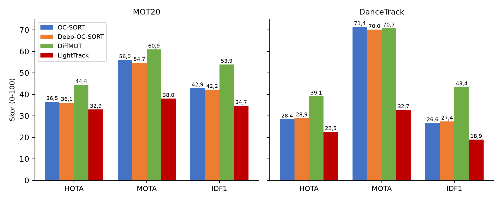
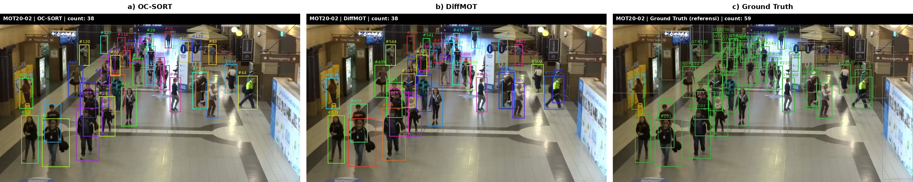

## 4.2. Multi-Object Tracking Results

Subbab ini mengevaluasi lapisan *tracker* yang menghubungkan kotak deteksi antar *frame* menjadi identitas temporal. Empat tracker dibandingkan pada deteksi yang identik, yaitu YOLO26s *fine-tune* CrowdHuman dari subbab 4.1: OC-SORT (Cao et al., 2023 – S024) sebagai baseline gerak murni, Deep-OC-SORT (Maggiolino et al., 2024 – S049) yang menambahkan Re-ID adaptif, DiffMOT (Lv et al., 2024 – S021) yang berbasis *diffusion* dan Re-ID, serta reimplementasi LightTrack-ReID (Khan et al., 2026 – S014) sebagai eksplorasi. Evaluasi memakai TrackEval 1.3.0 pada MOT20-*train* (4 sekuens, 8.931 *frame*) dan DanceTrack-*val* (25 sekuens, 25.508 *frame*). Karena deteksi berasal dari model yang sama pada seluruh tracker, perbandingan yang sah adalah antar tracker, bukan terhadap angka *leaderboard* yang memakai deteksi resmi.

### 4.2.1. Akurasi Pelacakan

**Tabel 5.** Hasil TrackEval pada deteksi YOLO26 yang sama (MOT20-*train* dan DanceTrack-*val*).

| Benchmark | Tracker | HOTA | MOTA | IDF1 | IDSW | Frag |
| :--- | :--- | :---: | :---: | :---: | :---: | :---: |
| MOT20 | OC-SORT | 36,51 | **55,98** | 42,88 | 14.293 | 27.646 |
| MOT20 | Deep-OC-SORT | 36,12 | 54,70 | 42,16 | 11.751 | 29.729 |
| MOT20 | **DiffMOT** | **44,37** | **60,91** | **53,86** | **6.905** | **15.005** |
| MOT20 | LightTrack | 32,92 | 38,00 | 34,69 | 13.121 | 8.863 |
| DanceTrack | OC-SORT | 28,39 | **71,38** | 26,63 | 6.701 | 6.936 |
| DanceTrack | Deep-OC-SORT | 28,91 | 70,05 | 27,38 | 5.948 | 8.053 |
| DanceTrack | **DiffMOT** | **39,05** | 70,72 | **43,39** | **2.784** | 6.765 |
| DanceTrack | LightTrack | 22,53 | 32,72 | 18,91 | 6.697 | 4.405 |

Pada kerumunan padat MOT20, kepadatan deteksi mencapai rata-rata 179 kotak per *frame* dengan puncak 272, dan di kondisi inilah perbedaan antar tracker terlihat (Gambar 3). OC-SORT mencatat MOTA 55,98, yang menunjukkan deteksi menutupi mayoritas orang, tetapi 14.293 ID *switch* dan 27.646 fragmentasi menandakan asosiasi berbasis IoU dan Kalman mudah putus saat orang saling menutupi. IDF1 42,88 berarti sekitar 57% bobot identitas tidak cocok dengan *ground truth*; bagi penghitungan orang, ketidakcocokan ini berarti orang yang tertutup beberapa *frame* lalu terdeteksi ulang berpotensi dihitung sebagai orang baru.

**Gambar 3.** HOTA, MOTA, dan IDF1 untuk empat *tracker* pada deteksi yang sama, di MOT20-*train* (kiri) dan DanceTrack-*val* (kanan).

Contoh kualitatif pada Gambar 4 memperlihatkan *frame* yang sama dari sekuens MOT20-02 pada tengah durasi klip. Kedua *tracker* sama-sama melacak 38 orang pada *frame* tersebut, sedangkan anotasi *ground truth* mencatat 59 — selisih 21 orang terkonsentrasi pada kerumunan padat di latar tengah yang tertutup saling menutupi. Perbedaan kualitas antar *tracker* tidak terbaca dari jumlah pada satu *frame*, melainkan dari kestabilan ID lintas waktu; *frame* statis tidak menyajikan perbedaan itu, sehingga penilaian kualitatif memakai klip video pada repositori eksperimen.

**Gambar 4.** *Frame* MOT20-02 dengan hasil pelacakan (a) OC-SORT, (b) DiffMOT, dan (c) anotasi *ground truth*. Kotak berwarna menandai identitas terlacak; label di atas kotak adalah ID.

Perbaikan terbesar datang dari DiffMOT. Pada MOT20, IDSW turun 52% menjadi 6.905 dan IDF1 naik 10,98 poin menjadi 53,86; pada DanceTrack yang menguji gerak non-linear dengan penampilan seragam, HOTA naik 10,66 poin menjadi 39,05 dan IDF1 naik 16,76 poin menjadi 43,39. Penambahan Deep-OC-SORT justru hampir tidak mengubah akurasi agregat dibandingkan OC-SORT (HOTA MOT20 36,12 vs 36,51), tetapi menurunkan IDSW dari 14.293 menjadi 11.751 pada MOT20 dan dari 6.701 menjadi 5.948 pada DanceTrack. Re-ID adaptifnya bekerja pada stabilitas identitas, tetapi efeknya berbeda jauh antar benchmark: IDSW turun 17,8% pada MOT20, sedangkan pada DanceTrack penurunannya hanya sekitar 11% (6.701 menjadi 5.948), jauh di bawah penurunan yang dihasilkan DiffMOT. Sementara itu, reimplementasi LightTrack-ReID berada di bawah kedua baseline pada sebagian besar metrik asosiasi, sehingga pada kondisi saat ini arsitektur tersebut belum direkomendasikan sebagai tracker utama.

Dua konsekuensi ditarik dari tabel ini. Pertama, pembatas sistem adalah asosiasi, bukan deteksi; HOTA yang konsisten jauh di bawah MOTA pada kedua benchmark menunjukkan komponen asosiasi lebih lemah daripada komponen deteksi. Kedua, IDF1 adalah metrik yang paling relevan bagi penghitungan orang, dan pada metrik itu DiffMOT unggul nyata. Meskipun demikian, DiffMOT membutuhkan GPU, berupa sistem *black-box* yang tidak dapat di-*fine-tune* pada data sendiri, dan bergantung pada *patch* dependensi yang rapuh; publikasinya melaporkan sekitar 22,7 FPS pada RTX 3090. Pertimbangan akurasi dan biaya ini yang mendasari pemilihan tracker pada subbab 4.3 dan 4.5: Deep-OC-SORT dipilih sebagai tracker utama sistem, dengan DiffMOT sebagai pembanding kualitas.
