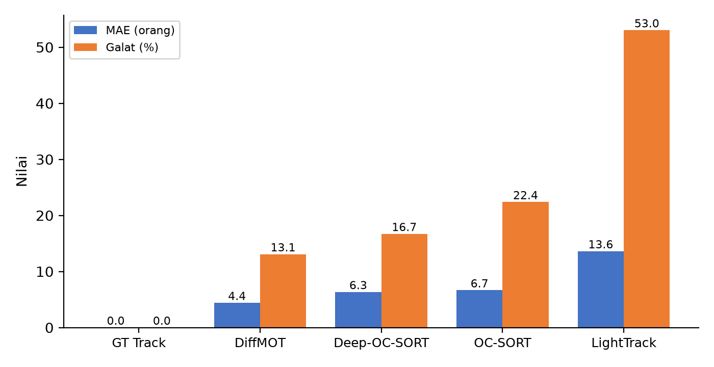

## 4.3. People Counting Results

Subbab ini mengevaluasi lapisan terakhir pipeline, yaitu logika penghitungan yang menerjemahkan lintasan menjadi hitungan orang. Empat tracker berbeda menghasilkan kualitas lintasan yang berbeda, sehingga logika hitung diuji pada masing-masing jalur tracker di seluruh 29 sekuens benchmark (MOT20 dan DanceTrack). Dua algoritma dibandingkan: *naive line crossing* yang murni menghitung persilangan garis vektor 2D tanpa memori status, serta *state machine* dengan *debouncing* yang mengelola status per ID melalui tahapan pelacakan, penghitungan, dan *cooldown*. Sebagai referensi, *state machine* yang sama dijalankan pada lintasan *ground truth* murni.

### 4.3.1. Akurasi Hitungan Agregat

**Tabel 6.** Akurasi hitungan agregat pada 29 sekuens (state machine, cooldown 30 *frame*; throughput diukur pada RTX 4090).

| Jalur pelacakan | Peran | Rata-rata GT | Rata-rata prediksi | MAE | Galat (%) | RMSE interval | Throughput (FPS) |
| :--- | :--- | :---: | :---: | :---: | :---: | :---: | :---: |
| Ground truth track | Referensi | 44,62 | 44,62 | 0,00 | 0,00 | 0,00 | − |
| DiffMOT | Pembanding kualitas | 44,62 | 41,03 | **4,41** | **13,08** | **3,25** | 20,0 |
| Deep-OC-SORT | Tracker utama | 44,62 | 42,28 | 6,34 | 16,71 | 4,16 | 40,6 |
| OC-SORT | Baseline awal | 44,62 | 45,00 | 6,66 | 22,38 | 4,31 | 54,0+ |
| LightTrack | Eksplorasi | 44,62 | 57,76 | 13,62 | 53,03 | 9,57 | 49,3 |

**Gambar 5.** MAE dan galat hitung rata-rata per jalur pelacakan pada 29 sekuens.

Dua hal terbaca langsung dari Tabel 6 (Gambar 5). Pertama, logika hitung tidak menambah galat pada lintasan ideal; *state machine* pada lintasan *ground truth* menghasilkan galat nol, sehingga galat pada baris-baris lainnya terutama berasal dari ketidaksempurnaan deteksi dan pelacakan di hulunya. Kedua, peringkat akurasi hitungan mengikuti kualitas asosiasi tracker: DiffMOT yang memiliki IDF1 tertinggi pada subbab 4.2 juga menghasilkan galat hitung terendah (13,08%), dan LightTrack yang IDF1-nya terendah justru menghasilkan galat terbesar (53,03%) dengan kecenderungan *over-count* yang kuat (prediksi rata-rata 57,76 melawan 44,62). Deep-OC-SORT mencapai galat 16,71% dengan prediksi yang cenderung kurang hitung, dan pada titik ini dipilih sebagai tracker utama sistem karena galatnya rendah sekaligus mempertahankan *throughput* 40,6 FPS; pertimbangan biayanya dirinci pada subbab 4.5. Galat 13,08–16,71% pada jalur utama mencakup lantai deteksi 7,4–10,0% dari subbab 4.1 yang tidak dapat diperbaiki oleh *tracker* maupun logika hitung.

### 4.3.2. Ablasi State Machine terhadap Naive Line Crossing

**Tabel 7.** Ablasi logika hitung (rata-rata lintas sekuens).

| Model | Karakteristik | Galat rata-rata | Perilaku |
| :--- | :--- | :---: | :--- |
| Naive (tanpa debounce) | Persilangan garis murni | Galat rata-rata 88,7–155,1% bergantung jalur tracker | *Over-count* parah |
| State machine (CD=30) | Status per ID + *cooldown* | 16,71% | Stabil |
| State machine (CD=15) | *Cooldown* pendek | 27,13% | Lebih tepat untuk arus pejalan cepat |

Mekanisme kegagalan model *naive* bersifat sistematis: getaran spasial kotak deteksi di sekitar garis virtual memicu event persilangan palsu berulang, orang yang berdiam di dekat garis terhitung berkali-kali, dan pergantian identitas memicu event ganda. *State machine* menghilangkan seluruh *over-count* palsu tersebut dengan mengingat status setiap ID sehingga satu orang hanya terhitung sekali. Studi sensitivitas nilai *cooldown* yang menentukan rentang optimalnya dibahas pada subbab 4.4.

**[PLACEHOLDER GAMBAR 9 — screenshot dashboard web `src/web/` saat sesi counting berjalan]**

**[PANDUAN SCREENSHOT: jalankan `python -m src.web.server --source <video.mp4>` (sumber: index webcam, file MP4, atau URL RTSP; tracker default deepocsort; tambahkan `--ssl` bila pakai kamera HP), buka dashboard di browser di `http://localhost:8000`, jalankan sesi counting, pastikan terlihat: (1) panel video dengan overlay deteksi/tracking, (2) garis hitung virtual atau RoI yang aktif, (3) counter IN/OUT yang bertambah saat orang melintas, (4) indikator FPS. Ambil screenshot saat angka counter sudah bergerak (bukan nol) agar menunjukkan event hitung nyata. Simpan sebagai `experiments/journal_figs/fig9_web_dashboard.png`, resolusi minimal 1280 px. Setelah terisi, hapus blok placeholder ini dan biarkan paragraf di bawah.]**

Selain uji kuantitatif pada *benchmark*, sistem dijalankan melalui antarmuka *web dashboard* yang memaketkan seluruh *pipeline* — *streaming* video, overlay deteksi dan pelacakan, garis hitung virtual, serta penghitung masuk-keluar — dalam satu halaman. **[Gambar 9]** memperlihatkan *dashboard* tersebut saat sesi penghitungan berjalan: panel video menampilkan hasil deteksi dan identitas terlacak secara langsung, garis hitung terdefinisi pada koordinat *frame*, dan penghitung masuk-keluar bertambah setiap lintasan sah melewatinya, dengan indikator *throughput* yang memantau kelayakan *real-time* selama sesi berjalan. Antarmuka ini menjadi bukti bahwa keluaran yang dievaluasi pada Tabel 6 terhubung ke sistem utuh yang dapat dioperasikan, bukan skrip evaluasi yang berdiri sendiri.
