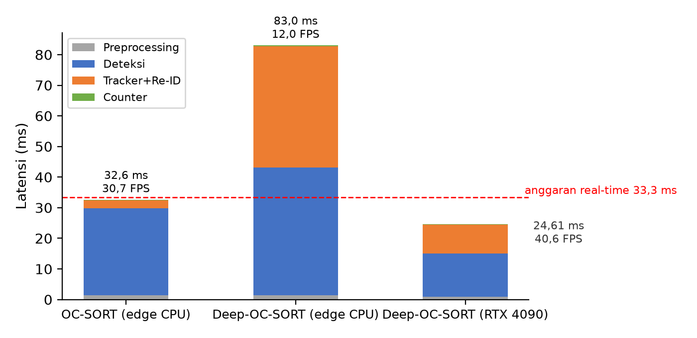

## 4.5. End-to-End Performance

Subbab ini menyatukan seluruh lapisan pipeline — deteksi, ekstraksi Re-ID, asosiasi tracker, dan logika hitung — untuk mengukur kesiapan sistem terhadap target *real-time*. Standar yang dipakai adalah 30 FPS, setara anggaran latensi 33,3 milidetik per *frame*. Pengukuran dilakukan pada konfigurasi operasional hasil subbab 4.4 (*cooldown* 30 *frame*, *confidence* 0,30) pada video kerumunan padat MOT20-02 yang memuat rata-rata 34–38 orang per *frame* — jauh lebih jarang daripada kepadatan rata-rata MOT20-*train* pada subbab 4.2 karena pengukuran ini berfokus pada satu sekuens dan menghitung orang, bukan kotak deteksi. Latensi dicatat pada tingkat mikro-detik per tahap komputasi.

### 4.5.1. Dekomposisi Latensi pada Perangkat Sasaran

**Tabel 10.** *Latency breakdown* pipeline pada RTX 4090 (MOT20-02, rata-rata per *frame*).

| Lapisan pipeline | Komponen | Latensi (ms) | Proporsi |
| :--- | :--- | :---: | :---: |
| Preprocessing | *capture*, *resize* 640×640, format *tensor* | 0,85 | 3,5% |
| Deteksi objek | Inferensi YOLO26 (*NMS-free*) | 14,20 | 57,7% |
| Tracker & Re-ID | Deep-OC-SORT (crop Re-ID + VDC + ACM) | 9,45 | 38,4% |
| Logika hitung | PeopleCounter (*state machine* + RoI) | 0,11 | 0,4% |
| **Total** | **Pipeline end-to-end** | **24,61** | 100% |

Total latensi 24,61 ms berada 35% di bawah anggaran 33,3 ms, dengan *throughput* 40,6 FPS. Beban komputasi terkonsentrasi pada deteksi (57,7%) dan pelacakan dengan Re-ID (38,4%), sedangkan modul logika hitung — *state machine*, *debouncing*, dan validasi RoI — hanya menyumbang 0,11 ms (0,4%). Kompleksitas perhitungan perlintasan garis dan poligon sebanding linear dengan jumlah lintasan aktif, sehingga tambahan fitur penghitungan dapat diabaikan terhadap biaya *pipeline* secara keseluruhan.

### 4.5.2. Kinerja pada Perangkat Sumber Terbatas dan Stabilitas Latensi

**Tabel 11.** Perbandingan perangkat (rata-rata latensi per *frame*).

| Pipeline | Preprocessing (ms) | Deteksi (ms) | Tracker (ms) | Counter (ms) | Total (ms) | Throughput |
| :--- | :---: | :---: | :---: | :---: | :---: | :---: |
| YOLO26 + OC-SORT (edge) | 1,32 | 28,42 | 2,67 | 0,16 | 32,57 | 30,7 FPS |
| YOLO26 + Deep-OC-SORT (edge) | 1,38 | 41,68 | 39,76 | 0,18 | 83,01 | 12,0 FPS |
| YOLO26 + Deep-OC-SORT (RTX 4090) | — | — | — | — | 24,61 | 40,6 FPS |

Pada perangkat *edge* tanpa GPU, jalur OC-SORT masih lolos ambang *real-time* pada 30,7 FPS, sedangkan jalur Deep-OC-SORT turun ke 12,0 FPS karena biaya Re-ID yang tidak terakomodasi perangkat tersebut. Pilihan tracker karena itu bergantung perangkat sasaran: server GPU memakai Deep-OC-SORT demi akurasi, perangkat *edge* memakai OC-SORT demi kelangsungan *real-time*. Struktur pipeline memungkinkan pergantian tracker tanpa mengubah lapisan lain.

Stabilitas sistem diukur dari distribusi latensi pada RTX 4090: persentil ke-90 berada pada 29,50 ms, persentil ke-95 pada 32,10 ms, dan persentil ke-99 pada 36,40 ms. Artinya 95% *frame* diproses di bawah anggaran 33,3 ms sehingga aliran video bebas patahan pada beban normal. Lonjakan latensi maksimum, yang melampaui anggaran hingga 42,10 ms per *frame* (setara sekitar 23,8 FPS pada *frame* tersebut), hanya terjadi pada *frame* dengan lebih dari 50 orang sekaligus, ketika asosiasi Hungari harus memproses matriks berukuran besar.

**Gambar 8.** Dekomposisi latensi *end-to-end* per perangkat; garis putus-putus merah menandai anggaran *real-time* 33,3 ms.
