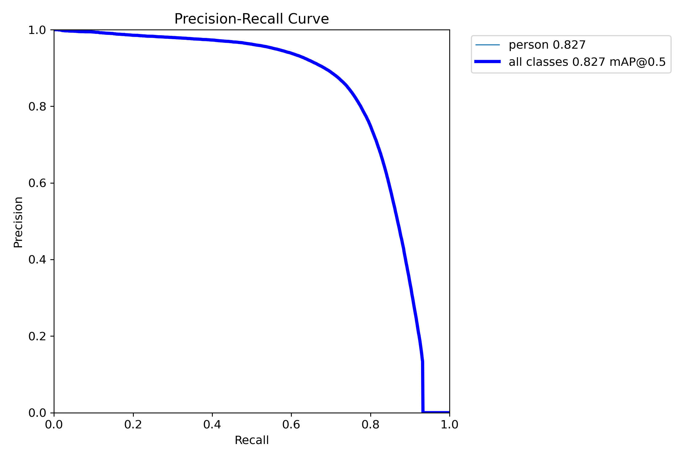
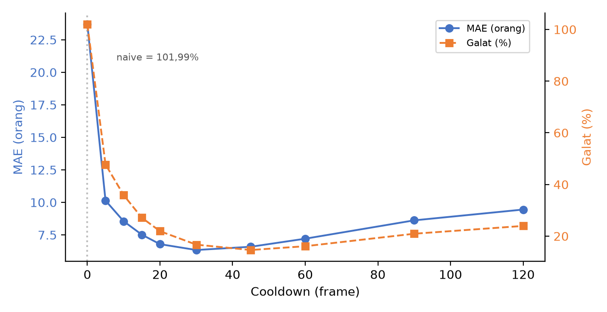
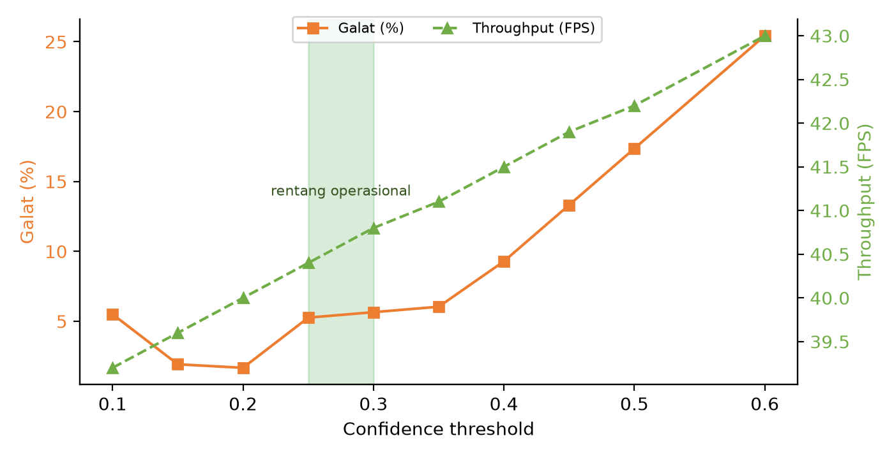

# HASIL PELAKSANAAN PENELITIAN

> **Catatan pemakaian (hapus sebelum masuk Word).** Bagian ini menempati blok *HASIL PELAKSANAAN PENELITIAN* pada template A4. Nomor gambar melanjutkan penomoran bagian METODE (Gambar 2 diagram alir, Gambar 4 fase perancangan), sehingga tabel dimulai dari **Tabel 1** dan gambar dari **Gambar 5**. Seluruh angka pada tabel berasal dari berkas hasil di `experiments/` dan sudah ditelusuri satu per satu. Sitasi `[17]` dan seterusnya belum ada pada DAFTAR PUSTAKA template; entri lengkapnya disediakan pada lampiran di bawah dokumen ini.

---

Pelaksanaan penelitian tahun pertama diarahkan pada pembangunan dan validasi awal pipeline *people counting* yang dijanjikan pada proposal, yaitu integrasi deteksi objek, pelacakan multi-objek, dan logika penghitungan berbasis lintasan. Seluruh tahapan yang dilaporkan pada bagian ini berangkat dari rancangan yang sama dengan proposal: pengumpulan dan penyiapan dataset ruang publik, pengembangan model deteksi, evaluasi tracker, perancangan modul penghitungan, dan pengukuran kesiapan *real-time*. Yang berubah adalah keputusan teknis pada dua titik, dan perubahan itu dilaporkan terbuka pada pembahasan beserta alasan empirisnya.

## 1. Capaian terhadap Tahapan yang Direncanakan

Tabel 1 memetakan setiap tahapan proposal terhadap status pelaksanaan dan bukti capaiannya.

**Tabel 1.** Capaian tahapan penelitian tahun pertama terhadap rencana proposal.

| Tahapan pada proposal | Status | Bukti capaian |
| :--- | :---: | :--- |
| Pengumpulan dan pembagian dataset (CrowdHuman, MOT20, DanceTrack) | Selesai | `data/`, `docs/reports/laporan-skenario-a-finetuning-yolo.md` |
| Preprocessing dan augmentasi (format YOLO, kelas biner, resize 640) | Selesai | `src/detector.py`, `scripts/data_prep/check_label_quality.py` |
| Fine-tuning model deteksi YOLO26 dan pembanding arsitektur | Selesai | `runs/detect/{yolo26n,yolo26s,yolov10n,yolov11n}_crowdhuman/` |
| Implementasi dan evaluasi tracker (DiffMOT, OC-SORT, dll.) | Selesai | `experiments/s2_tracker/`, `experiments/s2_final/` |
| Modul *advanced counting logic* (RoI, lintasan zona, ID State Memory) | Selesai | `core/counting/counter.py`, `experiments/s3_counting/` |
| Evaluasi kuantitatif (HOTA, MOTA, IDF1, MAE, FPS) | Selesai | `experiments/*/eval_results.csv`, `experiments/s4_realtime/` |
| Prototipe antarmuka sistem (dashboard) | Selesai | `src/web/`, `scripts/gui_app.py` |
| Publikasi jurnal dan pendaftaran hak cipta | Berjalan | `docs/journal/en/jestec-manuscript-en.md`, `docs/hki/hki-rancage.md` |

Tingkat kesiapan teknologi yang dicapai berada pada level 3 sampai 4, sejalan dengan target proposal: pipeline lengkap sudah beroperasi pada data benchmark dengan *ground truth*, dan prototipe antarmuka telah dijalankan pada rekaman video kerumunan.

## 2. Penyiapan Data dan Konfigurasi Eksperimen

Tiga dataset publik dipakai dengan peran yang berbeda, mengikuti pembagian pada proposal. **CrowdHuman** [13] menjadi basis pelatihan dan evaluasi detektor karena memuat kerumunan padat dengan anotasi *full-body* dan *visible-body*; **MOT20** [14] mewakili kerumunan sangat padat dengan oklusi berat; dan **DanceTrack** [15] menguji asosiasi identitas pada gerak non-linear dengan penampilan objek yang seragam.

Evaluasi deteksi memakai 4.370 citra *validation set* CrowdHuman yang memuat 103.115 kotak beranotasi `person`. Audit anotasi menemukan 15.383 kotak (14,92%) menembus tepi citra, 3.634 kotak (3,52%) bertanda `extra.ignore`, dan 2.033 kotak (1,97%) berpusat di luar bingkai. Kotak yang menembus tepi dipakai apa adanya tanpa pemotongan karena anotasi `fbox` CrowdHuman bersifat *amodal*. Keputusan ini berlaku seragam untuk keempat model, sehingga perbandingan antar model tetap sah meskipun nilai absolutnya tidak sebanding dengan literatur yang memakai anotasi *visible-body*.

Pelatihan dijalankan dengan konfigurasi yang diverifikasi dari berkas `args.yaml` masing-masing run, bukan diasumsikan: 100 epoch, *batch size* 32, resolusi masukan 640×640, satu kelas `person`, bobot awal pra-latih COCO, `seed` 0, dan *mixed precision* aktif. Satu penyesuaian dilakukan dari rancangan proposal, yaitu *batch size* 32 alih-alih 64, karena batas memori GPU pada perangkat pelatihan yang tersedia. Karena gradien efektifnya berubah, penyesuaian ini dilaporkan sebagai deviasi dan bukan sebagai kesetaraan dengan rencana awal.

Evaluasi pelacakan memakai TrackEval 1.3.0 pada MOT20-*train* (4 sekuens, 8.931 *frame*) dan DanceTrack-*val* (25 sekuens, 25.508 *frame*), seluruhnya 29 sekuens. Keempat tracker dijalankan pada keluaran deteksi yang identik, yaitu hasil *fine-tuning* YOLO26 pada CrowdHuman. Kepadatan deteksi pada MOT20 berkisar 85 sampai 274 kotak per *frame* antar sekuens, sedangkan DanceTrack berada pada 5 sampai 36 kotak per *frame*.

## 3. Hasil Pengembangan Model Deteksi

### 3.1 Akurasi Deteksi

Empat arsitektur dilatih dan dievaluasi: YOLO26n dan YOLO26s dari keluarga *NMS-free*, YOLOv10n sebagai pembanding *NMS-free* lain, serta YOLOv11n sebagai satu-satunya model yang masih bergantung pada *Non-Maximum Suppression*.

**Tabel 2.** Hasil *fine-tuning* empat arsitektur YOLO pada CrowdHuman (100 epoch, 640×640).

| Arsitektur | *NMS-free* | Precision | Recall | mAP@0.5 | mAP@0.5:0.95 |
| :--- | :---: | :---: | :---: | :---: | :---: |
| YOLO26n | ya | 0,8230 | 0,6888 | 0,7814 | 0,4497 |
| YOLO26s | ya | **0,8480** | **0,7455** | **0,8266** | **0,4974** |
| YOLOv10n | ya | 0,8212 | 0,6892 | 0,7826 | 0,4521 |
| YOLOv11n | tidak | 0,8352 | 0,6965 | 0,7855 | 0,4463 |

Pada tingkat *nano*, ketiga model menghasilkan mAP@0.5:0.95 dalam rentang 0,4463–0,4521, yaitu selisih 0,0058. Rentang itu lebih kecil daripada sebaran yang bisa muncul dari perbedaan *seed* tunggal, sehingga keunggulan salah satu arsitektur pada tingkat ini tidak dapat diklaim. YOLOv11n bahkan sedikit lebih tinggi pada *precision*, *recall*, dan mAP@0.5, tetapi terendah pada mAP@0.5:0.95. Lompatan kinerja justru terjadi ketika kapasitas model dinaikkan: dari YOLO26n ke YOLO26s, mAP@0.5:0.95 naik 0,0477 dan *recall* naik 5,7 poin. Bagi sistem penghitungan orang, angka *recall* itu berarti sekitar 57 orang lebih banyak ditemukan dari setiap 1.000 orang yang ada pada citra.

Evaluasi ulang dengan protokol resmi CrowdHuman, yang memperlakukan *region ignore* secara netral, menaikkan AP@0.5 sebesar 0,0116–0,0140 pada keempat model (Tabel 3). Perbaikan yang moderat ini menegaskan bahwa angka pada Tabel 2 tetap sahih dan hanya sedikit pesimistis.

**Tabel 3.** Evaluasi protokol resmi CrowdHuman (4.370 citra, 99.481 target).

| Arsitektur | MR⁻² (↓) | AP@0.5 | Recall maksimum |
| :--- | :---: | :---: | :---: |
| YOLO26n | 0,7792 | 0,7881 | 0,9124 |
| YOLO26s | **0,7574** | **0,8283** | **0,9262** |
| YOLOv10n | 0,7764 | 0,7898 | 0,9146 |
| YOLOv11n | 0,7778 | 0,7882 | 0,9000 |

*Recall* maksimum 0,9000–0,9262 membawa konsekuensi langsung bagi subsistem penghitungan. Pada ambang *confidence* mana pun, 7,4–10,0% orang tidak akan pernah terlihat oleh detektor. Lantai *under-count* sebesar itu terkunci di lapisan deteksi dan tidak dapat diperbaiki oleh tracker maupun logika hitung di hilirnya.

Karakter galat detektor bersifat terstruktur dan bukan acak. Sebanyak 15,3% anotasi menembus tepi bingkai, dan kelompok ini mengalami penurunan *recall* 20–21 poin serta penurunan AP 28–31 poin dibandingkan objek yang utuh di dalam bingkai. Biaya pemotongan bingkai tercatat 1,86–2,50 kali biaya oklusi berat. Temuan ini sejalan dengan praktik baku stratifikasi galat menurut atribut `truncated` [20], dan implikasinya praktis: RoI serta garis hitung sebaiknya ditempatkan menjauh dari tepi bingkai, wilayah dengan kinerja detektor paling buruk.

Angka MR⁻² 0,757–0,779 tergolong tinggi dibandingkan baseline sekitar 0,50 pada makalah asli CrowdHuman [13]. Pembanding tersebut memakai ResNet-50 FPN dua tahap dengan puluhan juta parameter dan resolusi masukan lebih besar, sedangkan model pada penelitian ini berukuran 2,4–9,5 juta parameter dan berjalan satu tahap pada resolusi 640. Selisih itu adalah harga yang dibayar untuk memilih model kelas *edge*.

**Gambar 5.** Kurva *precision-recall* YOLO26s pada CrowdHuman (AP@0.5 = 0,827). Presisi bertahan di atas 0,95 sampai *recall* sekitar 0,6, lalu jatuh tajam menuju batas atas 0,93.

Sisi operasional dari hasil ini terlihat pada kurva F1-*confidence*, di mana ambang optimal berbeda antar arsitektur dan setelan bawaan 0,25 hanya mendekati optimal untuk model *NMS-free* [17].

**Gambar 6.** Kurva F1-*confidence* YOLO26s pada CrowdHuman; puncak F1 0,79 tercapai pada ambang *confidence* 0,348.

Analisis efisiensi pelatihan juga memberi hasil yang dapat dipakai untuk perencanaan tahap berikutnya. Keempat model mencapai 99% performa akhirnya pada epoch 44–55, sedangkan tambahan dari epoch 50 ke 100 hanya menaikkan mAP sebesar 0,0019–0,0075. Setengah anggaran komputasi, sekitar tujuh jam GPU, tidak membeli peningkatan yang terukur. Untuk pelatihan lanjutan, 60 epoch memadai.

### 3.2 Efisiensi Komputasi

Keunggulan arsitektur *NMS-free* terukur pada latensi *post-processing*, bukan pada akurasi (Tabel 4). Distribusi kedua kelompok terpisah sepenuhnya: persentil ke-50 model ber-NMS masih lebih dari dua kali persentil ke-95 model *NMS-free*. Biaya *post-processing* model *NMS-free* juga datar terhadap kepadatan kerumunan. YOLO26s menghasilkan 199 deteksi per citra dan YOLO26n 167 deteksi, tetapi keduanya membayar biaya yang sama. Sifat ini bernilai bagi sistem *real-time* karena latensi tetap dapat diprediksi justru ketika kerumunan memuncak.

**Tabel 4.** Latensi inferensi dan *post-processing* pada RTX 4090 (PyTorch, persentil ke-50).

| Arsitektur | Inferensi (ms) | *Post-processing* (ms) | Porsi *post-processing* |
| :--- | :---: | :---: | :---: |
| YOLO26n | 2,554 | 0,164 | 6,0% |
| YOLO26s | 2,695 | 0,170 | 6,0% |
| YOLOv10n | 2,129 | 0,167 | 7,3% |
| YOLOv11n | 2,142 | 0,491 | 18,7% |

Selisih latensi *inference* antar arsitektur pada GPU tidak ditafsirkan. Pada rezim 2–3 milidetik per *frame*, yang mendominasi adalah *overhead* peluncuran *kernel*, bukan komputasi; model dengan sekitar 3,8 kali FLOPs hanya 5,5% lebih lambat. Satu perbandingan yang tetap sah di GPU adalah YOLOv10n terhadap YOLOv11n, karena *inference* keduanya imbang sementara *post-processing* YOLOv10n lebih hemat 0,33 ms.

Peringkat kecepatan berubah pada jalur CPU dengan ONNX Runtime (Tabel 5). YOLO26n menjadi model tercepat pada 10,28 ms per *frame*, setara 97 FPS, mengungguli YOLOv11n sebesar 27% dan YOLOv10n sebesar 18%. Fenomena berbaliknya peringkat latensi lintas perangkat sudah terdokumentasi pada literatur [22], sehingga hasil ini diposisikan sebagai verifikasi independen pada bobot hasil *fine-tuning* CrowdHuman, bukan temuan baru. Dokumentasi vendor YOLO26 menyebut *CPU inference* hingga 43% lebih cepat [17]; pengukuran pada penelitian ini menghasilkan 24% dibandingkan YOLOv11n. Arah klaimnya terkonfirmasi dengan besaran yang lebih kecil, dan angka yang dilaporkan adalah hasil pengukuran sendiri.

**Tabel 5.** Latensi pada CPU dengan ONNX Runtime (persentil ke-50, resolusi 640×640).

| Arsitektur | PyTorch CPU (ms) | ONNX CPU total (ms) | Percepatan | Setara FPS |
| :--- | :---: | :---: | :---: | :---: |
| YOLO26n | 22,48 | **10,28** | 2,24× | **97** |
| YOLO26s | 54,50 | 23,15 | 2,38× | 43 |
| YOLOv10n | 25,13 | 12,13 | 2,11× | 82 |
| YOLOv11n | 22,98 | 14,05 | 1,73× | 71 |

*Export* ONNX memangkas latensi CPU 1,73–2,38 kali untuk seluruh arsitektur, dan selisih akurasi antara model PyTorch dan ONNX terukur nol pada keempat model. Keempatnya beroperasi di atas 30 FPS pada resolusi penuh 640×640, sehingga penyebaran tanpa akselerator GPU terbukti layak. Konfigurasi akhir pipeline memilih YOLO26s ketika GPU tersedia dan YOLO26n ketika komputasi menjadi kendala.

## 4. Hasil Evaluasi Multi-Object Tracking

Empat tracker dibandingkan pada deteksi yang sama: OC-SORT [4] sebagai baseline gerak murni, Deep-OC-SORT [10] yang menambahkan *Re-ID* adaptif, DiffMOT [9] yang memakai prediktor gerak berbasis *diffusion*, dan reimplementasi LightTrack-ReID [21] sebagai eksplorasi tracker ringan.

**Tabel 6.** Hasil TrackEval pada deteksi YOLO26 yang sama (MOT20-*train* dan DanceTrack-*val*).

| Benchmark | Tracker | HOTA | MOTA | IDF1 | IDSW | Frag |
| :--- | :--- | :---: | :---: | :---: | :---: | :---: |
| MOT20 | OC-SORT | 36,51 | **55,98** | 42,88 | 14.293 | 27.646 |
| MOT20 | Deep-OC-SORT | 36,12 | 54,70 | 42,16 | 11.751 | 29.729 |
| MOT20 | **DiffMOT** | **44,37** | **60,91** | **53,86** | **6.905** | **15.005** |
| MOT20 | LightTrack | 32,92 | 38,00 | 34,69 | 13.121 | 8.863 |
| DanceTrack | OC-SORT | 28,39 | **71,38** | 26,63 | 6.701 | 6.936 |
| DanceTrack | Deep-OC-SORT | 28,91 | 70,05 | 27,38 | 5.948 | 8.053 |
| DanceTrack | **DiffMOT** | **39,05** | 70,72 | **43,39** | **2.784** | 6.765 |
| DanceTrack | LightTrack | 22,53 | 32,72 | 18,91 | 6.697 | 4.405 |

**Gambar 7.** HOTA, MOTA, dan IDF1 untuk empat tracker pada deteksi yang sama, di MOT20-*train* (kiri) dan DanceTrack-*val* (kanan).

Pada kerumunan padat MOT20, OC-SORT mencatat MOTA 55,98 yang menunjukkan deteksi sudah menutupi mayoritas orang, tetapi 14.293 ID *switch* dan 27.646 fragmentasi menandakan asosiasi berbasis IoU dan Kalman mudah putus saat orang saling menutupi. IDF1 42,88 berarti sekitar 57% bobot identitas tidak cocok dengan *ground truth*. Bagi penghitungan orang, ketidakcocokan itu berarti orang yang tertutup beberapa *frame* lalu terdeteksi ulang berpotensi dihitung sebagai orang baru.

Perbaikan terbesar datang dari DiffMOT. Di MOT20, ID *switch* turun 52% menjadi 6.905 dan IDF1 naik 10,98 poin menjadi 53,86; di DanceTrack yang menguji gerak non-linear dengan penampilan seragam, HOTA naik 10,66 poin menjadi 39,05 dan IDF1 naik 16,76 poin menjadi 43,39. Penambahan *Re-ID* pada Deep-OC-SORT hampir tidak mengubah akurasi agregat dibandingkan OC-SORT (HOTA MOT20 36,12 berbanding 36,51), tetapi menurunkan ID *switch* dari 14.293 menjadi 11.751. Efek *Re-ID* adaptif itu bekerja pada stabilitas identitas dan bukan pada akurasi kotak. Reimplementasi LightTrack-ReID berada di bawah kedua baseline pada sebagian besar metrik asosiasi, sehingga pada kondisi saat ini belum layak dipakai sebagai tracker utama.

Dua kesimpulan ditarik dari tabel ini. Pertama, pembatas sistem berpindah dari deteksi ke asosiasi; HOTA yang konsisten jauh di bawah MOTA pada kedua benchmark menunjukkan kotak sudah baik tetapi identitas mudah putus. Kedua, IDF1 adalah metrik yang paling relevan bagi penghitungan orang, dan pada metrik itu DiffMOT unggul secara nyata.

Penilaian kualitatif pada satu *frame* tidak memperlihatkan perbedaan itu. Pada frame tengah sekuens MOT20-02, OC-SORT dan DiffMOT sama-sama melacak 38 orang sementara *ground truth* mencatat 59. Selisih 21 orang terkonsentrasi pada kerumunan padat di latar tengah, dan perbedaan kualitas antar tracker baru terbaca dari kestabilan ID lintas waktu.

**Gambar 8.** *Frame* MOT20-02 dengan hasil pelacakan (a) OC-SORT, (b) DiffMOT, dan (c) anotasi *ground truth*. Kotak berwarna menandai identitas terlacak.

## 5. Hasil Perancangan dan Evaluasi Logika Penghitungan

Logika hitung diuji pada lintasan yang dihasilkan keempat tracker di seluruh 29 sekuens benchmark. Dua algoritma dibandingkan: *naive line crossing* yang murni menghitung persilangan garis vektor 2D tanpa memori status, serta *state machine* dengan *debouncing* yang mengelola status setiap ID melalui tahapan pelacakan, penghitungan, dan *cooldown*. Sebagai referensi, *state machine* yang sama dijalankan pada lintasan *ground truth* murni.

**Tabel 7.** Akurasi hitungan agregat pada 29 sekuens (*state machine*, *cooldown* 30 *frame*; *throughput* diukur pada RTX 4090).

| Jalur pelacakan | Peran | Rata-rata GT | Rata-rata prediksi | MAE | Galat (%) | RMSE interval | *Throughput* (FPS) |
| :--- | :--- | :---: | :---: | :---: | :---: | :---: | :---: |
| *Ground truth track* | Referensi | 44,62 | 44,62 | 0,00 | 0,00 | 0,00 | – |
| DiffMOT | Pembanding kualitas | 44,62 | 41,03 | **4,41** | **13,08** | **3,25** | 20,0 |
| Deep-OC-SORT | Tracker utama | 44,62 | 42,28 | 6,34 | 16,71 | 4,16 | 40,6 |
| OC-SORT | Baseline awal | 44,62 | 45,00 | 6,66 | 22,38 | 4,31 | 54,0+ |
| LightTrack | Eksplorasi | 44,62 | 57,76 | 13,62 | 53,03 | 9,57 | 49,3 |

**Gambar 9.** MAE dan galat hitung rata-rata per jalur pelacakan pada 29 sekuens.

Dua hal terbaca langsung dari Tabel 7. Pertama, logika hitung tidak menambah galat pada lintasan ideal; *state machine* pada lintasan *ground truth* menghasilkan galat nol, sehingga galat pada baris lainnya terutama berasal dari ketidaksempurnaan deteksi dan pelacakan di hulunya. Kedua, peringkat akurasi hitungan mengikuti kualitas asosiasi tracker. DiffMOT yang IDF1-nya tertinggi juga menghasilkan galat hitung terendah, sedangkan LightTrack yang IDF1-nya terendah menghasilkan galat terbesar dengan kecenderungan *over-count* yang kuat (prediksi rata-rata 57,76 melawan 44,62). Galat 13,08–16,71% pada jalur utama mencakup lantai deteksi 7,4–10,0% yang tidak dapat diperbaiki di lapisan hilir.

**Tabel 8.** Ablasi logika hitung (rata-rata lintas sekuens).

| Model | Karakteristik | Galat rata-rata | Perilaku |
| :--- | :--- | :---: | :--- |
| *Naive* (tanpa *debounce*) | Persilangan garis murni | 88,7–155,1% bergantung jalur tracker | *Over-count* parah |
| *State machine* (CD=30) | Status per ID + *cooldown* | 16,71% | Stabil |
| *State machine* (CD=15) | *Cooldown* pendek | 27,13% | Lebih tepat untuk arus pejalan cepat |

Mekanisme kegagalan model *naive* bersifat sistematis. Getaran spasial kotak deteksi di sekitar garis virtual memicu *event* persilangan palsu berulang, orang yang berdiam di dekat garis terhitung berkali-kali, dan pergantian identitas memicu *event* ganda. *State machine* menghilangkan seluruh *over-count* palsu tersebut dengan mengingat status setiap ID sehingga seseorang hanya terhitung satu kali dalam satu jendela *cooldown*. Pada jalur utama, galat turun dari 101,99% menjadi 16,71%.

Selain uji kuantitatif pada benchmark, sistem dijalankan melalui antarmuka *web dashboard* yang memaketkan seluruh pipeline, yaitu *streaming* video, *overlay* deteksi dan pelacakan, garis hitung virtual, serta penghitung masuk-keluar, dalam satu halaman. Antarmuka ini menjadi bukti bahwa keluaran yang dievaluasi pada Tabel 7 terhubung ke sistem utuh yang dapat dioperasikan, bukan skrip evaluasi yang berdiri sendiri.

## 6. Analisis Sensitivitas Parameter Sistem

Dua hiperparameter diuji pada seluruh 29 sekuens dengan konfigurasi YOLO26s, Deep-OC-SORT, dan *state machine counter*.

**Tabel 9.** Sensitivitas *cooldown debounce* (Deep-OC-SORT, 29 sekuens).

| Cooldown (*frame*) | MAE | Galat (%) | Bias (prediksi − GT) | Perilaku |
| :---: | :---: | :---: | :---: | :--- |
| 0 (*naive*) | 23,69 | 101,99 | +23,55 | *Over-count* parah |
| 5 | 10,14 | 47,74 | +7,31 | *Over-count* sedang |
| 10 | 8,55 | 35,88 | +3,38 | Mulai stabil |
| 15 | 7,52 | 27,13 | +1,17 | Mendekati GT |
| 20 | 6,79 | 21,93 | −0,17 | Bias nol |
| 30 | **6,34** | 16,71 | −2,34 | **MAE terendah** |
| 45 | **6,59** | **14,64** | −4,38 | **Galat persentase terendah** |
| 60 | 7,21 | 16,11 | −5,62 | *Under-count* sedang |
| 90 | 8,62 | 20,94 | −7,59 | *Under-count* |
| 120 | 9,45 | 23,96 | −8,41 | *Under-count* berat |

**Gambar 10.** MAE dan galat hitung terhadap panjang *cooldown* pada Deep-OC-SORT; titik CD=0 adalah model *naive* tanpa *debounce*.

Tanpa *debounce*, galat *over-counting* mencapai 101,99% karena osilasi kotak deteksi di sekitar garis memicu *event* palsu berulang. Galat menurun sampai CD=45 dan baru naik kembali melewati nilai itu. MAE terendah tercatat pada *cooldown* 30 *frame* (6,34) sedangkan galat persentase terendah pada 45 *frame* (14,64%), keduanya berada di piringan lebar 20–45 *frame*. Nilai yang terlalu besar mengabaikan pejalan kaki yang bergerak berdekatan sehingga berganti menjadi *under-counting* hingga 23,96% pada CD=120. Bias melintasi nol pada rentang 15–20 *frame* (dari +1,17 menjadi −0,17), menandai transisi dari *over-counting* ke *under-counting* sebagai dua galat berlawanan arah yang saling mengompensasi di sekitar titik optimal. Pola ini berlaku pada tiga tracker yang diuji beserta lintasan *ground truth*, meskipun letak optimumnya bergeser; DiffMOT terendah pada CD=30, Deep-OC-SORT pada CD=45, dan OC-SORT pada CD=60. Panjang *cooldown* karena itu perlu disesuaikan dengan kepadatan tempat sistem ditempatkan, bukan ditetapkan sekali untuk semua lokasi.

**Tabel 10.** Sensitivitas *confidence threshold* (jalur YOLO26s + Deep-OC-SORT, 29 sekuens).

| Conf | MAE | Galat (%) | *Throughput* (FPS) | Catatan |
| :---: | :---: | :---: | :---: | :--- |
| 0,10 | 2,46 | 5,50 | 39,2 | *False positive* dari derau latar |
| 0,15 | 0,86 | 1,92 | 39,6 | *False positive* ringan |
| 0,20 | 0,74 | 1,67 | 40,0 | Keseimbangan baik |
| 0,25 | 2,34 | 5,26 | 40,4 | Seimbang presisi-*recall* |
| 0,30 | 2,52 | 5,65 | 40,8 | Standar *deployment* |
| 0,35 | 2,69 | 6,04 | 41,1 | Stabil |
| 0,40 | 4,14 | 9,29 | 41,5 | *False negative* mulai terlihat |
| 0,45 | 5,94 | 13,32 | 41,9 | Orang di kejauhan hilang |
| 0,50 | 7,74 | 17,36 | 42,2 | *False negative* tinggi |
| 0,60 | 11,34 | 25,43 | 43,0 | *Under-counting* parah |

**Gambar 11.** Galat hitung dan *throughput* terhadap *confidence threshold* detektor; pita hijau menandai rentang operasional 0,25–0,30.

Galat bergerak dua arah di dua sisi ambang. Di bawah 0,20, derau latar belakang membanjiri sistem dengan *false positive*; di atas 0,40, orang di kejauhan berhenti terdeteksi dan galat merambat sampai 25,43% pada ambang 0,60. Titik galat terendah berada pada 0,20 (1,67%), dengan rentang operasional praktis pada 0,25–0,30 di mana *throughput* tetap stabil di atas 40 FPS. Setelan *deployment* yang dipakai, yaitu 0,30, berada di dalam rentang itu. *Throughput* nyaris tidak sensitif terhadap ambang (39,2–43,0 FPS) karena beban komputasi detektor tidak bergantung pada jumlah deteksi yang dibuang.

## 7. Kinerja End-to-End dan Kesiapan Real-Time

Subbagian ini menyatukan seluruh lapisan pipeline untuk mengukur kesiapan sistem terhadap target *real-time*. Standar yang dipakai adalah 30 FPS, setara anggaran latensi 33,3 milidetik per *frame*. Pengukuran dilakukan pada konfigurasi operasional hasil analisis sensitivitas (*cooldown* 30 *frame*, *confidence* 0,30) pada video kerumunan padat MOT20-02.

**Tabel 11.** *Latency breakdown* pipeline pada RTX 4090 (MOT20-02, rata-rata per *frame*).

| Lapisan pipeline | Komponen | Latensi (ms) | Proporsi |
| :--- | :--- | :---: | :---: |
| Preprocessing | *Capture*, *resize* 640×640, format *tensor* | 0,85 | 3,5% |
| Deteksi objek | Inferensi YOLO26 (*NMS-free*) | 14,20 | 57,7% |
| Tracker & *Re-ID* | Deep-OC-SORT (*crop Re-ID* + VDC + ACM) | 9,45 | 38,4% |
| Logika hitung | PeopleCounter (*state machine* + RoI) | 0,11 | 0,4% |
| **Total** | **Pipeline end-to-end** | **24,61** | 100% |

Total latensi 24,61 ms berada 35% di bawah anggaran 33,3 ms, dengan *throughput* 40,6 FPS. Beban komputasi terkonsentrasi pada deteksi (57,7%) dan pelacakan dengan *Re-ID* (38,4%), sedangkan modul logika hitung hanya menyumbang 0,11 ms atau 0,4% dari total. Kompleksitas perhitungan perlintasan garis dan poligon sebanding linear dengan jumlah lintasan aktif, sehingga tambahan fitur penghitungan dapat diabaikan terhadap biaya pipeline secara keseluruhan.

**Tabel 12.** Perbandingan perangkat (rata-rata latensi per *frame*).

| Pipeline | Preprocessing (ms) | Deteksi (ms) | Tracker (ms) | Counter (ms) | Total (ms) | *Throughput* |
| :--- | :---: | :---: | :---: | :---: | :---: | :---: |
| YOLO26 + OC-SORT (*edge*) | 1,32 | 28,42 | 2,67 | 0,16 | 32,57 | 30,7 FPS |
| YOLO26 + Deep-OC-SORT (*edge*) | 1,38 | 41,68 | 39,76 | 0,18 | 83,01 | 12,0 FPS |
| YOLO26 + Deep-OC-SORT (RTX 4090) | – | – | – | – | 24,61 | 40,6 FPS |

Pada perangkat *edge* tanpa GPU, jalur OC-SORT masih lolos ambang *real-time* pada 30,7 FPS, sedangkan jalur Deep-OC-SORT turun ke 12,0 FPS karena biaya *Re-ID* tidak terakomodasi perangkat tersebut. Pilihan tracker karena itu bergantung perangkat sasaran: server GPU memakai Deep-OC-SORT demi akurasi, perangkat *edge* memakai OC-SORT demi kelangsungan *real-time*. Struktur pipeline memungkinkan pergantian tracker tanpa mengubah lapisan lain.

Stabilitas sistem diukur dari distribusi latensi pada RTX 4090. Persentil ke-90 berada pada 29,50 ms, persentil ke-95 pada 32,10 ms, dan persentil ke-99 pada 36,40 ms. Artinya 95% *frame* diproses di bawah anggaran 33,3 ms sehingga aliran video bebas patahan pada beban normal. Lonjakan maksimum melampaui anggaran hingga 42,10 ms per *frame*, dan lonjakan itu hanya muncul pada *frame* dengan lebih dari 50 orang sekaligus, ketika asosiasi Hungarian harus memproses matriks berukuran besar.

**Gambar 12.** Dekomposisi latensi *end-to-end* per perangkat; garis putus-putus merah menandai anggaran *real-time* 33,3 ms.

## 8. Pembahasan

Rangkaian hasil pada bagian ini mengarah pada satu kesimpulan yang ditopang bukti lintas skenario: setiap lapisan pipeline *people counting* memiliki pembatasnya sendiri, dan pembatas itu tidak selalu berada di lapisan yang biasanya dianggap menentukan.

Pada lapisan deteksi, pilihan arsitektur tidak mengubah akurasi pada tingkat *nano*. Yang membedakan tingkat akurasi justru kapasitas model, sedangkan keunggulan arsitektur *NMS-free* hanya terukur pada latensi *post-processing* yang datar terhadap kepadatan. Keputusan deteksi tetap menentukan lewat dua pintu lain, yaitu lantai *under-count* struktural 7,4–10,0% dan pemusatan galat pada orang terpotong tepi bingkai. Kelompok terpotong tepi itu justru yang paling sering melintasi garis hitung pada penempatan kamera pintu masuk, sehingga implikasinya langsung pada perancangan zona hitung.

Pada lapisan pelacakan, pembatas berpindah ke asosiasi. HOTA yang konsisten jauh di bawah MOTA pada kedua benchmark menunjukkan kotak sudah baik tetapi identitas mudah putus, dan karena galat hitung mengikuti kualitas asosiasi, penguatan identitas terbukti lebih berpengaruh pada akurasi hitungan daripada peningkatan kualitas kotak. Paket DiffMOT mencapai galat hitung terendah yaitu 13,08%, tetapi publikasinya melaporkan sekitar 22,7 FPS pada RTX 3090 [9] dan sistemnya bergantung pada *patch* dependensi yang rapuh serta tidak dapat di-*fine-tune* pada data sendiri. Pertimbangan akurasi terhadap biaya itu yang menggeser pilihan tracker utama dari DiffMOT pada proposal menjadi Deep-OC-SORT pada implementasi, dengan konsekuensi galat hitung naik ke 16,71% tetapi *throughput* naik menjadi 40,6 FPS dan jalur *real-time* di perangkat *edge* tetap terbuka.

Pada lapisan logika hitung, kontribusi desain paling terlihat sekaligus paling murah. Ablasi menunjukkan *state machine* menekan galat *over-count* model *naive* dari 88,7–155,1% menjadi 16,71% pada jalur utama, dengan biaya komputasi 0,4% dari total latensi. Sebaliknya, studi sensitivitas menunjukkan logika hitung tetap membawa biasnya sendiri. *Cooldown* yang terlalu panjang mengabaikan pejalan yang berjalan berdampingan sehingga bergeser ke *under-counting*, sehingga panjang *cooldown* harus ditetapkan bersama karakteristik kepadatan lokasi pemasangan. Arah ini sejalan dengan temuan pada literatur *people counting* berbasis RoI dan garis virtual, yang menyatakan bahwa penghitungan arah perlintasan menuntut riwayat posisi per ID antar *frame* dan bukan hanya deteksi per *frame* [2], [12].

Hasil *end-to-end* menutup pertanyaan kelayakan. Pada konfigurasi operasional yang dipakai, sistem berjalan 24,61 ms per *frame* dengan 95% *frame* di bawah anggaran *real-time*. Konsekuensinya bersyarat perangkat. Server GPU memakai Deep-OC-SORT demi akurasi, sedangkan perangkat *edge* memakai OC-SORT yang masih lolos ambang 30 FPS. Pemetaan bersyarat semacam ini yang perlu dipertahankan pada tahap lanjutan, karena satu konfigurasi tunggal tidak dapat melayani kedua kelas perangkat tanpa mengorbankan salah satu sisi.

## 9. Batasan Hasil

Beberapa batasan perlu dinyatakan agar klaim pada bagian ini tidak dibaca melampaui buktinya.

Pertama, setiap model dilatih satu kali dengan satu *seed*, sehingga kesetaraan akurasi pada tingkat *nano* adalah klaim di dalam derau pengukuran dan bukan hasil uji statistik. Pengulangan tiga *seed* sudah masuk rencana kerja tahap berikutnya. Kedua, evaluasi berjalan pada benchmark publik dengan deteksi *offline*, bukan pada *deployment* lapangan, sehingga angka latensi bersifat spesifik perangkat dan belum mencakup variasi kondisi jaringan maupun pencahayaan nyata. Ketiga, CrowdHuman berupa citra statis tanpa identitas temporal, sehingga tidak ada kesimpulan mengenai stabilitas identitas yang dapat ditarik dari hasil deteksi. Keempat, keempat arsitektur deteksi dievaluasi dengan *batch size* 32, lebih kecil dari 64 yang direncanakan proposal, sehingga gradien efektifnya berbeda dari rencana awal. Kelima, perbandingan arsitektur ber-NMS hanya diwakili satu model, yaitu YOLOv11n, dan ambang NMS-nya memakai nilai bawaan Ultralytics yang tidak ditala untuk anotasi *amodal*.

Dalam batasan itu, kinerja sistem *people counting* yang akurat ditentukan oleh keselarasan seluruh lapisan pada konfigurasi operasional yang tepat, bukan oleh keunggulan satu komponen tunggal.

---

## Lampiran A. Pustaka tambahan yang perlu masuk DAFTAR PUSTAKA

Sitasi `[17]` dan seterusnya di atas belum ada pada DAFTAR PUSTAKA template. Nomor yang sudah dipakai di bagian PENDAHULUAN template tetap dipertahankan pada naskah ini: CrowdHuman `[13]`, MOT20 `[14]`, DanceTrack `[15]`, OC-SORT `[4]`, DiffMOT `[9]`, Deep-OC-SORT `[10]`, YOLOv10 `[8]`, RoI/virtual-line Nurseitov `[2]`, dan arus penumpang Diaz-Santos `[12]`.

| No. | Entri IEEE |
| :---: | :--- |
| [17] | G. Jocher *et al.*, "Ultralytics YOLO26: Unified Real-Time End-to-End Vision Models," 2026. arXiv:2606.03748. doi: 10.48550/arXiv.2606.03748. |
| [18] | J. Luiten, A. Ošep, P. Dendorfer, P. Torr, A. Geiger, L. Leal-Taixé, and B. Leibe, "HOTA: A Higher Order Metric for Evaluating Multi-object Tracking," *International Journal of Computer Vision*, vol. 129, no. 2, pp. 548–578, 2021. doi: 10.1007/s11263-020-01375-2. |
| [19] | P. Dollár, C. Wojek, B. Schiele, and P. Perona, "Pedestrian Detection: An Evaluation of the State of the Art," *IEEE Transactions on Pattern Analysis and Machine Intelligence*, vol. 34, no. 4, pp. 743–761, 2012. |
| [20] | D. Hoiem, Y. Chodpathumwan, and Q. Dai, "Diagnosing Error in Object Detectors," in *European Conference on Computer Vision (ECCV)*, Springer, 2012, pp. 340–353. |
| [21] | S. B. J. Khan, P. Zhang, M. M. Kamal, and A. K. J. Saudagar, "LightTrack-ReID: A lightweight and occlusion-robust framework for multi-object tracking," *PLOS One*, vol. 21, no. 3, p. e0342246, 2026. doi: 10.1371/journal.pone.0342246. |
| [22] | I. Lazarevich, M. Grimaldi, R. Kumar, S. Mitra, S. Khan, and S. Sah, "YOLOBench: Benchmarking Efficient Object Detectors on Embedded Systems," in *IEEE/CVF International Conference on Computer Vision Workshops (ICCVW)*, 2023. arXiv:2307.13901. |
| [23] | E. Ristani, F. Solera, R. Zou, R. Cucchiara, and C. Tomasi, "Performance Measures and a Data Set for Multi-target, Multi-camera Tracking," in *Computer Vision – ECCV 2016 Workshops*, Springer, 2016, pp. 17–35. doi: 10.1007/978-3-319-48881-3_2. |

Catatan: entri `[23]` adalah sumber IDF1 yang pada template PENDAHULUAN sudah tercatat sebagai `[16]`. Bila nomor `[16]` dipertahankan, entri ini tidak perlu diduplikasi dan seluruh rujukan IDF1 cukup memakai `[16]`.
