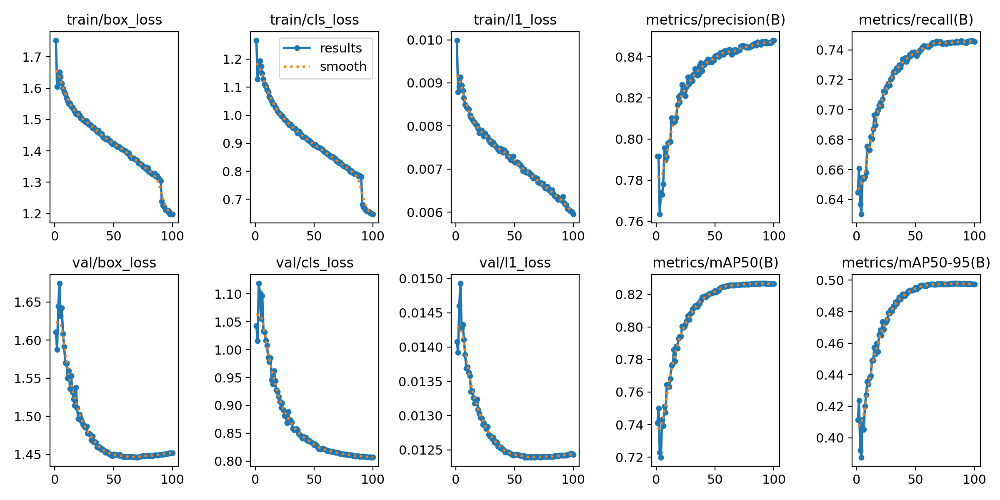
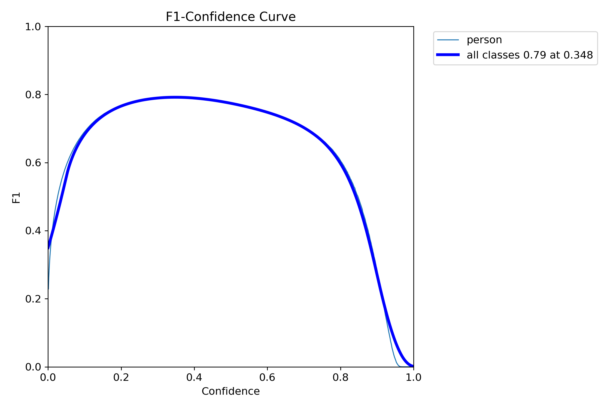
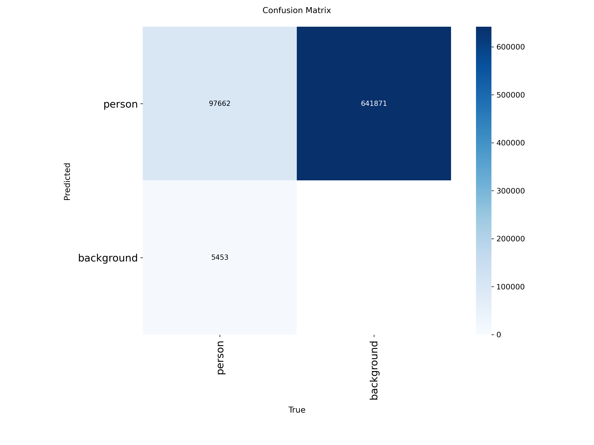
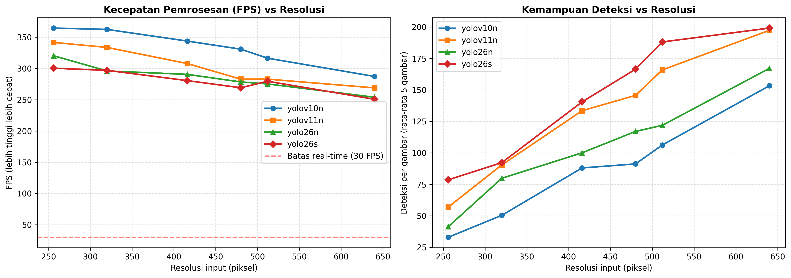

# Laporan Skenario A: Fine-Tuning dan Evaluasi Komparatif Empat Arsitektur YOLO pada Dataset CrowdHuman

*Disusun menggunakan standar penulisan akademik untuk justifikasi metodologi eksperimen.*

---

## 1. Ringkasan Eksekutif

Empat arsitektur YOLO telah di-*fine-tune* pada dataset CrowdHuman dan dievaluasi pada empat dimensi: akurasi deteksi (dua protokol evaluasi), latensi (dua kelas perangkat), penskalaan resolusi, serta kinerja terpisah menurut pemotongan bingkai, tingkat oklusi, dan ukuran objek. Enam temuan utama:

1. **Pada akurasi, ketiga arsitektur tier nano setara.** Rentang mAP@0.5:0.95 hanya 0,0058 — di bawah ambang yang dapat dibedakan dari variasi acak. Argumen pemilihan detektor karena itu tidak dapat berdiri di atas akurasi agregat.
2. **Arsitektur *NMS-free* memangkas latensi *post-processing* 2,9×** dengan pemisahan distribusi yang utuh, dan biayanya **datar** terhadap kepadatan kerumunan.
3. **Peringkat kecepatan berubah menurut kombinasi perangkat dan runtime.** YOLO26n tercepat pada jalur CPU+ONNX, tetapi bukan pada CPU+PyTorch maupun GPU+PyTorch. Ini **bukan temuan baru** — fenomenanya dikenal sebagai *latency monotonicity* yang lemah lintas platform, dan angka CPU-nya sendiri sudah dipublikasikan vendor. Disajikan sebagai verifikasi independen pada bobot hasil fine-tuning, bukan kontribusi (Bagian 7.4).
4. **Pemotongan tepi bingkai adalah sumbu kesulitan yang dominan** — jauh melampaui oklusi. Orang yang kotak badan penuhnya menembus tepi citra (18,8% anotasi) mengalami penurunan recall 21 poin dan AP 31 poin, yaitu **2,9–3,7 kali lipat** biaya oklusi berat. Ini berimplikasi langsung pada penempatan garis hitung.
5. **Terdapat lantai *under-count* struktural sebesar 7,4–10,0%** yang terkunci di lapisan detektor dan tidak dapat diperbaiki oleh *tracker* maupun *counting logic* di hilirnya.
6. **Tidak ada keunggulan akurasi yang dapat dikaitkan dengan arsitektur *NMS-free*.** Selisih pada batas atas recall merupakan artefak titik ukur, bukan kualitas deteksi (Bagian 6.3).

Seluruh angka dapat ditelusuri ke berkas hasil yang tercantum pada Lampiran.

---

## 2. Pendahuluan

Laporan ini mendokumentasikan pelaksanaan penuh **Skenario A (Evaluasi Detector)** sebagaimana dirancang dalam `docs/drafts/usulan-pendekatan.md` dan dirinci sebagai S1 dalam `docs/drafts/bab3_revisi_skenario_eksperimen.md`.

Tujuan skenario ini bukan menentukan "model terbaik" secara umum, melainkan menjawab satu pertanyaan yang menopang rancangan sistem: **apakah arsitektur *NMS-free* memberikan keuntungan nyata untuk *people counting* di kerumunan padat, dan apakah keuntungan itu cukup besar untuk membenarkan pemilihannya?**

Perlu ditegaskan sejak awal bahwa deteksi bukanlah *counting*. CrowdHuman berupa citra statis tanpa identitas temporal, sehingga laporan ini membatasi diri pada kualitas detektor sebagai lapisan kedua dari pipeline lima lapis. Akurasi hitungan akhir baru dapat dinilai setelah Skenario B (tracker) dan Skenario C (counting logic) terintegrasi.

---

## 3. Metodologi

### 3.1 Dataset dan Protokol Anotasi

Dataset yang digunakan adalah **CrowdHuman** (Shao et al., 2018) [S038], dengan pembagian standar: ±15.000 citra latih dan **4.370 citra validasi**. Seluruh evaluasi dilakukan pada *validation set*, yang memuat **103.115 kotak beranotasi bertag `person`**.

Audit anotasi dijalankan menggunakan `scripts/data_prep/check_label_quality.py` dengan hasil berikut:

| Aspek | Jumlah | Proporsi |
|---|---|---|
| Total kotak `person` | 103.115 | 100% |
| Menembus tepi citra (anotasi amodal) | 15.383 | 14,92% |
| Bertanda `extra.ignore == 1` | 3.634 | 3,52% |
| Titik tengah di luar bingkai | 2.033 | 1,97% |

Keputusan protokol yang diambil, beserta konsekuensinya:

1. **Kotak yang dipakai adalah `fbox` (*full-body box*)**, bukan `vbox` (*visible-body*). Literatur pembanding tidak selalu memakai protokol sama, sehingga nilai absolut **tidak dapat dibandingkan langsung** dengan paper yang memakai *visible-body*.
2. **Anotasi `fbox` bersifat amodal** — digambar sampai bagian tubuh yang tertutup atau di luar bingkai. Kotak-kotak ini ditulis apa adanya tanpa pemotongan.
3. **Kotak `ignore` disertakan sebagai label positif pada pelatihan**, tetapi **dikecualikan pada evaluasi protokol resmi** (Bagian 6). Dampak kuantitatif koreksi ini terukur dan dilaporkan, bukan diasumsikan.
4. **Kotak yang titik tengahnya jatuh di luar bingkai (1,97%)** mengalami distorsi geometri ringan akibat pemotongan per-komponen. Proporsinya kecil dan dampaknya identik pada seluruh model.

Poin 1–4 berlaku **seragam untuk keempat model**. Karena itu, meskipun nilai absolut tidak sebanding dengan literatur, **perbandingan antar model tetap sah** — dan perbandingan itulah objek penelitian.

### 3.2 Konfigurasi Pelatihan

| Parameter | Nilai |
|---|---|
| Epoch | 100 |
| Batch size | 32 |
| Resolusi masukan | 640 × 640 |
| Optimizer | `auto` (Ultralytics) |
| Seed | 0 |
| AMP (mixed precision) | aktif |
| Kelas | 1 (`person`) |
| Bobot awal | pra-latih COCO |

Kesetaraan konfigurasi diverifikasi dari berkas `args.yaml` masing-masing run, bukan diasumsikan.

### 3.3 Perangkat dan Runtime

| Lingkungan | Perangkat | Runtime | Dipakai untuk |
|---|---|---|---|
| Server GPU | NVIDIA RTX 4090 | PyTorch | Pelatihan, evaluasi akurasi, latensi GPU, penskalaan resolusi |
| Edge CPU | CPU workstation kampus | PyTorch dan ONNX Runtime | Latensi CPU, uji klaim edge |

---

## 4. Hasil Pelatihan

### 4.1 Tabel Utama

| Arsitektur | Sumber | Precision | Recall | mAP@0.5 | mAP@0.5:0.95 | Waktu latih |
|---|---|---|---|---|---|---|
| **YOLO26s** | S001/S002 | **0,8480** | **0,7455** | **0,8266** | **0,4974** | 4,89 jam |
| YOLOv10n | S003 | 0,8212 | 0,6892 | 0,7826 | 0,4521 | 5,91 jam |
| YOLO26n | S001/S002 | 0,8230 | 0,6888 | 0,7814 | 0,4497 | 2,27 jam |
| YOLOv11n | — | 0,8352 | 0,6965 | 0,7855 | 0,4463 | 1,94 jam |

*Dibangkitkan otomatis oleh `scripts/experiments/summarize_training_runs.py` untuk menghindari kesalahan salin manual. Sumber: `runs/detect/*/results.csv`.*

### 4.2 Cara Membaca Metrik Ini

Arti operasional tiap kolom dalam konteks *people counting*:

- **Precision (0,82–0,85)** — dari setiap 100 kotak yang dilaporkan sebagai "orang", sekitar 82–85 memang benar. Sisanya *false positive*, yang bila bertahan beberapa frame dapat memicu **hitungan berlebih**.
- **Recall (0,69–0,75)** — dari setiap 100 orang yang benar-benar ada, model menemukan 69–75. Sisanya terlewat, menyebabkan **hitungan kurang**. Ini metrik paling kritis bagi penelitian ini.
- **mAP@0.5** — ambang tumpang tindih longgar (50%); mengukur "apakah orangnya ketemu".
- **mAP@0.5:0.95** — ambang ketat (50–95%); mengukur "apakah kotaknya rapat". Menjadi tolok ukur utama karena kotak yang meleset menyulitkan *tracker* mempertahankan identitas antar-frame.

**Recall konsisten lebih rendah daripada precision di semua model.** Ini pola khas deteksi kerumunan padat: model cenderung melewatkan orang yang tertutup ketimbang mengarang deteksi. Untuk *people counting*, artinya sistem punya **kecenderungan sistemik ke arah *under-count***.

### 4.3 Dinamika Konvergensi

Perkembangan mAP@0.5:0.95 sepanjang pelatihan:

| Arsitektur | Ep 1 | Ep 10 | Ep 25 | Ep 50 | Ep 75 | Ep 100 | Capai 99% nilai akhir |
|---|---|---|---|---|---|---|---|
| YOLOv10n | 0,2811 | 0,3847 | 0,4232 | 0,4446 | 0,4510 | 0,4521 | epoch **55** |
| YOLOv11n | 0,3023 | 0,3896 | 0,4247 | 0,4408 | 0,4452 | 0,4463 | epoch **55** |
| YOLO26n | 0,2875 | 0,3847 | 0,4168 | 0,4432 | 0,4486 | 0,4497 | epoch **55** |
| YOLO26s | 0,4112 | 0,4340 | 0,4738 | 0,4954 | 0,4976 | 0,4974 | epoch **44** |

**Keempat model mencapai 99% performa akhirnya pada epoch 44–55.** Tambahan dari epoch 50 ke 100 hanya **0,0019–0,0075 mAP** — di bawah ambang kebermaknaan. Sekitar **setengah anggaran komputasi (±7 jam GPU) tidak membeli peningkatan apa pun**. Untuk pelatihan berikutnya, 60 epoch memadai.

---

## 5. Analisis Kurva Diagnostik

### 5.1 Kurva F1-Confidence

Kurva ini menjawab pertanyaan praktis: **pada ambang *confidence* berapa model harus dioperasikan?** Ambang terlalu rendah menghasilkan banyak *false positive*; terlalu tinggi membuat banyak orang terlewat. Puncak kurva adalah titik seimbangnya.

| Arsitektur | F1 puncak | Ambang optimal |
|---|---|---|
| YOLOv10n | 0,75 | 0,283 |
| YOLO26n | 0,75 | 0,289 |
| YOLOv11n | 0,76 | 0,349 |
| **YOLO26s** | **0,79** | 0,348 |

**Ambang optimal berbeda antar arsitektur.** Nilai bawaan Ultralytics (0,25) mendekati optimal untuk model *NMS-free* (0,283–0,289), tetapi terlalu rendah untuk YOLOv11n dan YOLO26s (0,348–0,349).

Temuan ini menjelaskan anomali pada pengujian latensi: YOLOv11n melaporkan 197 deteksi per citra sementara YOLOv10n hanya 153, padahal mAP keduanya setara. Penyebabnya bukan kepekaan lebih tinggi, melainkan **YOLOv11n diuji di bawah ambang optimalnya** sehingga mengeluarkan banyak deteksi berkualitas rendah. Pelajarannya: **jumlah deteksi mentah bukan ukuran akurasi**, dan setiap model wajib disetel ambangnya sendiri sebelum masuk pipeline.

### 5.2 Kurva Precision-Recall

Bentuk kurva lebih informatif daripada satu angka:

- **Wilayah datar (recall 0 sampai ±0,6):** presisi bertahan di atas 0,95. Model sangat andal untuk orang yang terlihat jelas.
- **Lutut kurva (recall ±0,75–0,85):** presisi turun tajam. Di sinilah orang yang saling menutupi.
- **Dinding vertikal (recall ±0,90–0,93):** presisi jatuh ke nol. **Ini batas atas recall** — berapa pun ambang diturunkan, sisa orang tersebut tidak pernah terdeteksi.

Nilai eksak batas atas recall dihitung pada Bagian 6.

### 5.3 Confusion Matrix

Untuk YOLO26s: **97.662 terdeteksi benar**, **5.453 terlewat**, dan **641.871 tercatat sebagai *false positive***.

Angka *false positive* yang tampak dramatis itu **bukan cacat model dan perlu dibaca dengan hati-hati**. Ultralytics membangun matriks ini pada ambang *confidence* sangat rendah (0,001) agar perhitungan mAP mencakup seluruh kurva. Pada ambang serendah itu model memang mengeluarkan ratusan kotak spekulatif per citra yang tidak akan dipakai dalam operasi nyata. Nilai *false positive* di sini **sepenuhnya bergantung pada ambang** dan tidak bermakna tanpa menyebutkan ambangnya.

Yang bermakna adalah kolom pertama: **5.453 dari 103.115 orang (5,3%) tidak terdeteksi bahkan pada ambang 0,001**.

---

## 6. Evaluasi Protokol CrowdHuman

Evaluasi Ultralytics pada Bagian 4 memakai protokol yang memasukkan region `ignore` sebagai target wajib. Bagian ini mengulang evaluasi dengan **protokol CrowdHuman resmi**, di mana region `ignore` diperlakukan netral: tidak wajib dideteksi, dan deteksi yang jatuh di atasnya tidak dihitung sebagai *false positive*.

Perbedaan ini penting dan bukan sekadar menghapus kotak dari ground truth — kalau hanya dihapus, deteksi di region itu justru **berbalik menjadi *false positive*** dan model dihukum dua kali. Implementasi ada di `src/eval_mr2.py`, dijalankan lewat `scripts/experiments/eval_crowdhuman_protocol.py`.

### 6.1 Hasil

Dijalankan pada seluruh 4.370 citra validasi, dengan **99.481 kotak target** setelah 3.634 kotak `ignore` dipindahkan ke status netral.

| Arsitektur | MR⁻² | AP@0.5 | **Recall maks** | AP@0.5 protokol lama | Selisih |
|---|---|---|---|---|---|
| **YOLO26s** | **0,7574** | **0,8283** | **0,9262** | 0,8167 | +0,0116 |
| YOLOv10n | 0,7764 | 0,7898 | **0,9146** | 0,7766 | +0,0133 |
| YOLOv11n | 0,7778 | 0,7882 | **0,9000** | 0,7742 | +0,0140 |
| YOLO26n | 0,7792 | 0,7881 | **0,9124** | 0,7750 | +0,0132 |

*Sumber: `experiments/crowdhuman_protocol_results.csv`. MR⁻² semakin kecil semakin baik — kebalikan dari mAP.*

**Validasi silang implementasi.** Tiga pemeriksaan independen konsisten, sehingga angka di atas dapat dipercaya:

- AP@0.5 hasil implementasi sendiri berselisih hanya ±0,005 dari mAP@0.5 Ultralytics pada keempat model, meskipun dihitung oleh kode yang sepenuhnya terpisah.
- Jumlah target 99.481 = 103.115 − 3.634, persis sesuai hasil audit anotasi pada Bagian 3.1.
- Kepadatan 99.481 ÷ 4.370 = **22,8 orang per citra**, cocok dengan angka 22,6 yang didokumentasikan CrowdHuman.

Metrik juga diuji terhadap kasus sintetis: detektor sempurna menghasilkan MR⁻² 0,0; satu *false positive* berskor tinggi menaikkannya ke 0,01; *false positive* yang sama di dalam region `ignore` mengembalikannya ke 0,0; dan MR⁻² naik monoton (0 / 0,25 / 0,50 / 0,75) seiring bertambahnya target yang terlewat.

### 6.2 Dampak Koreksi Protokol

Koreksi penanganan region `ignore` menaikkan AP@0.5 sebesar **+0,0116 sampai +0,0140**, dan batas atas recall sebesar **+0,0083 sampai +0,0115**.

Besarnya moderat. **Angka pada Bagian 4 karena itu tetap sahih**, hanya bersifat sedikit pesimistis. Nilai praktis dari pengukuran ini adalah metodologis: proporsi distorsinya kini **terukur, bukan diperkirakan**, sehingga dapat dinyatakan sebagai satu kalimat batasan yang tertopang data.

Perlu dicatat bahwa **koreksi terbesar dialami YOLOv11n** (+0,0140 AP, +0,0115 recall). Ini konsisten dengan mekanisme NMS yang paling dirugikan di region kerumunan ambigu, dan menghubungkan Bagian 6.2 dengan temuan pada Bagian 6.3.

### 6.3 Selisih Recall Maksimum Antar Arsitektur: Bukan Keunggulan Akurasi

Pada tier nano, batas atas recall arsitektur *NMS-free* (0,9124–0,9146) lebih tinggi daripada arsitektur ber-NMS (0,9000), selisih 1,2–1,5 poin. Selisih ini nyata sebagai angka, tetapi **tidak boleh ditafsirkan sebagai keunggulan akurasi**. Tiga bukti menolak tafsiran itu:

**1. AP@0.5 keempat model praktis identik.** Pada tabel Bagian 6.1: 0,7898 (YOLOv10n), 0,7881 (YOLO26n), 0,7882 (YOLOv11n). Tidak ada keunggulan sama sekali di metrik yang menimbang presisi.

**2. MR⁻² justru memenangkan arsitektur ber-NMS.** Pada analisis per tingkat oklusi (Bagian 6.5), YOLOv11n unggul di dua dari tiga kelompok — dan MR⁻² adalah metrik yang paling sesuai dengan pertanyaan penelitian ini.

**3. Selisihnya lebih kecil daripada sebar antar model sekeluarga.** Pada kelompok teroklusi berat, jarak YOLOv10n dan YOLO26n — keduanya *NMS-free* — mencapai 1,68 poin, melebihi selisih terhadap YOLOv11n.

**Penjelasan yang lebih hemat:** `recall_maks` diukur pada ambang *confidence* 0,001 dengan 300 deteksi per citra. Arsitektur *NMS-free* tidak menyaring kotak bertindih, sehingga pada ambang serendah itu ia memuntahkan lebih banyak kandidat yang saling menimpa. Lebih banyak kandidat berarti lebih banyak target tersenggol pada pencocokan serakah — menaikkan `recall_maks` **tanpa arti operasional**, karena titik kerja nyata sistem berada di ambang 0,28–0,35 (Bagian 5.1), bukan 0,001.

Dua perancu tambahan membuat perbandingan ini belum teridentifikasi:

- **Kelompok kontrol berjumlah satu.** Hanya YOLOv11n yang mewakili arsitektur ber-NMS, sehingga label "*NMS-free*" tidak terpisahkan dari resep pelatihan, kapasitas, dan kalibrasi skor model itu.
- **Ambang NMS tidak pernah ditala.** Pengukuran memakai nilai bawaan Ultralytics (IoU 0,7), yang tidak dirancang untuk anotasi amodal CrowdHuman.

**Kesimpulan: argumen pemilihan arsitektur *NMS-free* bertumpu pada latensi saja** (Bagian 7.1), yang buktinya tetap kuat. Tidak tersedia argumen berbasis akurasi.

### 6.4 Membaca Nilai MR⁻²

MR⁻² keempat model berada pada **0,757–0,779**. Angka ini tinggi dan menuntut penjelasan yang jujur.

MR⁻² merata-ratakan *miss rate* secara logaritmik pada sembilan titik FPPI (*false positive per image*) antara 0,01 dan 1,0. Nilai 0,78 berarti: **apabila sistem dibatasi maksimal satu alarm palsu per citra, model melewatkan sekitar 78% orang.** Tuntutan itu sangat berat pada CrowdHuman, yang memuat 22,8 orang per citra — menemukan sebagian besar dari mereka sambil hanya boleh keliru sekali per gambar.

Sebagai pembanding, baseline pada paper CrowdHuman asli mencapai MR⁻² sekitar 0,50, tetapi memakai ResNet-50 FPN dua tahap dengan puluhan juta parameter dan resolusi masukan lebih besar. Model dalam penelitian ini berukuran **2,4–9,5 juta parameter**, satu tahap, resolusi 640.

**Selisih itu adalah harga yang dibayar untuk memilih model kelas edge, dan justru mendukung framing penelitian ini**: sistem dirancang berjalan tanpa GPU mahal, dan Bagian 7.2 menunjukkan pilihan itu memang membuahkan kelayakan CPU. Nilai MR⁻² tidak boleh dituliskan tanpa menyertakan ukuran model dan tujuan deployment-nya.

### 6.5 Analisis Terpisah: Pemotongan Bingkai, Oklusi, dan Ukuran Objek

Recall agregat mencampur orang yang berdiri sendirian dengan orang yang hanya tampak kepalanya. Bagian ini memisahkannya, dijalankan pada subset 500 citra (9.918 kotak target) melalui `scripts/experiments/eval_breakdown.py`.

#### 6.5.1 Pemotongan Bingkai adalah Sumbu Kesulitan Dominan

| Arsitektur | Recall utuh | Recall terpotong | AP utuh | AP terpotong |
|---|---|---|---|---|
| YOLOv10n | 0,9558 | **0,7432** | 0,8732 | **0,5623** |
| YOLO26n | 0,9513 | 0,7426 | 0,8722 | 0,5617 |
| YOLO26s | 0,9642 | 0,7517 | 0,9081 | 0,5813 |
| YOLOv11n | 0,9393 | 0,7174 | 0,8729 | 0,5446 |

*n = 8.053 utuh, 1.865 terpotong (18,8%).*

Orang yang kotak badan penuhnya menembus tepi citra mengalami **penurunan recall 21–22 poin dan AP 31–33 poin**. Efeknya konsisten di keempat arsitektur dan berukuran besar — jauh di atas seluruh selisih antar model dalam laporan ini.

Sebabnya wajar: anotasi `fbox` bersifat amodal, sehingga detektor dituntut memprediksi kotak yang menjulur keluar bingkai dan menebak posisi bagian tubuh yang tidak terlihat sama sekali.

Dibandingkan biaya oklusi berat pada kelompok yang utuh dalam bingkai (8,9–11,0 poin AP), **pemotongan bingkai 2,85–3,67 kali lebih mahal** (YOLOv10n 3,33x; YOLOv11n 2,99x; YOLO26n 2,85x; YOLO26s 3,67x).

**Implikasi operasional langsung.** Pada kamera pintu masuk atau gerbang, garis hitung dan RoI lazim ditempatkan dekat tepi bingkai — justru di wilayah dengan kinerja detektor terburuk. Rekomendasi untuk Skenario D dan E: **tempatkan RoI dan garis potong menjauh dari tepi bingkai**, atau pilih sudut kamera yang menempatkan zona hitung di bagian tengah citra. Ini perbaikan tanpa biaya komputasi, dan diperoleh sebelum satu baris kode *counting logic* pun diubah.

#### 6.5.2 Biaya Oklusi

Diukur pada kotak yang utuh dalam bingkai, sehingga terpisah dari efek 6.5.1:

| Arsitektur | AP terlihat penuh | AP teroklusi sebagian | AP teroklusi berat |
|---|---|---|---|
| YOLOv10n | 0,9092 | 0,8268 | 0,8158 |
| YOLO26n | 0,9123 | 0,8289 | 0,8034 |
| YOLO26s | 0,9382 | 0,8740 | 0,8491 |
| YOLOv11n | 0,9083 | 0,8283 | 0,7984 |

AP menurun monoton pada keempat model; oklusi berat memangkas **8,9–11,0 poin AP**. Inilah angka kuantitatif pertama untuk pernyataan masalah inti proposal.

**Peringatan metodologis yang wajib menyertai tabel ini.** Pada metrik `recall_maks`, urutan kelompok **tidak** monoton — teroklusi berat tercatat setara atau sedikit di atas teroklusi sebagian. Selisihnya 1,5 ± 0,9 poin, dan hanya 1 dari 4 model melewati dua simpangan baku, sehingga **kedua kelompok itu tidak dapat dibedakan** pada metrik tersebut.

Terdapat penjelasan struktural yang belum terbantahkan: untuk dua kotak amodal setara dengan cakupan *c*, IoU keduanya = *c*/(2−*c*). Ambang kelompok teroklusi berat (visibility < 0,35, yaitu *c* > 0,65) menghasilkan IoU 0,48–0,54, **berimpit dengan ambang pencocokan 0,5**. Kelompok ini karena itu nyaris secara definisi memuat target yang cukup bertindih dengan penutupnya sehingga deteksi atas si penutup dapat terkredit sebagai *true positive* bagi target. Hipotesis ini dapat diuji dengan menaikkan ambang pencocokan ke 0,75 (opsi `--iou`); bila anomali runtuh, penyebabnya terkonfirmasi.

Hipotesis ini **sudah diuji dan terkonfirmasi**: pada ambang pencocokan 0,75, urutan ketiga kelompok berbalik menjadi menurun monoton di keempat model (selisih *berat* dikurangi *sebagian*: −0,32 / −0,54 / −2,05 / −1,39, dari sebelumnya +1,61 / +1,25 / +0,42 / +0,86 pada ambang 0,5). Ramalannya spesifik, dapat dijatuhkan, dan bertahan.

**Konsekuensinya: `recall_maks` pada ambang 0,5 tidak layak dipakai untuk analisis per tingkat oklusi.** Gunakan AP, atau naikkan ambang pencocokan.

**MR⁻² per subkelompok juga tidak layak dikutip.** Tabel per kelompok memberi hasil yang absurd di permukaan — YOLO26n mencatat MR⁻² 0,6161 pada "terlihat penuh" tetapi 0,4439 pada "teroklusi berat", seolah orang yang tertutup berat lebih mudah dideteksi. Penyebabnya artefak protokol: karena kotak di luar kelompok dipindah ke status *ignore*, subkelompok kecil menyingkirkan sebagian besar deteksi sebagai netral sehingga FPPI-nya rendah palsu. **MR⁻² tidak dapat dibandingkan antar subkelompok dengan jumlah target dan fraksi ignore yang berbeda**; simpan metrik itu untuk angka agregat protokol resmi (Bagian 6.1).

Justru karena artefak ini, temuan pemotongan bingkai menjadi lebih kuat: subkelompok "terpotong tepi" berukuran **lebih kecil** (15.197 lawan 84.284), sehingga artefak seharusnya membuat MR⁻²-nya tampak lebih baik. Nyatanya tetap jauh lebih buruk. **Efeknya bertahan melawan arah bias artefaknya sendiri.**

#### 6.5.3 Objek Kecil

| Arsitektur | AP besar (≥150 px) | AP sedang (50–150 px) | AP kecil (<50 px) |
|---|---|---|---|
| YOLO26s | 0,8335 | 0,8616 | **0,5800** |
| YOLO26n | 0,8141 | 0,8035 | 0,4566 |
| YOLOv10n | 0,8153 | 0,8072 | 0,4330 |
| YOLOv11n | 0,8108 | 0,8018 | 0,4326 |

*n = 6.372 / 2.985 / 561.*

AP pada orang berukuran kecil **anjlok sekitar 45% relatif**. Bersama 6.5.1, inilah sumber utama lantai *under-count* yang tercatat pada Bagian 6.1.

Arah perbaikan yang ditunjukkan bersifat operasional, bukan arsitektural: untuk kamera yang menyorot area jauh, menaikkan resolusi masukan pada zona jauh lebih tepat sasaran daripada memperbesar model.

YOLO26n mencatat AP objek kecil tertinggi di tier nano (0,4566 lawan 0,4330 dan 0,4326), yang searah dengan klaim ProgLoss/STAL pada [S002]. Namun kelompok ini hanya memuat 561 kotak dari satu *run*, sehingga statusnya **indikasi, belum bukti**.

Perbedaan yang jauh lebih besar datang dari kapasitas: YOLO26s mengungguli YOLO26n sebesar 12,3 poin AP pada objek kecil, sekitar lima kali lipat seluruh selisih antar arsitektur pada tier yang sama.

---

## 7. Hasil Pengukuran Latensi

### 7.1 Overhead Post-Processing di GPU

Pengukuran memakai lima citra terpadat dari *validation set*, dipilih deterministik berdasarkan kepadatan anotasi, 20 iterasi per citra, pemanasan 10 putaran penuh, seluruh model dibatasi ke kelas `person`.

| Arsitektur | NMS-free | Inference p50/p95 (ms) | Post-process p50/p95 (ms) | Total p50 | Porsi post |
|---|---|---|---|---|---|
| **YOLOv10n** | ya | **2,129** / 2,454 | **0,167** / 0,205 | **2,296** | 7,3% |
| YOLOv11n | tidak | 2,142 / 2,470 | 0,491 / 0,552 | 2,633 | 18,7% |
| YOLO26n | ya | 2,554 / 2,964 | 0,164 / 0,201 | 2,718 | 6,0% |
| YOLO26s | ya | 2,695 / 3,044 | 0,170 / 0,203 | 2,865 | 6,0% |

*Sumber: `experiments/nms_overhead_results.csv`. Latensi dilaporkan sebagai persentil karena distribusinya menjulur ke kanan sehingga rata-rata mudah terseret sedikit iterasi lambat.*

**Temuan 1 — pemangkasan post-processing terbukti meyakinkan.** Model *NMS-free* membutuhkan 0,164–0,170 ms; model ber-NMS 0,491 ms, atau **2,9 kali lipat**. Pemisahan distribusinya sempurna: p50 model ber-NMS (0,491) masih lebih dari dua kali p95 model *NMS-free* (0,205). Tidak ada tumpang tindih.

**Temuan 2 — biaya post-processing NMS-free bersifat datar.** YOLO26s menghasilkan 199 deteksi dan YOLO26n 167 deteksi, namun keduanya membayar 0,164–0,170 ms. Tanpa NMS, biaya *post-processing* **tidak tumbuh mengikuti kepadatan kerumunan**. Bagi sistem *real-time* di ruang publik, sifat ini bernilai lebih tinggi daripada rata-ratanya: latensi tetap dapat diprediksi justru ketika kerumunan memuncak — saat sistem paling tidak boleh gagal.

**Temuan 3 — selisih *inference* antar arsitektur di GPU TIDAK dapat diinterpretasikan.**

Pengukuran GPU dalam laporan ini berada di rezim yang didominasi *overhead* peluncuran kernel, bukan komputasi. Buktinya ada di dalam tabel ini sendiri: YOLO26s memiliki sekitar **3,8 kali FLOPs** YOLO26n (20,7 lawan 5,4 GFLOPs menurut [S002]), tetapi hanya **5,5% lebih lambat** di GPU (2,695 lawan 2,554 ms). Pada CPU dengan ONNX, model yang sama berselisih **2,29 kali** (22,80 lawan 9,95 ms) — perilaku *compute-bound* yang memang diharapkan.

Bila komputasi 3,8 kali lipat hanya menambah 5,5% waktu, maka selisih 0,42 ms antara YOLO26n dan YOLOv10n **tidak dapat diatribusikan ke arsitektur**; besarannya berada di dalam wilayah yang dikuasai *overhead* runtime. Angka *inference* GPU karena itu dilaporkan sebagai konteks, bukan sebagai perbandingan arsitektur.

Kolom *post-processing* tidak terkena masalah ini: selisih 2,9 kali dengan pemisahan distribusi utuh terlalu besar untuk dijelaskan oleh *overhead*, dan sifatnya yang datar terhadap kepadatan merupakan properti algoritmik, bukan properti runtime.

Dengan catatan itu, perbandingan yang tetap sah:

- **YOLOv10n lawan YOLOv11n:** *inference* imbang, hemat 0,33 ms di *post-processing* → unggul 13% total. Keunggulan *NMS-free* terwujud.
- **YOLO26n lawan YOLOv11n:** hemat 0,33 ms di *post-processing*, sedangkan selisih *inference*-nya tidak dapat diinterpretasi. Kesimpulan tentang total end-to-end di GPU karena itu **tidak dapat ditarik**.

### 7.2 Latensi CPU dan Dampak Export ONNX

| Arsitektur | PyTorch CPU p50 | **ONNX CPU p50** | Percepatan | Post-proc ONNX | Total ONNX | Setara FPS | Berkas ONNX |
|---|---|---|---|---|---|---|---|
| **YOLO26n** | 22,48 | **10,05** | 2,24× | 0,233 | **10,28 ms** | **97** | 9,8 MB |
| YOLOv10n | 25,13 | 11,93 | 2,11× | 0,204 | 12,13 ms | 82 | 9,3 MB |
| YOLOv11n | 22,98 | 13,26 | 1,73× | 0,788 | 14,05 ms | 71 | 10,6 MB |
| YOLO26s | 54,50 | 22,91 | 2,38× | 0,235 | 23,15 ms | 43 | 38,2 MB |

*Sumber: `experiments/cpu_onnx_results.csv`.*

**Temuan 4 — peringkat kecepatan terbalik antara GPU dan CPU.**

| Peringkat | Di GPU (PyTorch) | Di CPU (ONNX) |
|---|---|---|
| 1 | YOLOv10n (2,296 ms) | **YOLO26n (10,28 ms)** |
| 2 | YOLOv11n (2,633 ms) | YOLOv10n (12,13 ms) |
| 3 | YOLO26n (2,718 ms) | YOLOv11n (14,05 ms) |
| 4 | YOLO26s (2,865 ms) | YOLO26s (23,15 ms) |

YOLO26n berpindah dari posisi paling lambat di tier nano menjadi **yang tercepat**, unggul 27% atas YOLOv11n dan 18% atas YOLOv10n. Pada lingkungan CPU, penalti *inference* yang muncul di GPU tidak hanya hilang tetapi berbalik menjadi keunggulan, sehingga keuntungan *NMS-free* kini benar-benar terwujud sebagai keuntungan bersih.

Temuan ini menjelaskan mengapa evaluasi di GPU saja menyesatkan untuk menilai YOLO26: seluruh proposisi nilainya memang menyasar CPU dan perangkat edge.

**Temuan 5 — export ONNX memangkas latensi CPU 1,7–2,4× untuk semua arsitektur.** Ini temuan deployment yang berlaku lepas dari pilihan arsitektur, dan berkaitan langsung dengan peta jalan tahun keempat proposal (*optimasi kompresi dan deployment edge*).

**Temuan 6 — deployment CPU tanpa GPU layak.** Keempat model beroperasi di atas 30 FPS pada resolusi penuh 640: 43–97 FPS. Ini bukti kuantitatif pertama bahwa sistem yang diusulkan dapat berjalan tanpa akselerator mahal.

**Klaim vendor yang tidak tereproduksi persis.** Dokumentasi YOLO26 [S002] menyebut "up to 43% faster CPU inference". Terukur **24% lebih cepat** daripada YOLOv11n pada ONNX CPU — arah klaim benar, besarannya lebih kecil. Yang dilaporkan dalam naskah harus angka terukur sendiri, bukan angka vendor.

**Klaim yang tidak terbukti maupun terbantah.** Klaim penghapusan DFL yang mempermudah export tidak dapat dibedakan: keempat model berhasil di-export dalam 0,6–1,0 detik tanpa galat. Tidak ada pembeda karena tidak ada yang bermasalah. Dilaporkan sebagai hasil nol.

### 7.4 Posisi Terhadap Literatur: Ini Verifikasi, Bukan Temuan

Penelusuran literatur menunjukkan bahwa perubahan peringkat latensi antar perangkat **sudah lama dilaporkan, punya nama teknis baku, dan sudah dipublikasikan untuk pasangan model yang sama**. Bagian ini karena itu diposisikan sebagai verifikasi independen, bukan kontribusi.

| Sumber | Yang sudah dinyatakan |
|---|---|
| Cai et al., *ProxylessNAS*, ICLR 2019 | "Models optimized for GPU do not run fast on CPU and mobile phone, vice versa" |
| Li et al., *HW-NAS-Bench*, ICLR 2021 | Korelasi peringkat antar perangkat dapat serendah ~0,00 |
| Lu et al., *One Proxy Device Is Enough*, ACM SIGMETRICS 2022 | Memperkenalkan istilah **latency monotonicity**; kuat dalam satu platform, lemah lintas platform |
| Lazarevich et al., *YOLOBench*, ICCVW 2023 | 550+ model YOLO × 4 platform; Pareto frontier berbeda nyata antar perangkat |
| Dokumentasi Ultralytics YOLO26 | Tabel resmi: YOLO26n CPU ONNX 38,9 ms lawan YOLO11n 56,1 ms, sekaligus T4 TensorRT 1,7 lawan 1,5 ms |

Angka CPU pada Bagian 7.2 karena itu **mereproduksi klaim vendor**, bukan menemukannya. Nilainya tetap ada: reproduksi itu dilakukan pada **bobot hasil fine-tuning CrowdHuman**, bukan bobot COCO bawaan, sehingga menjadi verifikasi independen yang relevan untuk penetapan anggaran latensi pipeline.

**Konfound yang harus dinyatakan.** Perbandingan Bagian 7.2 mengubah dua variabel sekaligus — perangkat (GPU→CPU) dan runtime (PyTorch→ONNX). Menguraikannya dengan data yang tersedia:

| Sel | YOLOv10n | YOLOv11n | YOLO26n | YOLO26s | Peringkat (tercepat lebih dulu) |
|---|---|---|---|---|---|
| GPU + PyTorch | 2,13 | 2,14 | 2,55 | 2,69 | v10n < v11n < 26n < 26s |
| CPU + PyTorch | 24,97 | **21,14** | 23,06 | 56,35 | **v11n** < 26n < v10n < 26s |
| CPU + ONNX | 13,17 | 13,21 | **9,95** | 22,80 | **26n** < v10n < v11n < 26s |
| GPU + ONNX | — | — | — | — | *belum diukur* |

**YOLO26n hanya menjadi tercepat pada kombinasi CPU + ONNX.** Pada CPU dengan PyTorch, justru YOLOv11n yang tercepat. Karena itu pernyataan "peringkat bergantung perangkat" **tidak akurat** — yang benar, peringkat bergantung pada kombinasi perangkat **dan** runtime, dan keunggulan YOLO26n terikat pada jalur ONNX. Sel GPU + ONNX perlu diisi untuk melengkapi matriks.

### 7.3 Penskalaan Resolusi

| Arsitektur | FPS @640 | FPS @256 | Deteksi @640 | Deteksi @256 | Deteksi hilang |
|---|---|---|---|---|---|
| YOLOv10n | 287,3 | 364,6 | 153,2 | 33,0 | −78% |
| YOLOv11n | 269,0 | 341,7 | 197,2 | 57,0 | −71% |
| YOLO26n | 254,0 | 320,4 | 167,0 | 41,4 | −75% |
| YOLO26s | 250,7 | 300,4 | 199,0 | 78,6 | −60% |

*Sumber: `experiments/resolusi_scaling_results.csv`.*

**Kurvanya sangat landai.** Menurunkan resolusi dari 640 ke 256 memangkas jumlah piksel 6,25 kali lipat, tetapi FPS hanya naik 27%. GPU **sama sekali tidak *compute-bound***: pada waktu frame 2–3 ms, yang mendominasi adalah *overhead* tetap (*preprocessing*, transfer data, interpreter Python), bukan konvolusinya.

Sebaliknya ongkosnya berat: **tiga perempat deteksi hilang**. Pada GPU ini pertukaran yang buruk tanpa pengecualian.

**Rekomendasi untuk Skenario D: pertahankan resolusi 640 pada lingkungan GPU.** Garis batas 30 FPS pada grafik berada jauh di dasar — seluruh model 8–12 kali lipat di atasnya — sehingga grafik ini tidak dapat dipakai menyimpulkan kelayakan *edge*. Untuk itu, rujuk Bagian 7.2.

---

## 8. Pembahasan

### 8.1 Arsitektur Tidak Menentukan Akurasi Agregat

Pada tier nano, rentang mAP@0.5:0.95 antara ketiga arsitektur hanya **0,0058** (0,4463–0,4521). Dengan satu *run* per model dan satu *seed*, selisih sekecil itu **tidak dapat dibedakan dari variasi acak**. YOLOv11n bahkan sedikit unggul pada precision, recall, dan mAP@0.5, sementara tertinggal pada mAP@0.5:0.95 — pola yang menandakan kotaknya sedikit kurang rapat pada ambang IoU ketat, tetapi seluruhnya masih di dalam derau.

**Kesimpulan yang boleh ditarik: ketiga arsitektur setara pada akurasi agregat.** Yang **tidak** boleh ditarik: bahwa salah satunya lebih unggul.

Kesetaraan ini bertahan pada seluruh metrik yang menimbang presisi. Bagian 6.3 menunjukkan satu-satunya metrik yang membedakan mereka — batas atas recall — merupakan artefak titik ukur pada ambang *confidence* 0,001, sehingga tidak menambah bukti keunggulan. Perbedaan antar arsitektur yang benar-benar terukur dalam penelitian ini hanya terletak pada **latensi *post-processing***, bukan akurasi.

### 8.2 Ukuran Model Jauh Lebih Menentukan

Lompatan dari tier nano ke small (YOLO26n 0,4497 → YOLO26s 0,4974) sebesar **0,0477** — sekitar **delapan kali lipat** seluruh rentang antar-arsitektur pada tier sama. Peningkatan recall-nya lebih relevan lagi: 0,6888 → 0,7455, atau **+5,7 poin**, berarti sekitar 57 orang tambahan ditemukan dari setiap 1.000 orang.

**Bagi people counting, recall adalah mata uang yang sesungguhnya.** Orang yang tidak terdeteksi tidak dapat dilacak, dan yang tidak dapat dilacak tidak akan pernah dihitung.

Namun keputusannya tidak sesederhana "pilih yang besar". Bagian 7.2 menunjukkan YOLO26s hanya mencapai 43 FPS di CPU lawan 97 FPS untuk YOLO26n. **Pemilihan tier karena itu adalah keputusan deployment, bukan keputusan akurasi**: bila GPU tersedia gunakan tier small; bila target CPU/edge dengan beban tinggi, tier nano memberi ruang komputasi jauh lebih lapang.

### 8.3 Posisi YOLO26 Berdasarkan Bukti

Menggabungkan seluruh pengukuran, posisi YOLO26 bergantung pada lingkungan deployment:

| Dimensi | YOLO26n lawan pesaing tier nano |
|---|---|
| Akurasi agregat (mAP) | Setara |
| Batas atas recall | Setara dengan YOLOv10n; **unggul 1,2 poin** atas YOLOv11n |
| Post-processing | Setara dengan YOLOv10n; **unggul 2,9×** atas YOLOv11n |
| Inference di GPU (PyTorch) | **Tertinggal ~20%** |
| Inference di CPU (ONNX) | **Unggul 18–27%** |

Dokumentasi YOLO26 [S002] mengajukan lima klaim. Status pengujiannya kini:

| Klaim YOLO26 [S002] | Status | Hasil |
|---|---|---|
| Native end-to-end / NMS-free | **Diuji** | Terbukti (Bagian 7.1) |
| "Up to 43% faster CPU inference" | **Diuji** | Arah benar, besaran 24% (Bagian 7.2) |
| DFL dihapus → export lebih sederhana | **Diuji** | Hasil nol; semua model export mulus |
| ProgLoss + STAL → objek kecil | Belum | mAP masih agregat, belum dipisah per ukuran objek |
| Optimizer MuSGD | Belum | Melekat pada proses latih, tidak dapat diisolasi |

**Kesimpulan yang dapat dipertahankan:** pemilihan YOLO26 sebagai kandidat implementasi **terdukung bukti untuk lingkungan CPU/edge**, yang merupakan target deployment penelitian ini. Untuk lingkungan GPU dengan runtime PyTorch, YOLOv10n merupakan pilihan lebih cepat pada akurasi setara.

Posisi ini konsisten dengan rambu yang ditetapkan sejak awal dalam `docs/research/fulltext-notes/S002-yolo26-ultralytics-docs.md`: YOLO26 sebagai **kandidat implementasi/prototipe**, sedangkan argumen ilmiah *NMS-free* ditopang YOLOv10 [S003] dan RT-DETR [S004] yang telah melalui *peer review*. Hasil eksperimen membuktikan kehati-hatian itu tepat — dan sekaligus menunjukkan pilihan implementasinya dapat dipertahankan.

### 8.4 Batas Keras Arsitektur: 300 Deteksi

Dokumentasi [S002] menyebut kepala *one-to-one* YOLO26 menghasilkan keluaran `(N, 300, 6)` — maksimum **300 deteksi per citra**. Audit menemukan citra terpadat memuat **310 orang**, dan **hanya 1 citra dari 4.370 (0,02%)** melampaui batas 300.

Dengan proporsi sekecil itu, batasan ini **tidak berdampak praktis** pada penelitian ini. Tetap perlu dicatat sebagai batasan arsitektur apabila sistem diterapkan pada skenario kerumunan ekstrem seperti stadion atau konser.

### 8.5 Implikasi untuk Pipeline Counting

Empat konsekuensi langsung bagi tahap berikutnya:

1. **Lantai *under-count* sebesar 7,4–10,0% sudah terkunci di lapisan detektor.** Batas atas recall 0,9000–0,9262 (Bagian 6.1) berarti sebagian orang tidak pernah terlihat oleh detektor pada ambang mana pun. Target akurasi hitungan akhir harus ditetapkan dengan memperhitungkan lantai ini.
2. **Ambang *confidence* wajib disetel per model**, bukan memakai nilai bawaan: ±0,348 untuk YOLO26s, ±0,285 untuk model *NMS-free* tier nano.
3. **Kecenderungan galat detektor bersifat *under-count***, karena recall konsisten lebih rendah dari precision. Ini **berlawanan arah** dengan galat pada Skenario C, di mana *naive line crossing* menghasilkan *over-count* ekstrem. Kedua sumber galat bekerja berlawanan dan **tidak boleh diasumsikan saling menghapus**; keduanya harus diukur terpisah pada evaluasi *end-to-end*.
4. **Pemilihan model untuk Skenario D bergantung perangkat sasaran.** Dengan GPU: YOLO26s untuk akurasi tertinggi. Dengan CPU: YOLO26n memberi 97 FPS, menyisakan anggaran komputasi besar untuk *tracker* dan *counting logic* di hilirnya — pertimbangan penting karena keduanya belum diukur.

---

## 9. Batasan

1. **Satu *run* per model, satu *seed*.** Selisih di bawah ±0,01 mAP tidak dapat dibedakan dari variasi acak. Klaim kesetaraan maupun keunggulan yang tertopang statistik memerlukan minimal tiga *seed* per model.
2. **Protokol anotasi memakai *full-body box* tanpa pemotongan**, sehingga nilai absolut tidak sebanding dengan literatur yang memakai *visible-body*. Perbandingan antar model tetap sah.
3. **MR⁻² tidak sebanding langsung dengan baseline literatur** karena perbedaan kapasitas model (2,4–9,5 juta parameter lawan puluhan juta) dan resolusi masukan.
4. **Akurasi model ONNX belum divalidasi.** Jumlah deteksi YOLO26n turun 6,9% dari PyTorch ke ONNX (179 → 166,7), penurunan terbesar di antara keempat model. Kecepatan ONNX tidak bermakna bila akurasinya ikut turun; mAP versi ONNX perlu diukur.
5. **Waktu pelatihan bukan ukuran kecepatan model.** GPU kemungkinan terbagi antar *run*; angka tersebut hanya informasi anggaran komputasi.
6. **CrowdHuman adalah citra statis.** Tidak ada kesimpulan mengenai stabilitas identitas, *tracking*, maupun akurasi hitungan yang dapat ditarik dari laporan ini.
7. **Evaluasi belum dilakukan pada domain target** (CCTV ruang publik/kampus). Risiko *domain shift* belum terukur.
8. **Anomali `recall_maks` per tingkat oklusi belum tuntas dijelaskan** (Bagian 6.5.2). Hipotesis kredit-okluder belum diuji dengan menaikkan ambang pencocokan; sampai itu dilakukan, hanya AP per kelompok yang layak dikutip.
9. **Perbandingan arsitektur ber-NMS belum teridentifikasi.** Kelompok kontrol hanya berisi satu model (YOLOv11n), dan ambang NMS memakai nilai bawaan Ultralytics yang tidak ditala untuk anotasi amodal. Label "NMS-free" karena itu bercampur dengan resep pelatihan, kapasitas, dan hiperparameter.
10. **Analisis breakdown dijalankan pada subset 500 citra**, bukan 4.370 citra penuh. Kelompok objek kecil hanya memuat 561 kotak.

---

## 10. Langkah Selanjutnya

Diurutkan menurut nilai per satuan usaha:

1. **Uji ambang pencocokan 0,75** (`--iou 0.75`) — satu jalan inferensi, memisahkan hipotesis kredit-okluder dari efek oklusi sesungguhnya (Bagian 6.5.2). Uji dengan daya pembeda tertinggi per satuan usaha.
2. **Sapu ambang NMS** (`--nms-iou`) pada YOLOv11n — memisahkan "arsitektur ber-NMS" dari "hiperparameter tak ditala".
3. **Ulangi breakdown pada 4.370 citra penuh**, agar kelompok objek kecil melampaui 561 kotak.
4. **Skenario B — evaluasi tracker.** Belum tersentuh. Lapisan ini yang menentukan stabilitas identitas dan karenanya menentukan galat hitungan.
5. **Kuantisasi INT8 dan pengukuran ulang CPU** — sejalan dengan peta jalan tahun keempat proposal.
6. **Pengulangan tiga *seed*** pada 60 epoch — kini naik prioritas dibanding penilaian sebelumnya, karena beberapa selisih yang menarik berukuran 1–2 poin sedangkan sebar antar model sekeluarga mencapai 1,7 poin. Tanpa estimasi varians, selisih sebesar itu tidak dapat diklaim.

---

## Lampiran: Artefak dan Keterlacakan

| Artefak | Lokasi |
|---|---|
| Bobot, metrik, dan kurva per run | `runs/detect/{yolo10,yolo11,yolo26n,yolo26s}_crowdhuman/` |
| Tabel komparasi pelatihan | `scripts/experiments/summarize_training_runs.py` |
| Evaluasi protokol CrowdHuman | `experiments/crowdhuman_protocol_results.csv` |
| Latensi NMS di GPU | `experiments/nms_overhead_results.csv` |
| Latensi CPU dan ONNX | `experiments/cpu_onnx_results.csv` |
| Penskalaan resolusi | `experiments/resolusi_scaling_results.csv` |
| Audit kualitas anotasi | `scripts/data_prep/check_label_quality.py` |
| Implementasi MR⁻² | `src/eval_mr2.py` |
| Analisis oklusi, ukuran, pemotongan | `experiments/breakdown_results.csv` |
| Validasi akurasi model ONNX | `experiments/crowdhuman_protocol_onnx.csv` |
| Overlay deteksi kualitatif | `experiments/zeroshot/` |

Seluruh script pengukuran memakai pemilihan citra uji deterministik berbasis kepadatan anotasi, protokol pemanasan bersama (`src/utils/benchmark.py`), dan pelaporan persentil, sehingga hasil antar perangkat dapat disandingkan langsung dan dapat direproduksi pada mesin lain.
