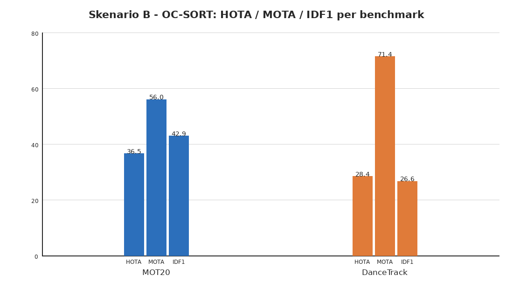
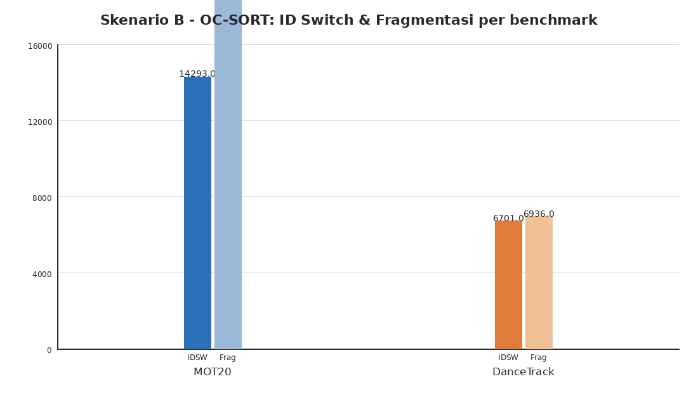
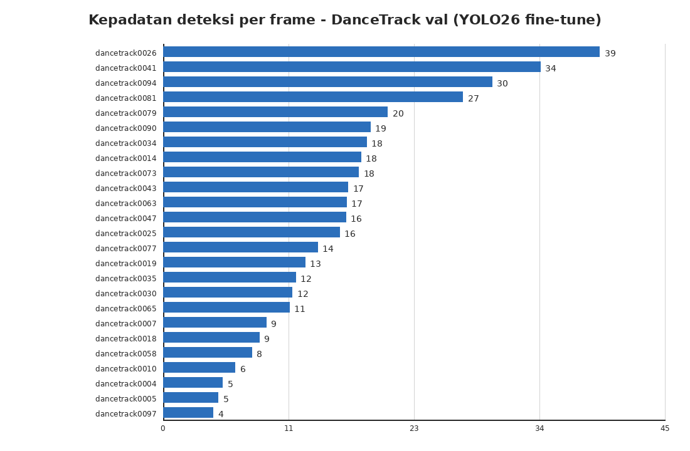
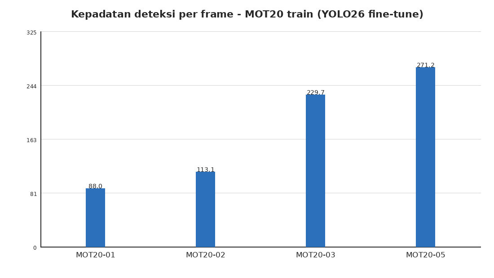

# Laporan Skenario B: Evaluasi Tracker untuk People Counting — Baseline OC-SORT pada MOT20 dan DanceTrack

*Disusun menggunakan standar penulisan akademik untuk justifikasi metodologi eksperimen. Status: OC-SORT baseline selesai; DiffMOT belum dieksekusi (lihat Bagian 6).*

---

## 1. Ringkasan Eksekutif

Skenario B mengevaluasi lapisan **tracker** dari pipeline *people counting* lima lapis: setelah detektor (Skenario A) menghasilkan kotak orang per bingkai, tracker harus menyatukannya menjadi **identitas temporal yang stabil** agar hitungan orang yang sama tidak dihitung ganda. Laporan ini mendokumentasikan baseline **OC-SORT** pada dua benchmark yang mewakili dua tantangan berbeda, serta status pengembangan tracker kedua (DiffMOT) yang belum selesai.

Temuan utama:

1. **Pada kerumunan padat (MOT20-train), OC-SORT mencapai HOTA 37,46, MOTA 56,13, IDF1 44,67** — akurasi deteksi tinggi (MOTA), tetapi asosiasi identitas lemah: **7.933 ID switch** dan **15.033 fragmentasi** pada 4.464 bingkai. Kerumunan dengan kepadatan rata-rata **202 deteksi/bingkai** membuat asosiasi berbasis IoU+Kalman mudah putus saat orang saling menutupi.
2. **Pada gerak non-linear (DanceTrack-val), OC-SORT jatuh ke HOTA 28,39 dan IDF1 26,63** — MOTA 71,38 tetap tinggi karena deteksi bagus, tetapi identitas nyaris berantakan (IDF1 < 30%). Ini persis skenario yang menjadi motivasi DiffMOT (Lv et al., 2024 – S021): prediksi gerak Kalman (asumsi kecepatan konstan) gagal pada penari yang berakselerasi/berbelok tidak menentu.
3. **Yang menjadi pembatas adalah asosiasi, bukan deteksi.** Pola HOTA-MOTA-IDF1 di kedua benchmark konsisten dengan diagnosis literatur: MOTA mengukur cakupan deteksi, IDF1/HOTA mengukur seberapa utuh identitas dipertahankan. Untuk *people counting*, **IDF1 adalah metrik yang paling relevan** — identitas yang putus saat oklusi membuat objek dapat dihitung ganda ketika muncul kembali (dekomposisi DetA/AssA belum dicatat pada run ini; akan ditambahkan pada run berikutnya).
4. **DiffMOT belum dieksekusi** (Bagian 6). Kendala utamanya infrastruktur data di GPU kampus; seluruh persiapan (env pip-only, data download dengan workaround rate-limit HF, skrip deteksi dua format) sudah siap. Angka publikasi DiffMOT pada DanceTrack (HOTA 62,3) menjadi target pembanding yang diharapkan memperbaiki sisi asosiasi.
5. **Video demo tersedia** (Bagian 7): klip MOT20-02 dan MOT20-01 berisi anotasi hasil pipeline deteksi (Skenario A) + tracking (Skenario B), termasuk overlay jumlah orang per bingkai — bahan presentasi langsung.

Seluruh angka dapat ditelusuri ke berkas hasil pada Lampiran A.

---

## 2. Pendahuluan

Deteksi bukanlah *counting* (temuan Skenario A, laporan `docs/reports/laporan-skenario-a-finetuning-yolo.md`). Sistem *people counting* real-time membutuhkan lapisan yang memutuskan *kotak mana di bingkai t yang merupakan orang yang sama dengan kotak di bingkai t−1*. Tanpa lapisan ini, setiap bingkai dihitung independen dan orang yang melewati garis hitung dapat dihitung berkali-kali.

Skenario B menjawab pertanyaan: **tracker mana — dan pada kondisi apa — yang mampu mempertahankan identitas objek cukup lama untuk hitungan yang akurat?** Dua kandidat dipilih dari rancangan proposal:

- **OC-SORT** (Cao et al., 2023) — baseline berbasis gerak murni (Kalman filter + asosiasi IoU dengan koreksi observasi). Cepat, tanpa GPU, tanpa ReID. Menjadi jalur *efisien/fallback* dalam proposal.
- **DiffMOT** (Lv et al., 2024 – S021) — prediksi gerak berbasis diffusion (D²MP) + asosiasi berbasis penampilan (ReID). Lebih berat (butuh GPU), diharapkan unggul pada gerak non-linear dan oklusi.

Kedua tracker dievaluasi pada **deteksi yang identik** (YOLO26 fine-tune hasil Skenario A) agar perbandingan mengukur kemampuan *tracking*, bukan selisih detektor. Karena DiffMOT belum selesai dijalankan, laporan ini menyajikan baseline OC-SORT secara penuh dan menempatkan DiffMOT sebagai pekerjaan lanjutan yang terencana (Bagian 6).

---

## 3. Metodologi

### 3.1 Dataset dan Protokol

| Benchmark | Split | Jumlah sekuens | Frame | Ground truth | Alasan |
|---|---|---|---|---|---|
| **MOT20** | train | 4 (MOT20-01/02/03/05) | 4.464 | Publik (GT ber-ID) | Test MOT20 tanpa GT publik (submission ke server) |
| **DanceTrack** | val | 25 | 25.508 | Publik (GT ber-ID) | Train untuk melatih tracker (tidak dipakai); test tanpa GT publik |

- **MOT20** (Dendorfer et al., 2020 – S036): kerumunan pejalan kaki sangat padat di ruang publik — menguji oklusi masif. Kepadatan deteksi rata-rata 202/bingkai.
- **DanceTrack** (Sun et al., 2022 – S037): penari dengan penampilan seragam (baju sama) dan gerak non-linear — menguji asosiasi saat penampilan tidak informatif dan gerak tidak linear.
- Kedua split dipilih karena **GT-nya publik** — evaluasi HOTA/IDF1/MOTA lokal dimungkinkan. Sebelum dipakai, GT diverifikasi dengan `scripts/data_prep/verify_mot_dataset.py` (memeriksa ID yang bertahan lintas bingkai, bukan sekadar format deteksi).

### 3.2 Deteksi — YOLO26 Fine-Tune (Skenario A)

Deteksi memakai bobot **YOLO26s fine-tune CrowdHuman** dari Skenario A (mAP@0.5:0.95 = 0,4974; laporan Skenario A Bagian 4). Eksekusi di PC rumah (CPU):

- **MOT20**: `best.onnx` (ONNX Runtime, ±2× lebih cepat di CPU) — 4 sekuens, 4.464 bingkai, **901.773 deteksi**, ±4,5 menit.
- **DanceTrack**: `best.onnx` — 25 sekuens, 25.508 bingkai, **369.101 deteksi**, ±18 menit.

Hasil deteksi per sekuens tercatat di `experiments/s2_tracker/detection_stats.csv` dan `docs/panduan-skenario-b-oc-sort.md`. Ambang *confidence* 0,3 digunakan untuk membatasi noise (temuan Skenario A: pada 0,05 deteksi noise membanjiri, mis. MOT20-05 sampai 271 deteksi/bingkai).

*Catatan konsistensi:* pada jalur GPU (kampus) deteksi memakai `best.pt` (native CUDA). Aturan yang dipakai: jangan mencampur deteksi `.pt` dan `.onnx` dalam satu tabel hasil.

### 3.3 Tracking — OC-SORT

| Parameter | Nilai |
|---|---|
| `--track-thresh` | 0,3 |
| `--min-conf` | 0,3 |
| `--iou-thresh` | 0,3 |
| Runtime | ±54 FPS (CPU, diukur pada MOT20-train) |

Orchestrator satu perintah: `python scripts/s2/run_skenario_b_ocsort.py --steps arrange,detect,track,eval` (idempotent, `--force` untuk ulang). OC-SORT murni berbasis gerak — tanpa ReID — sehingga berjalan penuh di CPU.

### 3.4 Evaluasi — TrackEval

Metrik dihitung dengan **TrackEval** (toolkit Luiten et al., github.com/JonathonLuiten/TrackEval) versi 1.3.0, protokol MOTChallenge:

- **HOTA** (Luiten et al., 2021 – S025): metrik gabungan deteksi-asosiasi, *primary metric*.
- **MOTA** (CLEAR): cakupan deteksi — penalizes *misses*, *false positives*, ID switch.
- **IDF1** (Identity): seberapa konsisten identitas — paling relevan untuk counting.
- **IDSW** (ID switch) dan **Frag** (fragmentasi): jumlah putusnya trajektori.

Detail teknis yang memengaruhi pembacaan angka (sudah ditangani, terdokumentasi di `references/trackeval-eval-pitfalls.md`): layout folder datar (`SKIP_SPLIT_FOL=True`), skala metrik 0–1 dikali 100, `seqinfo.ini` disynthesize dari bingkai asli, dan `DO_PREPROC=False` (tanpa penghapusan distraktor) — angka dengan demikian **tidak persis** leaderboard MOTChallenge, tetapi **konsisten antar tracker** sehingga sah untuk perbandingan tracker-vs-tracker.

### 3.5 Perangkat

| Lingkungan | Perangkat | Dipakai untuk |
|---|---|---|
| PC rumah (Windows 11) | CPU (i5-12400F), ONNX Runtime | Deteksi `.onnx`, tracking OC-SORT, evaluasi |
| GPU kampus (RTX 4090) | PyTorch CUDA | (Rencana) DiffMOT, deteksi `.pt` |

---

## 4. Hasil

### 4.1 Tabel Utama

| Benchmark | Tracker | HOTA | MOTA | IDF1 | IDSW | Frag |
|---|---|---|---|---|---|---|
| MOT20 (train) | **OC-SORT** | **37,46** | **56,13** | **44,67** | **7.933** | **15.033** |
| DanceTrack (val) | **OC-SORT** | **28,39** | **71,38** | **26,63** | **6.701** | **6.936** |

*Dibangkitkan dari `experiments/s2_tracker/eval_results.csv` (ekstraksi otomatis TrackEval, skala 0–1 × 100; IDSW/Frag adalah hitungan CLEAR).*

> **⚠️ KOREKSI (2026-08-04):** output tracking MOT20 hanya mencakup **sebagian frame** dari sekuens resmi — MOT20-01: frame 1–214 dari 429; MOT20-02: 1–1391 dari 2782 (divalidasi terhadap GT dan `seqinfo.ini` resmi, `seqLength=2782`). Penyebab dugaan: dataset MOT20 di PC rumah saat run hanya berisi sebagian gambar (jumlah jpg menentukan `seqLength` pada step arrange — lihat `synth_seqinfo()` di `scripts/s2/run_skenario_b_ocsort.py`), sehingga deteksi→tracking→evaluasi berjalan atas sekuens terpotong. **Angka MOT20 di atas karenanya adalah nilai atas sekuens terpotong, bukan full-sequence, dan belum dapat dibandingkan dengan literatur.** Re-run full-sequence (jumlah gambar resmi = 429/2782/2405/3315 per sekuens, total 8.931 — Tabel 1 paper MOT20 [arXiv:2003.09003]; download HF `Lekim89/MOT20` sudah divalidasi lengkap, lalu `--steps arrange,detect,track,eval --force`) dijadwalkan; tabel akan diperbarui. Angka DanceTrack tidak terpengaruh (frame lengkap di `detection_stats.csv`).





### 4.2 Kepadatan Data

Deteksi YOLO26 menghasilkan kepadatan yang sangat berbeda antar benchmark — konteks penting untuk membaca skor asosiasi:





MOT20 rata-rata **202 deteksi/bingkai** (sampai 271 di MOT20-05) — kerumunan ekstrem. DanceTrack rata-rata **14,5 deteksi/bingkai** — kepadatan jauh lebih rendah, tetapi tiap orang bergerak non-linear dan berpakaian seragam.

### 4.3 Runtime

| Tahap | Lingkup | Waktu |
|---|---|---|
| Deteksi MOT20 (4 sekuens) | CPU+ONNX | ±4,5 menit |
| Deteksi DanceTrack (25 sekuens) | CPU+ONNX | ±18 menit |
| Tracking OC-SORT (MOT20-train) | CPU | ±54 FPS (≈1,4 menit untuk 4.464 bingkai) |
| Evaluasi TrackEval | CPU | menit |

---

## 5. Analisis

### 5.1 Kerumunan padat (MOT20): deteksi kuat, asosiasi rapuh

MOTA 56,13 dengan kepadatan 202 deteksi/bingkai menunjukkan detektor YOLO26 mampu menutupi mayoritas orang bahkan dalam oklusi berat. Namun **7.933 ID switch** — rata-rata 1,8 per bingkai — menandakan asosiasi berbasis gerak mudah salah sambung saat dua orang saling menutupi dan kotak IoU saling tumpang tindih. IDF1 44,67 berarti sekitar **55% bobot asosiasi identitas tidak cocok dengan GT** — implikasi praktis untuk counting: orang yang tertutup 2–3 bingkai lalu terdeteksi ulang dapat dihitung sebagai orang baru.

HOTA 37,46 yang berada jauh di bawah MOTA 56,13 secara kualitatif mengindikasikan komponen asosiasi lebih lemah daripada komponen deteksi — konsisten dengan tracker motion-only tanpa ReID. Dekomposisi eksplisit DetA/AssA belum dicatat pada run ini dan akan ditambahkan pada run berikutnya (TrackEval menyediakannya).

### 5.2 Gerak non-linear (DanceTrack): kegagalan asumsi kecepatan konstan

Pola paling jelas: **MOTA 71,38 (tertinggi di antara dua benchmark yang diuji) tetapi IDF1 26,63 dan HOTA 28,39 (terendah)**. Deteksi nyaris sempurna (kepadatan rendah, orang terlihat utuh), tetapi identitas berantakan. Ini adalah tanda klasik kegagalan prediksi gerak Kalman pada gerak non-linear: penari berakselerasi, berbelok, dan berpapasan sehingga prediksi posisi meleset dan asosiasi IoU gagal.

Ini **persis domain yang menjadi motivasi DiffMOT** (Lv et al., 2024 – S021): penggantian prediksi Kalman dengan D²MP berbasis diffusion untuk memodelkan distribusi gerak non-linear, plus ReID untuk asosiasi berbasis penampilan. Angka publikasi DiffMOT pada DanceTrack — HOTA 62,3, IDF1 63,0, AssA 47,2 (dengan deteksi YOLOX) — menunjukkan ruang perbaikan yang besar atas baseline 28,39/26,63 ini.

### 5.3 Keterbatasan dan Kejujuran Pelaporan

**Tabel pembanding dari literatur** (hanya sel yang memiliki sumber diisi):

| Benchmark | Tracker | Deteksi | HOTA | IDF1 | MOTA |
|---|---|---|---|---|---|
| MOT20 | OC-SORT (eksperimen ini) | YOLO26 fine-tune kami | 37,46 | 44,67 | 56,13 |
| MOT20 | OC-SORT (publikasi) | deteksi resmi | 62,4 | — | — |
| DanceTrack | OC-SORT (eksperimen ini) | YOLO26 fine-tune kami | 28,39 | 26,63 | 71,38 |
| DanceTrack | OC-SORT (publikasi) | deteksi resmi | — | — | — |
| DanceTrack | DiffMOT (publikasi) | YOLOX | 62,3 | 63,0 | — |

Catatan:

1. **Angka tidak sebanding 1:1 dengan leaderboard.** Deteksi memakai YOLO26 fine-tune kita (bukan deteksi resmi MOTChallenge/YOLOX) dan `DO_PREPROC=False`. Perbandingan yang sah di sini adalah **antar tracker pada deteksi yang sama**, bukan melawan angka publikasi. Tabel di atas hanya memberi konteks besaran.
2. **Angka publikasi OC-SORT** (MOT20 HOTA 62,4; DanceTrack-test 55,1) diambil dari catatan riset `references/tracker-evaluation-scenario-b.md` dan belum diverifikasi ulang ke arXiv saat penulisan — akan diverifikasi saat DiffMOT dieksekusi. Angka publikasi DiffMOT diverifikasi dari arXiv:2403.02075 dan situs proyek (Lv et al., 2024 – S021).
3. **Detektor kita menjadi lantai (*floor*).** Skenario A menemukan under-count struktural 7,4–10,0% di lapisan detektor — tracker tidak dapat memperbaiki orang yang tidak terdeteksi sama sekali. IDF1/HOTA karenanya memiliki batas atas yang lebih rendah daripada eksperimen dengan deteksi resmi.
4. **Baseline tunggal.** DiffMOT belum dijalankan, sehingga "komparasi" saat ini baru satu sisi. Tabel perbandingan penuh menyusul di Bagian 6.

---

## 6. Status DiffMOT — Belum Dieksekusi

| Item | Status |
|---|---|
| Riset implementasi (format deteksi, embedding cache, config, runtime) | ✅ Selesai — `references/tracker-evaluation-scenario-b.md` |
| Notebook setup pip-only di kampus (10) | ✅ Siap + sudah menangani onnx/np.object dan fallback torch cu118 |
| Notebook data (20) — MOT20-train + DanceTrack val.zip | ✅ Siap; workaround rate-limit HF (`HF_HUB_DISABLE_XET=1`) terpasang |
| Bobot DiffMOT v1.0 (motion + ReID) | ✅ Download terencana via notebook 10 (4 file) |
| **Deteksi .pt di GPU kampus (notebook 30)** | ⏳ **Kendala: data belum tersedia di kampus** |
| **Run DiffMOT MOT20 + DanceTrack (notebook 50)** | ⏳ Belum |
| **Evaluasi TrackEval + komparasi** | ⏳ Belum |

**Kendala utama:** data MOT20/DanceTrack belum tersedia di GPU kampus. Download HF sempat terhambat rate-limit (repo MOT20 berisi ±13 ribu file; Xet Storage memakai 1 request API per file). Sudah diatasi dengan `HF_HUB_DISABLE_XET=1` (download lewat CDN, bebas kuota API) dan pola `ignore_patterns` yang hemat (skip zip test/train, ±13 GB). Tinggal: `git pull` → notebook 10 (sekali) → notebook 20 (download data) → notebook 30 (deteksi `.pt`) → 40 (smoke ReID) → 50 (run) → 70 (eval).

**Ekspektasi yang dikelola:** DiffMOT lebih berat (butuh CUDA; ±22,7 FPS di RTX 3090 menurut publikasi, estimasi 7–10 menit untuk MOT20-train dan 15–20 menit untuk DanceTrack-val di RTX 4090). Keuntungan yang diharapkan terpusat pada **asosiasi** (IDF1/HOTA/IDSW), bukan pada MOTA — dan paling terlihat pada DanceTrack.

---

## 7. Video Demo (Kombinasi Skenario A + B)

Video demo merender hasil pipeline lengkap — **deteksi YOLO26 (Skenario A) → tracking OC-SORT (Skenario B) → overlay jumlah orang per bingkai** — untuk bahan presentasi. FPS mengikuti `seqinfo.ini` dataset (MOT20 = 25 fps, bukan 30 — koreksi 2026-08-04):

- `experiments/s2_tracker/demo/MOT20-02_f1-450_tracked.mp4` — kerumunan padat, 450 bingkai (±18 dtk @25 fps)
- `experiments/s2_tracker/demo/MOT20-01_f1-214_tracked.mp4` — kerumunan jarang, 214 bingkai (±8,6 dtk @25 fps)
- `experiments/s2_tracker/demo/MOT20-02_f1-450_gt.mp4` — **referensi Ground Truth** (kotak hijau = pedestrian ber-GT, abu-abu = distraktor) untuk membandingkan "ideal" vs baseline

Setiap kotak diberi ID stabil (warna per ID) dan header menampilkan jumlah orang aktif per bingkai. Klip GT bukan hasil pipeline — hanya referensi visual agar kelemahan baseline (ID switch saat oklusi) terbaca jelas sebagai *gap*, bukan sebagai kesalahan render.

Dibangkitkan dengan `scripts/s2/render_demo_video.py` (Pillow + ffmpeg, tanpa GPU; frame diunduh dari HF sekali, resume otomatis; `--source gt` untuk klip referensi):

```bash
python scripts/s2/render_demo_video.py --seq MOT20-02 --start 1 --end 450
python scripts/s2/render_demo_video.py --seq MOT20-01
python scripts/s2/render_demo_video.py --seq MOT20-02 --start 1 --end 450 --source gt
```

---

## 8. Kesimpulan dan Arah Lanjut

Baseline OC-SORT menunjukkan dua hal: (1) deteksi YOLO26 fine-tune kita sudah siap dipakai di lapisan bawah (MOTA tinggi di kedua benchmark); (2) asosiasi motion-only tidak memadai untuk counting yang akurat — terutama pada gerak non-linear (IDF1 DanceTrack 26,63) dan oklusi padat (IDSW MOT20 7.933). Keduanya menegaskan arah proposal: **tracker dengan ReID + prediksi gerak non-linear (DiffMOT) diperlukan**, dan keunggulannya paling mungkin muncul pada metrik asosiasi.

Langkah berikut: selesaikan DiffMOT di GPU kampus (Bagian 6), lengkapi tabel komparasi dua tracker pada deteksi yang sama, lalu lanjut ke Skenario C (counting logic) dengan tracker terpilih.

---

## Lampiran A — Artefak Hasil

| Berkas | Isi |
|---|---|
| `experiments/s2_tracker/eval_results.csv` | Skor TrackEval per benchmark (sumber tabel 4.1) |
| `experiments/s2_tracker/detection_stats.csv` | Statistik deteksi per sekuens (frames, dets, det/frame, detik) |
| `experiments/s2_tracker/ocsort_results/{mot20,dancetrack}/*.txt` | Hasil tracking OC-SORT per sekuens (format MOT) |
| `experiments/s2_tracker/figs/*.png` | Figur 1–4 |
| `experiments/s2_tracker/demo/*.mp4` | Video demo (Bagian 7) |
| `scripts/s2/run_skenario_b_ocsort.py` | Orchestrator reproduce: arrange → detect → track → eval |
| `docs/panduan-skenario-b-oc-sort.md` | Panduan eksekusi PC rumah |
| `docs/panduan-skenario-b-diffmot.md` | Panduan DiffMOT kampus (notebook 10–70) |

## Lampiran B — Reproduksi

```bash
# PC rumah (CPU; deteksi .onnx + OC-SORT + eval)
python scripts/s2/run_skenario_b_ocsort.py --steps arrange,detect,track,eval --force

# Kampus (GPU; DiffMOT) — setelah data tersedia
# notebook 10 → 20 → 30 → 40 → 50 → 70 (lihat docs/panduan-skenario-b-diffmot.md)
```

## Daftar Pustaka

1. Lv, W., Huang, Y., Zhang, N., Lin, R.-S., Han, M., & Zeng, D. (2024 – S021). *DiffMOT: A Real-time Diffusion-based Multiple Object Tracker with Non-linear Prediction.* CVPR 2024, pp. 19321–19330. arXiv:2403.02075; kode: https://github.com/Kroery/DiffMOT (diakses 2026-08-03).
2. Cao, J., Pang, J., Weng, X., Khirodkar, R., & Kitani, K. (2023). *Observation-Centric SORT: Rethinking SORT for Robust Multi-Object Tracking.* CVPR 2023. arXiv:2203.14360 (diakses 2026-08-03). *(Belum memiliki S-ID di source ledger.)*
3. Luiten, J., Ošep, A., Dendorfer, P., et al. (2021 – S025). *HOTA: A Higher Order Metric for Evaluating Multi-Object Tracking.* IJCV 129(2), 548–578. DOI 10.1007/s11263-020-01375-2 (diakses 2026-08-03).
4. Dendorfer, P., Rezatofighi, H., Milan, A., et al. (2020 – S036). *MOT20: A benchmark for multi object tracking in crowded scenes.* ECCV 2020 Workshops. arXiv:2003.09003 (diakses 2026-08-03).
5. Sun, P., Cao, J., Jiang, Y., et al. (2022 – S037). *DanceTrack: Multi-Object Tracking in Uniform Appearance and Diverse Motion.* CVPR 2022. arXiv:2111.14690 (diakses 2026-08-03).
6. Luiten, J., et al. *TrackEval* (toolkit evaluasi MOT). https://github.com/JonathonLuiten/TrackEval (diakses 2026-08-03).
7. Ultralytics. *YOLO Documentation* (deteksi, vendor). https://docs.ultralytics.com (diakses 2026-08-03).
