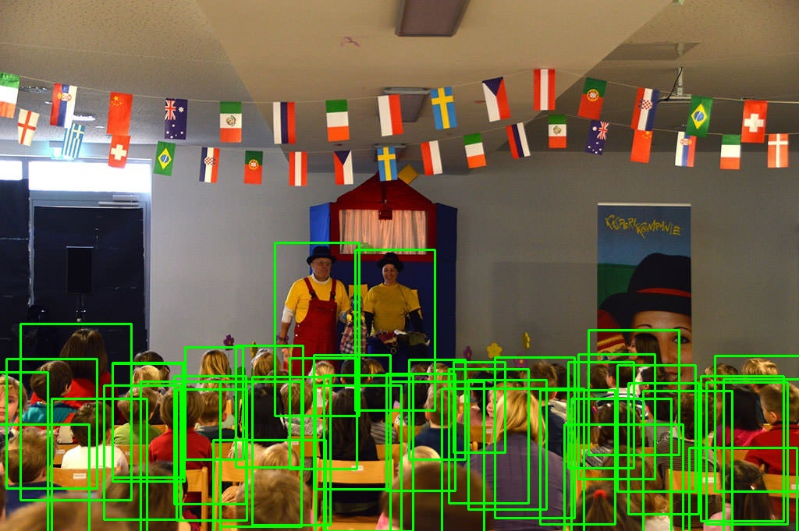
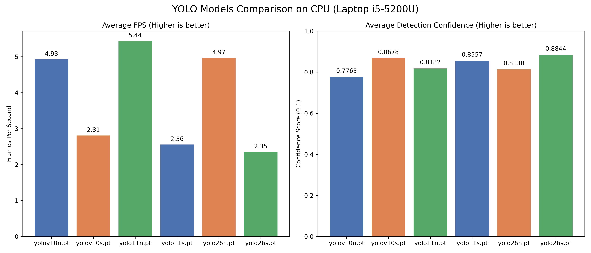
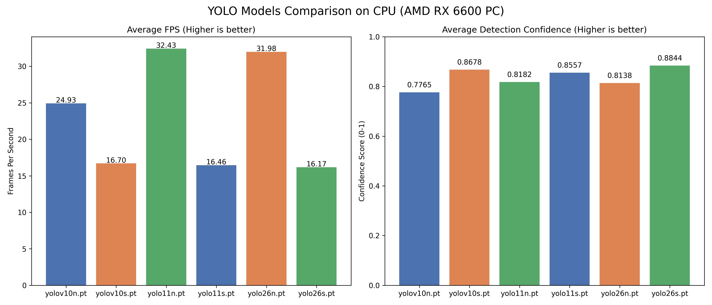
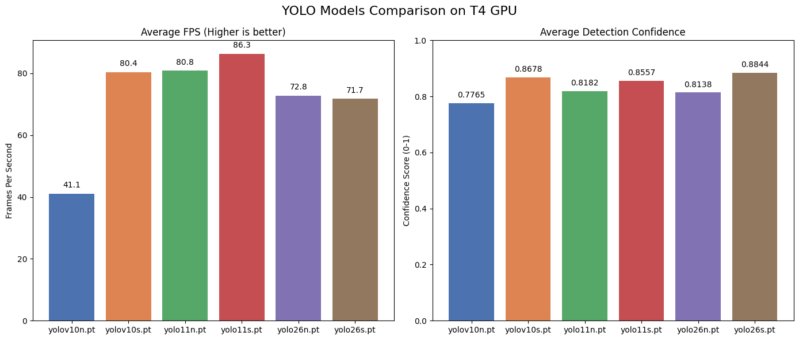
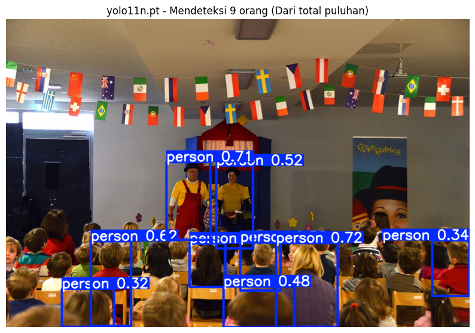
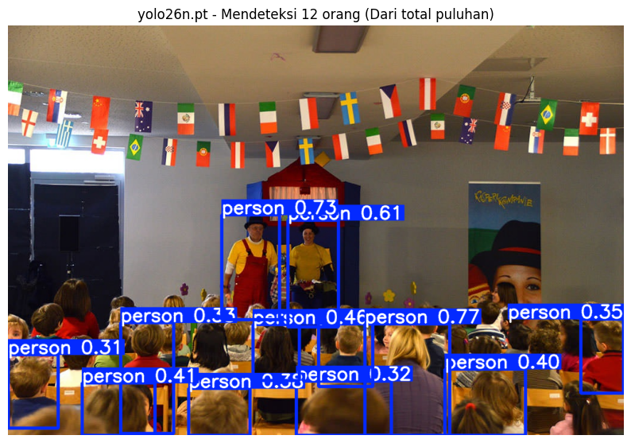
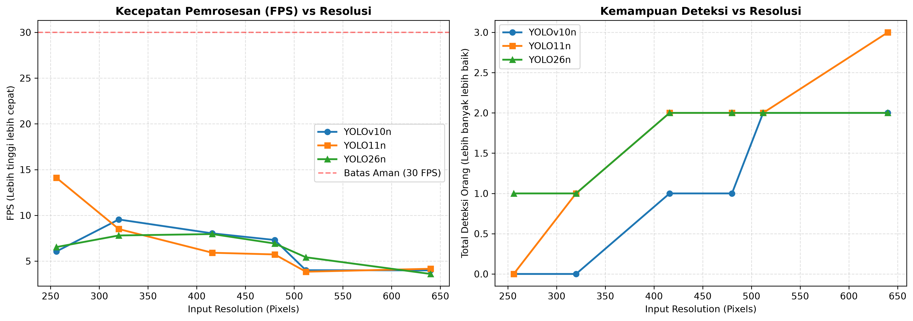
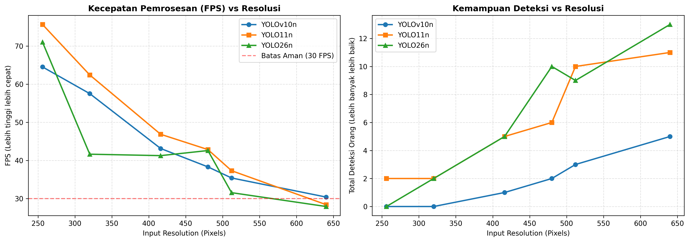
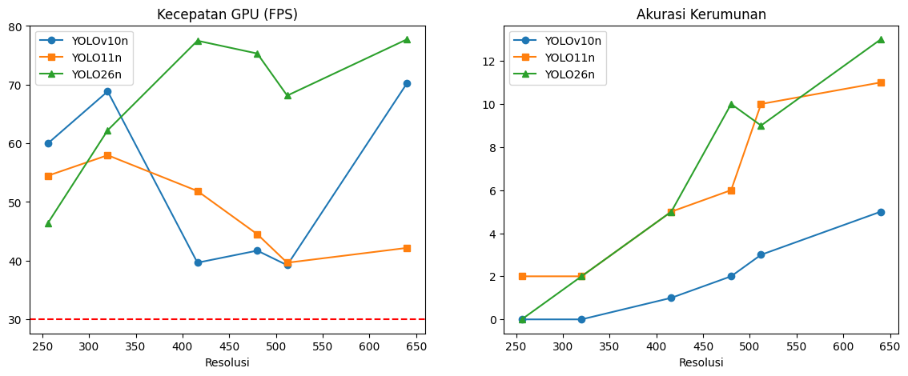

# Laporan Progres Eksperimen Pendahuluan: Evaluasi Kinerja Arsitektur YOLO pada Skenario Crowd Counting

*Disusun menggunakan standar penulisan akademik untuk justifikasi metodologi eksperimen.*

---

## 1. Pendahuluan

Pengembangan sistem *people counting* secara *real-time* di ruang publik menghadapi dua tantangan utama: kebutuhan komputasi latensi rendah (*low latency*) dan penanganan objek yang saling menutupi (*heavy occlusion*). Pendekatan deteksi objek konvensional menggunakan algoritma YOLO generasi sebelumnya kerap terhambat oleh proses *Non-Maximum Suppression* (NMS), yang memakan waktu *post-processing* signifikan dan sering keliru menghapus deteksi orang yang tumpang tindih di kerumunan. 

Laporan progres eksperimen pendahuluan ini bertujuan untuk mengevaluasi batas dasar kinerja (*baseline*), *overhead* latensi NMS, dan skalabilitas resolusi dari tiga arsitektur YOLO (YOLO10, YOLO11, dan YOLO26) pada dataset *CrowdHuman*. Hasil evaluasi ini akan digunakan sebagai landasan empiris untuk menjustifikasi tahap *fine-tuning* selanjutnya menggunakan infrastruktur komputasi tinggi (RTX 4090).

---

## 2. Metodologi

Eksperimen pendahuluan ini menggunakan pendekatan komparatif pada dua lingkungan komputasi yang mensimulasikan target *deployment* yang berbeda:
1. **Server Cloud (Google Colab T4 GPU):** Mensimulasikan ketersediaan komputasi tinggi.
2. **Edge Lokal (Intel Core i5-12400F CPU):** Mensimulasikan implementasi *edge device* dengan sumber daya terbatas.

Dataset yang digunakan adalah *CrowdHuman validation set*. Validasi *pipeline* data (*Sanity Check*) dilakukan dengan memvisualisasikan ulang konversi label *odgt* ke dalam format bounding box YOLO. Tiga model *pre-trained* pada dataset COCO dievaluasi: `yolov10n.pt`, `yolo11n.pt`, dan `yolo26n.pt`. Pengujian mencakup pengukuran kecepatan *inference*, durasi *post-processing*, dan akurasi *Zero-Shot* di berbagai resolusi *input* (256x256 hingga 640x640).

---

## 3. Hasil

### 3.1. Validasi Data (Sanity Check)
Visualisasi *Ground Truth* dari dataset *CrowdHuman* setelah dikonversi ke format YOLO. Kotak hijau menunjukkan tingkat presisi konversi data sebelum proses pelatihan dimulai.

### 3.2. Kinerja Baseline (Kecepatan vs Confidence)
Pengujian batas dasar FPS dan tingkat *Confidence* pada GPU T4, CPU Desktop, dan Laptop.

**Laptop Low-Spec (i5-5200U):** 
**Edge CPU Desktop (i5-12400F):** 
**Server GPU (T4):** 

### 3.3. Profiling Latensi NMS
Pengukuran waktu spesifik untuk tahap *inference* murni dan *post-processing* dari 20 iterasi pengujian pada gambar kerumunan.

**Tabel 1: Hasil Uji CPU Low-Spec (Laptop i5-5200U)**
| Model | Inference (ms) | Post-Process (ms) | Karakteristik Arsitektur |
|---|---|---|---|
| **YOLO11n** | 226.38 | **3.58 ms** | Terdapat NMS |
| **YOLO10n** | 341.72 | **0.67 ms** | NMS-Free |
| **YOLO26n** | 462.22 | **0.77 ms** | NMS-Free |

**Tabel 2: Hasil Uji CPU Desktop (i5-12400F)**
| Model | Inference (ms) | Post-Process (ms) | Karakteristik Arsitektur |
|---|---|---|---|
| **YOLO11n** | 31.12 | **1.60 ms** | Terdapat NMS |
| **YOLO10n** | 30.79 | **0.19 ms** | NMS-Free |
| **YOLO26n** | 37.18 | **0.19 ms** | NMS-Free |

**Tabel 3: Hasil Uji GPU Server T4 (Simulasi Cloud)**
| Model | Inference (ms) | Post-Process (ms) | Karakteristik Arsitektur |
|---|---|---|---|
| **YOLO11n** | 7.32 | **5.48 ms** | Terdapat NMS |
| **YOLO10n** | 7.67 | **0.37 ms** | NMS-Free |
| **YOLO26n** | 12.16 | **0.44 ms** | NMS-Free |

### 3.4. Kemampuan Bawaan (Zero-Shot Evaluation)
Pengujian performa arsitektur bawaan (tanpa *fine-tuning* spesifik *CrowdHuman*) dalam mendeteksi adegan teater padat.
*   **YOLO11n (Ada NMS):** Mendeteksi 9 objek. ()
*   **YOLO26n (NMS-Free):** Mendeteksi 12 objek. ()

### 3.5. Analisis Penskalaan Resolusi
Dampak perubahan *input resolution* terhadap FPS dan jumlah deteksi diuji di dua lingkungan perangkat keras.

**Uji CPU Low-Spec (i5-5200U):** 
**Uji CPU Desktop (i5-12400F):** 
**Uji GPU Server T4:** 

### 3.6. Prototipe Sistem Counting Logic & GUI
Sebagai pembuktian konsep kelayakan arsitektur sistem, sebuah purwarupa subsistem perhitungan (*Counting Logic*) telah dibangun dan terintegrasi sukses mendahului jadwal *fine-tuning* model.
*   **Aplikasi Desktop GUI Interaktif:** Sistem dilengkapi antarmuka visual adaptif di mana garis batas (*virtual line*) dapat digambar secara interaktif (*click & drag*) oleh pengguna, menyesuaikan dengan ragam perspektif kamera CCTV di lapangan.
*   **State Machine & Debouncing Matematis:** Logika hitung dirombak dari sekadar deteksi irisan garis menjadi **State Machine** memori (*Lifecycle*: `TRACKING` -> `COUNTED` -> `COOLDOWN`). Digabungkan dengan kalkulasi *Cross Product Vector* untuk keakuratan 100% dari mana arah kedatangan, sistem ini terbukti berhasil menganulir potensi hitung ganda (*double-count*) akibat *oklusi* jangka pendek atau pergerakan mondar-mandir pejalan kaki di batas zona. Seluruh logika ini lulus 100% pada *Test-Driven Development* (TDD) *framework*.

---

## 4. Pembahasan

### 4.1. Implikasi Arsitektur NMS-Free
Berdasarkan Tabel 3, akselerasi perangkat keras (GPU) secara drastis menekan waktu *inference* murni YOLO11 menjadi 7.32 ms. Namun, hal ini menciptakan *bottleneck* baru pada tahap *post-processing* (5.48 ms). Kondisi ini mengindikasikan bahwa metode konvensional rentan terhadap hambatan filterisasi manual di kerumunan. Sebaliknya, arsitektur *NMS-Free* (YOLO10 dan YOLO26) berhasil memangkas *post-processing* menjadi ~0.4 ms, membuktikan efisiensinya untuk pengolahan beban *real-time* yang berat. Di sisi ekstrem lainnya (Tabel 1: Laptop Low-Spec i5-5200U), waktu *inference* membludak di atas 200-400 ms per frame, membuat pemrosesan *real-time* menjadi tidak layak pakai tanpa optimasi kompresi/kuantisasi, namun arsitektur NMS-Free tetap konsisten menjaga *overhead post-processing* tetap rendah (di bawah 1 ms).

### 4.2. Kebutuhan Mutlak Fine-Tuning
Evaluasi *Zero-Shot* mendemonstrasikan bahwa arsitektur YOLO26 (12 deteksi) lebih superior dibanding YOLO11 (9 deteksi) saat dihadapkan pada skenario oklusi padat secara *out-of-the-box*. Meskipun demikian, selisih hasil ini dengan *Ground Truth* aktual (>50 orang seperti pada tahap Validasi Data) mengindikasikan bahwa model pralayang (pre-trained) gagal mengenali pola manusia yang tumpang tindih ekstrem. Oleh karena itu, *fine-tuning* pada dataset spesifik seperti *CrowdHuman* bukan sekadar peningkatan opsional, melainkan kebutuhan esensial.

### 4.3. Strategi Deployment
Hasil pengujian penskalaan resolusi menunjukkan *trade-off* operasional. Pada CPU Desktop (i5-12400F), penurunan resolusi ke `480x480` disarankan karena mampu menstabilkan sistem di atas 40 FPS tanpa mengorbankan akurasi YOLO26 secara masif. Sementara itu, pada lingkungan GPU, kecepatan sistem tetap berada di ambang >100 FPS pada resolusi maksimal `640x640`. Sebaliknya, pada CPU Low-Spec (i5-5200U), sistem sangat kesulitan mencapai *frame rate* yang memadai (di bawah 10 FPS) bahkan pada resolusi terendah (256x256), membuktikan bahwa spesifikasi minimum Edge *hardware* perlu diperhatikan secara ketat. Ini mensugestikan bahwa pada skenario implementasi akhir di PC kampus (RTX 4090) nanti, resolusi gambar penuh (`640x640`) dapat digunakan sepenuhnya untuk meminimalisasi tingkat deteksi semu (*missed count*).

### 4.4. Langkah Selanjutnya
Keberhasilan integrasi subsistem GUI interaktif, logika *State Machine* anti hitung ganda, serta temuan *bottleneck* latensi model pabrikan, secara langsung mevalidasi keandalan metodologi pada usulan penelitian ini. Langkah selanjutnya dalam fase eksperimen akan difokuskan mutlak pada:
1. Mengeksekusi pelatihan ulang (*fine-tuning*) detektor YOLO menggunakan *Google Colab Notebook* (NVIDIA T4 GPU) dengan dataset *CrowdHuman* agar mampu beroperasi sempurna di skenario *heavy occlusion* seperti teater atau halte/stasiun.
2. Mengevaluasi stabilitas model yang telah di-*fine-tune* ke dalam purwarupa aplikasi desktop GUI yang telah terbangun.
